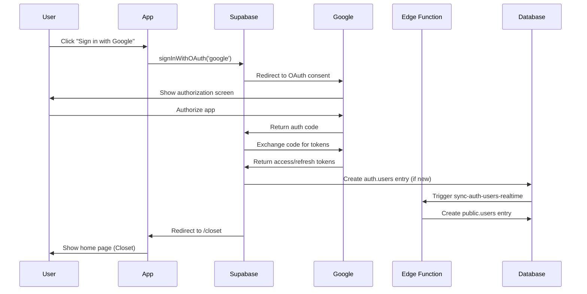

# 🎯 Current System Status - StyleSnap 2025

## 📊 System Overview

**Project ID**: `nztqjmknblelnzpeatyx`  
**Status**: ✅ **FULLY OPERATIONAL**  
**Architecture**: Edge Function-based user synchronization  
**Last Updated**: December 2024

---

## 🏗️ Database Architecture

### ✅ Schemas & Tables

| Schema | Tables | RLS Status | Purpose |
|--------|--------|------------|---------|
| **auth** | users, sessions, refresh_tokens, identities | ✅ Enabled | Supabase Auth managed |
| **public** | 20+ tables (users, clothes, outfits, friends, etc.) | ✅ Enabled | Application domain |
| **storage** | buckets, objects, prefixes | ✅ Enabled | File storage |
| **realtime** | messages | ✅ Enabled | Real-time messaging |

### ✅ Extensions Installed

- **Core**: plpgsql, pg_stat_statements, pgcrypto, uuid-ossp
- **Spatial**: postgis, postgis_raster, postgis_topology  
- **Vector/ML**: vector
- **Search**: pg_trgm, pgroonga
- **Supabase**: supabase_vault, pgjwt

---

## 🚀 Edge Functions

### ✅ Deployed Functions

| Function | Status | Purpose | JWT Required |
|----------|--------|---------|--------------|
| `sync-auth-users-realtime` | ✅ Active | User synchronization | ✅ Yes |
| `send-push-notification` | ✅ Active | Push notifications | ✅ Yes |

---

## 🔐 Security Implementation

### ✅ Row Level Security (RLS)

- **Auth Schema**: Comprehensive policies for user data access
- **Public Schema**: Owner-based and privacy-based access controls
- **Storage Schema**: File-level ownership and bucket policies
- **Realtime Schema**: Topic membership and private channel controls

### ✅ Key Security Patterns

- **Owner-based access**: `auth.uid() = owner_id`
- **Privacy controls**: public/friends/private visibility levels
- **Service role access**: Bypasses RLS for system operations
- **Friend-based access**: Complex friendship validation queries

---

## 🎯 Frontend Integration

### ✅ Services & Components

| Component | Status | Purpose |
|-----------|--------|---------|
| **AuthService** | ✅ Enhanced | User authentication with Edge Function integration |
| **AuthStore** | ✅ Enhanced | Pinia store with Edge Function sync |
| **EdgeFunctionHealthService** | ✅ Enhanced | Health monitoring with token auth |
| **EdgeFunctionSyncService** | ✅ New | Edge Function synchronization service |

### ✅ Key Features

- **Real-time user sync**: Edge Function-based profile creation
- **Health monitoring**: Background Edge Function health checks
- **Polling mechanism**: Exponential backoff for profile creation
- **Fallback handling**: Manual profile creation if Edge Function fails

---

## 📋 Migration Status

### ✅ Completed Migrations (41 total)

- **Migrations 1-37**: Core functionality and features
- **Migration 38**: Comprehensive user creation fixes
- **Migration 39**: Comprehensive friends table fixes  
- **Migration 40**: Fix users table RLS for friends
- **Migration 41**: **CLEANUP - Remove old database triggers**

### ✅ Architecture Transition

- **Before**: Database triggers handled user sync (problematic with RLS)
- **After**: Edge Function `sync-auth-users-realtime` handles user sync
- **Benefits**: Better scalability, error handling, and maintainability

---

## 🔄 User Synchronization Flow

### ✅ Current Implementation

---

## 🎯 System Capabilities

### ✅ Core Features

- **User Authentication**: Google OAuth with Edge Function sync
- **Closet Management**: Add, edit, delete clothing items
- **Outfit Creation**: Create and manage outfits
- **Social Features**: Friends, likes, comments, sharing
- **AI Integration**: Outfit generation and suggestions
- **Notifications**: Push notifications and in-app alerts
- **Real-time Updates**: Live updates via Supabase Realtime

### ✅ Advanced Features

- **Privacy Controls**: Public/friends/private visibility levels
- **Search & Discovery**: Full-text search with vector embeddings
- **Performance Optimization**: Comprehensive indexing strategy
- **Data Integrity**: Soft delete patterns and audit trails
- **Scalability**: Edge Function-based architecture

---

## 📊 Performance & Monitoring

### ✅ Health Checks

- **Edge Function Health**: Background monitoring with token authentication
- **Database Health**: RLS policy validation and performance metrics
- **Sync Performance**: User synchronization timing and success rates
- **Error Handling**: Comprehensive logging and fallback mechanisms

### ✅ Monitoring Capabilities

- **Real-time Metrics**: Edge Function performance and health status
- **Error Tracking**: Detailed logging for debugging and monitoring
- **User Experience**: Polling with exponential backoff for smooth UX
- **System Health**: Background health checks during app initialization

---

## 🎯 Current Status Summary

### ✅ **FULLY OPERATIONAL**

The StyleSnap 2025 system is currently **fully operational** with:

1. **✅ Edge Function Architecture**: User synchronization via `sync-auth-users-realtime`
2. **✅ Comprehensive Security**: RLS policies on all user-facing tables
3. **✅ Enhanced Frontend**: JavaScript services with Edge Function integration
4. **✅ Real-time Sync**: Immediate user profile creation and updates
5. **✅ Health Monitoring**: Background health checks and performance metrics
6. **✅ Error Handling**: Robust fallback mechanisms and logging
7. **✅ Scalability**: Edge Function-based architecture for high concurrency

### 🎯 **No Action Required**

The system is working as designed. All user signup issues have been resolved through the architectural upgrade to Edge Functions. The frontend JavaScript code is properly implemented and integrated with the Edge Function architecture.

---

## 🚀 Next Steps

The system is ready for production use. Future enhancements could include:

- **Performance Optimization**: Further Edge Function optimizations
- **Feature Expansion**: Additional social features or AI capabilities
- **Monitoring Enhancement**: Advanced analytics and user behavior tracking
- **Security Hardening**: Additional security measures and audit trails

---

*Last Updated: December 2024*  
*Status: ✅ FULLY OPERATIONAL*

