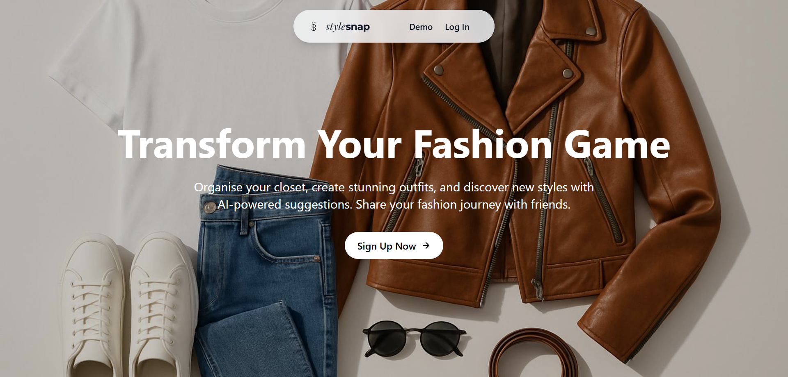
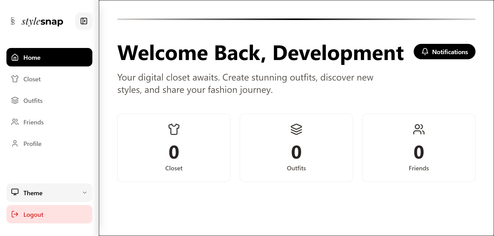
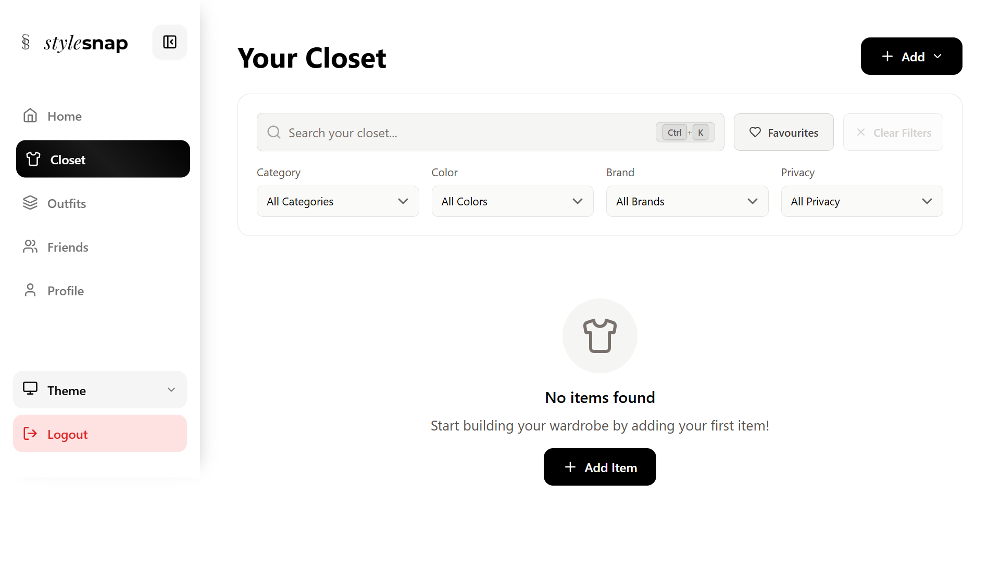
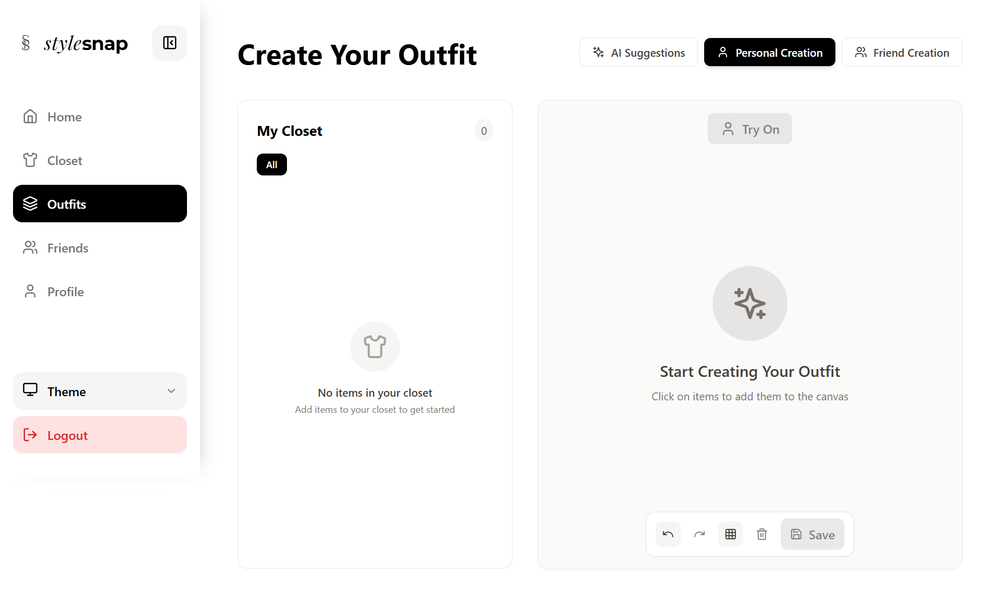
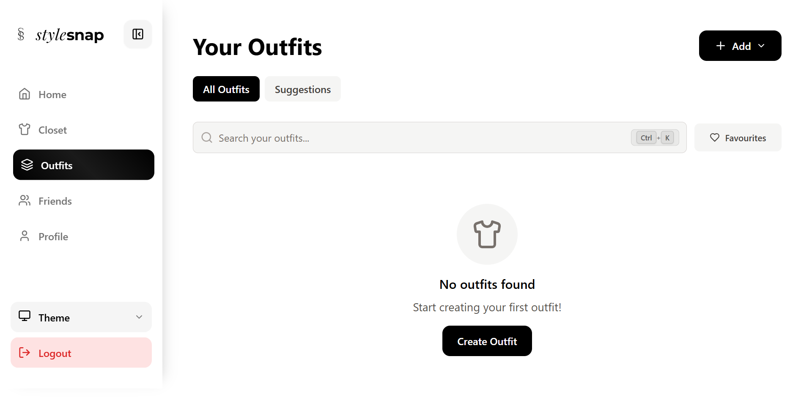
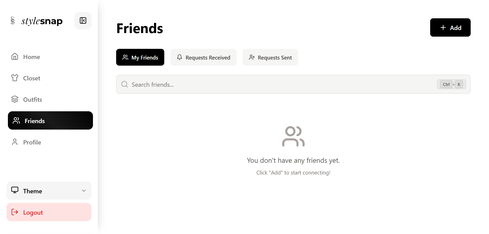
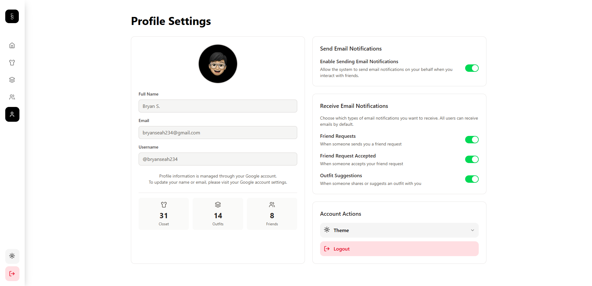

# 🏫 IS216 Web Application Development II

---

## Section & Team Number
G3 Team 4

---

## Team Members

| Photo | Full Name | Role / Features Responsible For |
|:--:|:--|:--|
|  | Leon | Frontend Developer - Outfit Canvas & Drag-and-Drop |
|  | Kai Jie | Backend Developer - Supabase API & Database |
|  | Bryan | Full Stack Developer - Authentication & Notifications |
|  | Wei Ting | UI/UX Designer - Theme System & Responsive Design |
|  | Andrew | Frontend Developer - Closet Management & Search |
|  | Alan | Backend Developer - AI Integration & Cloudinary |

> ✅ All headshot thumbnails are in the `/public/photos` folder (PNG format).

---

## Business Problem

**The Challenge:**  
Fashion enthusiasts struggle to organize their wardrobes, plan outfits efficiently, and discover new style combinations. Many people own clothes they forget about, cannot easily visualize outfit combinations, and lack tools to manage their fashion choices digitally.

**Pain Points Addressed:**
- No centralized system to track clothing items across different storage locations
- Difficulty visualizing outfit combinations before wearing them
- Limited ability to get personalized style recommendations
- Lack of social features to share and get feedback on outfits
- No weather-based or occasion-specific outfit suggestions

**Solution Overview:**  
StyleSnap is a comprehensive digital closet management platform that helps users organize their clothing, create outfit combinations, connect with fashion-forward friends, and receive AI-powered style suggestions based on their preferences and external factors.

---

## Web Solution Overview

### 🎯 Intended Users

StyleSnap targets three primary user groups:

1. **Fashion Enthusiasts** - Users who love fashion and want to organize their wardrobe
2. **Minimalists** - People who want to maximize outfit variety with fewer items
3. **Social Style Seekers** - Users who want to share outfits and get style inspiration from friends

### 💡 What Users Can Do & Benefits

| Feature | Description | User Benefit |
|:--|:--|:--|
| Digital Closet | Upload and organize clothing items with photos | Keep all clothing information in one place, accessible from any device |
| Interactive Outfit Creator | Drag-and-drop canvas to create outfit combinations | Visualize outfits before wearing them, discover new combinations |
| AI-Powered Suggestions | Get automated outfit recommendations using Google Gemini | Save time planning outfits, discover unexpected combinations |
| Virtual Try-On | See outfits on AI-generated models using Hugging Face IDM-VTON | Visualize how outfits look before wearing them |
| Catalog Browsing | Browse pre-seeded catalog of clothing items | Quick-add items without manual upload |
| Friend Connections | Add friends and view their closets | Get style inspiration from people you know and trust |
| Outfit Suggestions | Create and share outfit ideas with friends | Receive personalized style advice and recommendations |
| Real-time Notifications | Get notified of friend activities and suggestions | Stay engaged with the community, never miss important updates |
| Search & Filter | Find items by name, brand, category, color, or privacy | Quickly locate specific items from large wardrobes |
| Email Notifications | Configure email preferences for notifications | Stay updated via email |
| AI Description Generation | Auto-generate detailed item descriptions using Llama-4-Scout | Automatic item metadata extraction |

---

## Tech Stack

| Logo | Technology | Purpose / Usage |
|:--:|:--|:--|
|  | **Vue.js 3** | Component-based frontend framework using Composition API |
|  | **Vite** | Fast development server and production build tool |
|  | **Tailwind CSS** | Utility-first CSS framework for responsive design |
|  | **Supabase** | Backend-as-a-Service for PostgreSQL, Auth, and Realtime |
|  | **PostgreSQL** | Relational database with Row-Level Security |
|  | **Cloudinary** | Image storage, optimization, and CDN |
|  | **TypeScript** | Type-safe JavaScript for better development experience |
|  | **Lucide Vue Next** | Modern icon library with 1000+ icons |

> Core technologies: Vue 3 + Composition API, Supabase for backend, Tailwind CSS for styling, Cloudinary for images

### Additional Technologies
- **Vue Router** - Client-side routing
- **Pinia** - State management library
- **Motion** - Animation library for liquid glass effects
- **Row-Level Security (RLS)** - Database-level security policies
- **Supabase Realtime** - Real-time data synchronization
- **@google/genai** - Google Generative AI integration for outfit suggestions
- **@huggingface/inference** - Hugging Face Inference API for virtual try-on
- **Three.js** - 3D graphics library for avatar carousel
- **@studio-freight/lenis** - Smooth scroll library
- **@vueuse/core** - Vue composition utilities
- **modern-rembg** - Background removal for images
- **onnxruntime-web** - ONNX runtime for AI model inference
- **@getbrevo/brevo** - Email notification service
- **class-variance-authority** - Component variant utility
- **tailwind-merge** - Tailwind CSS class merging utility

---

## Project Structure

```
sgStyleSnap2025/
├── src/
│   ├── components/           # Reusable Vue components
│   │   ├── cabinet/         # Closet-related components
│   │   │   ├── AddItemForm.vue
│   │   │   ├── CatalogueBrowser.vue
│   │   │   ├── CategoryFilter.vue
│   │   │   ├── ClothingItemCard.vue
│   │   │   ├── ItemDetailsModal.vue
│   │   │   ├── ManualUploadForm.vue
│   │   │   └── UploadItemModal.vue
│   │   ├── dashboard/       # Outfit canvas components
│   │   │   ├── ItemSelector.vue
│   │   │   ├── OutfitCanvas.vue
│   │   │   ├── OutfitCanvasMiniature.vue
│   │   │   ├── SaveOutfitDialog.vue
│   │   │   ├── ShareOutfitDialog.vue
│   │   │   └── VirtualTryOnModal.vue
│   │   ├── friends/         # Social features components
│   │   │   ├── AddFriendDialog.vue
│   │   │   ├── FriendCard.vue
│   │   │   └── FriendRequestCard.vue
│   │   ├── outfits/         # Outfit-related components
│   │   │   └── FriendSuggestionCard.vue
│   │   ├── ui/              # Base UI components
│   │   │   ├── Button.vue
│   │   │   ├── Dialog.vue
│   │   │   ├── Input.vue
│   │   │   ├── Select.vue
│   │   │   └── ...
│   │   ├── Avatar3DCarousel.vue  # 3D avatar carousel
│   │   ├── ThemeToggle.vue
│   │   ├── StyleSnapLogo.vue
│   │   └── StyleSnapBrand.vue
│   ├── composables/         # Vue composables for reusable logic
│   │   ├── useAuth.js       # Authentication composable
│   │   ├── useTheme.js      # Theme management
│   │   ├── useLiquidGlass.js # Animation effects
│   │   ├── usePopup.js      # Modal/popup management
│   │   ├── useKeyboardShortcuts.js # Keyboard shortcuts
│   │   ├── usePerformanceMonitor.js # Performance tracking
│   │   ├── useSmoothScroll.ts # Smooth scrolling
│   │   └── ...
│   ├── pages/               # Route components
│   │   ├── Home.vue         # Dashboard/home page
│   │   ├── Landing.vue      # Landing page
│   │   ├── Login.vue        # Login page
│   │   ├── Cabinet.vue      # Closet management
│   │   ├── OutfitCreator.vue # Outfit creation canvas
│   │   ├── Outfits.vue      # Outfit gallery
│   │   ├── Friends.vue      # Social features
│   │   ├── FriendCabinet.vue # View friend's closet
│   │   ├── FriendProfile.vue # View friend's profile
│   │   ├── Profile.vue      # User profile settings
│   │   ├── Logout.vue       # Logout handler
│   │   ├── OAuthCallback.vue # OAuth callback handler
│   │   └── NotFound.vue     # 404 page
│   ├── services/            # API service layers
│   │   ├── authService.js   # Authentication API
│   │   ├── clothesService.js # Wardrobe management API
│   │   ├── outfitsService.js # Outfit management API
│   │   ├── friendsService.js # Social features API
│   │   ├── notificationsService.js # Notifications API
│   │   ├── catalogService.js # Catalog browsing API
│   │   ├── virtualTryOnService.js # Virtual try-on API
│   │   ├── recommendation-service.js # AI recommendations
│   │   ├── weatherService.js # Weather integration
│   │   ├── analyticsService.js # Analytics tracking
│   │   └── ...
│   ├── stores/              # Pinia state management
│   │   ├── auth-store.js    # Authentication state
│   │   └── theme-store.js   # Theme state
│   ├── lib/                 # Library configurations
│   │   ├── supabase.js      # Supabase client
│   │   ├── cloudinary.js    # Cloudinary client
│   │   └── utils.js         # Utility functions
│   ├── utils/               # Utility functions
│   │   ├── color-detector.js # Color detection
│   │   ├── clothing-constants.js # Clothing constants
│   │   ├── sanitize.js      # Input sanitization
│   │   └── ...
│   ├── types/               # TypeScript type definitions
│   │   ├── index.ts
│   │   └── supabase.ts
│   ├── assets/              # Static assets
│   │   ├── css/             # Global styles
│   │   └── masks/           # SVG masks
│   └── main.js              # Application entry point
├── database/
│   └── migrations/          # Database migration files (001-048)
├── api/                     # API proxy endpoints
│   ├── proxy-gemini.js      # Google Gemini proxy
│   ├── proxy-image.js       # Image processing proxy
│   └── proxy-transformer.js # AI transformer proxy
├── supabase/
│   └── functions/           # Supabase Edge Functions
├── public/                  # Public static files
├── docs/                    # Documentation files
└── scripts/                 # Utility scripts
```

---

## Use Case & User Journey

Provide screenshots and captions showing how users interact with your app.

1. **Landing/Login Page**  
     
   - Clean landing page with Google OAuth sign-in button
   - Theme toggle and feature highlights
   - Terms of Service and Privacy Policy modals

2. **Home Dashboard**  
     
   - Welcome message with user's name
   - Stats cards showing closet items, outfits, and friends count
   - Notification bell with unread count
   - Quick navigation to all major features

3. **Digital Closet**  
     
   - Grid layout of clothing items with images
   - Category filters (All, Top, Bottom, Shoes, etc.)
   - Search functionality to find items quickly
   - Favorite toggle on each item

4. **Interactive Outfit Creator**  
     
   - Drag-and-drop canvas for arranging items
   - Sidebar with user's closet items
   - Canvas tools for zoom, rotate, layer management
   - Save/Share buttons

5. **Outfit Gallery**  
     
   - Visual gallery of all saved outfits
   - Filter by All, Favorites, or Suggestions
   - Quick edit and delete options on hover
   - Add outfit dropdown with 3 options

6. **Friend & Social Features**  
     
   - Friend list with avatars
   - Friend request management
   - Ability to browse friend closets
   - Create outfit suggestions for friends

7. **Profile & Settings**  
     
   - User profile information from Google
   - Email notification preferences
   - Theme toggle and logout
   - Account management options

> Save screenshots inside `/screenshots` with clear filenames: landing.png, home.png, closet.png, outfit-creator.png, outfits.png, friends.png, profile.png

---

## Developers Setup Guide

Comprehensive steps to help other developers or evaluators run and test your project.

---

### 0) Prerequisites
- [Git](https://git-scm.com/) v2.4+  
- [Node.js](https://nodejs.org/) v18+ and npm v9+  
- [Supabase Account](https://supabase.com/) - Free tier available
- [Cloudinary Account](https://cloudinary.com/) - Free tier available
- Modern browser (Chrome, Firefox, Safari, Edge)

---

### 1) Download the Project
```bash
git clone https://github.com/<org-or-user>/sgStyleSnap2025.git
cd sgStyleSnap2025
npm install
```

---

### 2) Configure Environment Variables
Create a `.env` file in the root directory with the following structure:

```bash
# Supabase Configuration
VITE_SUPABASE_URL=your_supabase_project_url
VITE_SUPABASE_ANON_KEY=your_supabase_anon_key

# Cloudinary Configuration
VITE_CLOUDINARY_CLOUD_NAME=your_cloudinary_cloud_name
VITE_CLOUDINARY_API_KEY=your_cloudinary_api_key
VITE_CLOUDINARY_API_SECRET=your_cloudinary_api_secret
VITE_CLOUDINARY_UPLOAD_PRESET=your_upload_preset_name

# Optional: Hugging Face API (for Virtual Try-On feature)
VITE_HUGGINGFACE_API_TOKEN=your_huggingface_api_token

# Optional: Google Generative AI (for AI outfit suggestions)
VITE_GOOGLE_GENAI_API_KEY=your_google_genai_api_key
```

> **Important:** Never commit the `.env` file to your repository.  
> An `.env.example` file with placeholder values is included in the repository.

---

### 3) Backend / Cloud Service Setup

#### Supabase Setup
1. Go to [Supabase Console](https://supabase.com/dashboard)
2. Create a new project
3. Wait for the project to initialize (2-3 minutes)
4. Navigate to **Settings → API** to find:
   - Project URL → Copy to `VITE_SUPABASE_URL`
   - Anon public key → Copy to `VITE_SUPABASE_ANON_KEY`
5. Enable Row-Level Security (RLS) on all tables:
   - Go to **SQL Editor**
   - Run migrations in order from `database/migrations/` folder
6. Configure Authentication:
   - Go to **Authentication → Providers**
   - Enable **Google** provider
   - Add your OAuth credentials
7. Enable Realtime (optional):
   - Go to **Database → Replication**
   - Enable replication for `notifications` table

#### Cloudinary Setup
1. Go to [Cloudinary Dashboard](https://console.cloudinary.com/)
2. Create an account or sign in
3. Navigate to **Settings → Upload**
4. Create an unsigned upload preset:
   - Go to **Settings → Upload presets**
   - Click **Add upload preset**
   - Set to **Unsigned**
   - Add folder: `stylesnap/clothes`
   - Save and copy preset name to `VITE_CLOUDINARY_UPLOAD_PRESET`
5. Copy your credentials:
   - Cloud name → `VITE_CLOUDINARY_CLOUD_NAME`
   - API Key → `VITE_CLOUDINARY_API_KEY`
   - API Secret → `VITE_CLOUDINARY_API_SECRET`

#### Database Migrations
Run migrations in the correct sequential order:

**Option 1: Using Supabase SQL Editor (Recommended)**
1. Go to Supabase Dashboard → SQL Editor
2. Run migrations in order: `001_initial_schema.sql`, `002_rls_policies.sql`, `003_indexes_functions.sql`, etc.
3. Continue through all numbered migrations (001-048)

**Option 2: Using Migration Script**
```bash
# Use the provided migration runner script
node scripts/run-migrations.js
```

**Option 3: Using psql Command Line**
```bash
# Navigate to database/migrations folder
cd database/migrations

# Apply each migration in order
psql -h your-db-host -U your-username -d your-database -f 001_initial_schema.sql
psql -h your-db-host -U your-username -d your-database -f 002_rls_policies.sql
psql -h your-db-host -U your-username -d your-database -f 003_indexes_functions.sql
# ... continue with all migration files up to 048
```

> **Important:** 
> - Migration files are numbered sequentially (001-048). Run them in exact order.
> - Migration `000_reset_database.sql` is optional and only for development (deletes all data).
> - See `database/migrations/README.md` for detailed migration information and dependencies.

#### Database Schema Overview

The application uses PostgreSQL with the following core tables:

**Users Table:**
```sql
CREATE TABLE users (
  id UUID PRIMARY KEY DEFAULT gen_random_uuid(),
  email VARCHAR(255) UNIQUE NOT NULL,
  username VARCHAR(255) NOT NULL,
  name VARCHAR(255),
  avatar_url TEXT,
  google_id VARCHAR(255) UNIQUE,
  removed_at TIMESTAMP WITH TIME ZONE,
  created_at TIMESTAMP WITH TIME ZONE DEFAULT NOW(),
  updated_at TIMESTAMP WITH TIME ZONE DEFAULT NOW()
);
```

**Clothes Table:**
```sql
CREATE TABLE clothes (
  id UUID PRIMARY KEY DEFAULT gen_random_uuid(),
  owner_id UUID REFERENCES users(id) ON DELETE CASCADE,
  name VARCHAR(255) NOT NULL,
  category VARCHAR(50) CHECK (category IN ('top', 'bottom', 'outerwear', 'shoes', 'accessory')),
  image_url TEXT NOT NULL,
  thumbnail_url TEXT,
  style_tags TEXT[],
  privacy VARCHAR(20) DEFAULT 'friends' CHECK (privacy IN ('private', 'friends')),
  size VARCHAR(20),
  brand VARCHAR(100),
  color TEXT,
  clothing_type VARCHAR(50),
  ai_description JSONB,
  is_favorite BOOLEAN DEFAULT false,
  removed_at TIMESTAMP WITH TIME ZONE,
  created_at TIMESTAMP WITH TIME ZONE DEFAULT NOW(),
  updated_at TIMESTAMP WITH TIME ZONE DEFAULT NOW()
);
```

**Outfits Table:**
```sql
CREATE TABLE outfits (
  id UUID PRIMARY KEY DEFAULT gen_random_uuid(),
  owner_id UUID REFERENCES users(id) ON DELETE CASCADE,
  outfit_name TEXT NOT NULL,
  description TEXT,
  privacy VARCHAR(20) DEFAULT 'friends' CHECK (privacy IN ('private', 'friends')),
  is_favorite BOOLEAN DEFAULT FALSE,
  removed_at TIMESTAMP WITH TIME ZONE,
  created_at TIMESTAMP WITH TIME ZONE DEFAULT NOW(),
  updated_at TIMESTAMP WITH TIME ZONE DEFAULT NOW()
);
```

**Outfit Items Table (Junction Table):**
```sql
CREATE TABLE outfit_items (
  id UUID PRIMARY KEY DEFAULT gen_random_uuid(),
  outfit_id UUID REFERENCES outfits(id) ON DELETE CASCADE,
  clothing_item_id UUID REFERENCES clothes(id) ON DELETE CASCADE,
  position_x INTEGER,
  position_y INTEGER,
  rotation INTEGER DEFAULT 0,
  scale DECIMAL DEFAULT 1.0,
  z_index INTEGER DEFAULT 0,
  created_at TIMESTAMP WITH TIME ZONE DEFAULT NOW()
);
```

**Friends Table:**
```sql
CREATE TABLE friends (
  id UUID PRIMARY KEY DEFAULT gen_random_uuid(),
  requester_id UUID NOT NULL REFERENCES users(id) ON DELETE CASCADE,
  receiver_id UUID NOT NULL REFERENCES users(id) ON DELETE CASCADE,
  status TEXT NOT NULL CHECK (status IN ('pending', 'accepted', 'rejected')),
  created_at TIMESTAMP WITH TIME ZONE DEFAULT now(),
  updated_at TIMESTAMP WITH TIME ZONE DEFAULT now(),
  UNIQUE(requester_id, receiver_id),
  CHECK (requester_id < receiver_id)
);
```

**Notifications Table:**
```sql
CREATE TABLE notifications (
  id UUID PRIMARY KEY DEFAULT gen_random_uuid(),
  recipient_id UUID REFERENCES users(id) ON DELETE CASCADE,
  actor_id UUID REFERENCES users(id) ON DELETE CASCADE,
  type TEXT NOT NULL CHECK (type IN (
    'friend_request',
    'friend_request_accepted',
    'outfit_shared',
    'friend_outfit_suggestion',
    'outfit_like',
    'item_like'
  )),
  reference_id UUID,
  custom_message TEXT,
  is_read BOOLEAN DEFAULT FALSE,
  created_at TIMESTAMP WITH TIME ZONE DEFAULT NOW()
);
```

**Catalog Table:**
```sql
CREATE TABLE catalog_items (
  id UUID PRIMARY KEY DEFAULT gen_random_uuid(),
  name VARCHAR(255) NOT NULL,
  category VARCHAR(50),
  clothing_type VARCHAR(50),
  brand VARCHAR(100),
  color TEXT,
  image_url TEXT NOT NULL,
  thumbnail_url TEXT,
  style_tags TEXT[],
  privacy VARCHAR(20) DEFAULT 'public',
  created_at TIMESTAMP WITH TIME ZONE DEFAULT NOW()
);
```

**Row-Level Security (RLS):**
All tables implement RLS policies to ensure data security:
- **Users**: Can only access their own profile data
- **Clothes**: Users can only access their own clothing items and friends' public items
- **Outfits**: Users can only access their own outfits and friends' public outfits
- **Friends**: Users can only access their own friend relationships
- **Notifications**: Users can only access notifications sent to them
- **Catalog Items**: Public read access, authenticated users can contribute
- **Outfit Items**: Access controlled through parent outfit RLS policies

---

### 4) Run the Frontend
To start the development server:
```bash
npm run dev
```
The project will run on [http://localhost:5173](http://localhost:5173) by default.

To build and preview the production version:
```bash
npm run build
npm run preview
```

#### Available Development Scripts

```bash
# Development server
npm run dev

# Production build
npm run build

# Preview production build
npm run preview

# Lint code
npm run lint

# Fix linting issues
npm run lint:fix

# Run tests (when implemented)
npm run test
```

#### Code Style Guidelines

The project follows Vue.js 3 Composition API patterns with:
- **ESLint** configuration for code quality
- **Prettier** for code formatting (recommended)
- **Vue 3 Composition API** for component logic
- **TypeScript-ready** structure (can be migrated)

---

### 5) Testing the Application

#### Manual Testing
Perform the following checks before submission:

| Area | Test Description | Expected Outcome |
|:--|:--|:--|
| Authentication | Login with Google OAuth | User successfully signs in and redirects to home page |
| Closet Management | Add, Edit, Delete clothing items | Items appear/disappear in grid, database updates correctly |
| Outfit Creation | Create outfit using drag-and-drop canvas | Outfit saved and appears in gallery with correct items |
| Friend System | Send friend request, accept/reject | Friend connections reflect correctly in database |
| Search & Filter | Search items by name, filter by category | Results update in real-time based on search term |
| Responsiveness | Test on mobile & desktop | Layout adjusts without distortion, touch interactions work |
| Theme System | Toggle light/dark mode | Theme persists across page refreshes |
| Notifications | Receive friend notifications | Notifications appear and can be marked as read |

#### Automated Testing (Optional)
If applicable:
```bash
# Run unit tests
npm run test

# Run E2E tests with Playwright
npm run test:e2e
```

---

## Technical Implementation Details

### Search Functionality

The search functionality is implemented consistently across all pages using Vue.js computed properties and reactive filtering.

**Key Features:**
- **Real-time Filtering**: Results update as you type
- **Multi-field Search**: Searches across multiple relevant fields (name, brand, color, category)
- **Case-insensitive**: Search is not case-sensitive
- **Combined Filters**: Works alongside existing filters (categories, favorites)
- **Empty State Handling**: Shows appropriate messages when no results found

**Example Implementation (Closet Search):**
```javascript
const filteredItems = computed(() => {
  let filtered = items.value

  // Apply search filter
  if (searchTerm.value) {
    const query = searchTerm.value.toLowerCase()
    filtered = filtered.filter(item => 
      item.name?.toLowerCase().includes(query) ||
      item.brand?.toLowerCase().includes(query) ||
      item.color?.toLowerCase().includes(query) ||
      item.category?.toLowerCase().includes(query)
    )
  }

  // Apply additional filters
  if (activeCategory.value !== 'all') {
    filtered = filtered.filter(item => item.category === activeCategory.value)
  }

  if (showFavoritesOnly.value) {
    filtered = filtered.filter(item => item.is_favorite)
  }

  return filtered
})
```

### Notification System

The notification system uses Supabase realtime subscriptions and database triggers for automatic notification creation.

**Notification Types:**
- `friend_request`: New friend request received
- `friend_request_accepted`: Friend request was accepted
- `outfit_shared`: Friend shared an outfit with you
- `friend_outfit_suggestion`: Friend suggested an outfit
- `outfit_like`: Someone liked your outfit
- `item_like`: Someone liked your clothing item

**Architecture:**
- Database triggers automatically create notifications when certain events occur
- Frontend subscribes to realtime changes on the notifications table
- Users receive instant updates without page refresh

**Example Database Trigger:**
```sql
CREATE OR REPLACE FUNCTION create_friend_request_notification()
RETURNS TRIGGER AS $$
BEGIN
  INSERT INTO notifications (recipient_id, actor_id, type, reference_id)
  VALUES (NEW.friend_id, NEW.user_id, 'friend_request', NEW.id);
  RETURN NEW;
END;
$$ LANGUAGE plpgsql;

CREATE TRIGGER friend_request_notification_trigger
  AFTER INSERT ON friends
  FOR EACH ROW
  EXECUTE FUNCTION create_friend_request_notification();
```

### UI Components & Design System

The application uses a consistent design system with:

**Color Palette:**
- **Light Mode**: White backgrounds, black text, stone/zinc grays
- **Dark Mode**: Black backgrounds, white text, zinc grays
- **Accent Colors**: Brand-specific accent colors for interactive elements

**Typography:**
- **Headings**: Bold, large text for page titles and section headers
- **Body Text**: Regular weight for content
- **Captions**: Smaller, muted text for secondary information

**Components:**
- **Cards**: Rounded corners, subtle borders, hover effects
- **Buttons**: Consistent styling with hover states and transitions
- **Inputs**: Clean, accessible form elements
- **Modals**: Overlay dialogs with backdrop blur effects

**Liquid Glass Effects:**
The application features custom liquid glass animations using the Motion library for enhanced visual appeal and smooth user interactions.

---

### 6) Common Issues & Fixes

| Issue | Cause | Fix |
|:--|:--|:--|
| `Module not found` | Missing dependencies | Run `npm install` again |
| `Failed to fetch` | Supabase connection issue | Check `.env` file has correct `VITE_SUPABASE_URL` and `VITE_SUPABASE_ANON_KEY` |
| `Cloudinary upload failed` | Invalid credentials | Verify Cloudinary credentials in `.env` file |
| `CORS policy error` | Supabase not allowing requests | Check Supabase project settings and RLS policies |
| `.env` variables undefined | Missing `VITE_` prefix | Rename variables to start with `VITE_` |
| `npm run dev` fails | Node version mismatch | Check Node version (`node -v` ≥ 18) and update if needed |
| `Database migration error` | Migrations not run in order | Run migrations sequentially from 001 onwards |
| `Authentication redirects to localhost` | Wrong OAuth redirect URL | Add `http://localhost:5173/auth/callback` to Supabase auth settings |
| `Images not loading` | Cloudinary not configured | Verify Cloudinary credentials and upload preset |
| `Build errors` | Missing dependencies or env vars | Ensure all dependencies installed, check environment variables |
| `Runtime errors` | Supabase connection issues | Check browser console, verify Supabase connection and authentication |
| `Performance issues` | Slow API calls or large datasets | Check network tab, verify database queries are optimized |

---

## Deployment

### Vercel Deployment (Optional)

1. **Connect Repository**: Link your GitHub repository to Vercel
2. **Environment Variables**: Add all required environment variables in Vercel dashboard
3. **Build Settings**: 
   - Build Command: `npm run build`
   - Output Directory: `dist`
   - Install Command: `npm install`

### Environment Variables for Production

```env
VITE_SUPABASE_URL=your_production_supabase_url
VITE_SUPABASE_ANON_KEY=your_production_supabase_anon_key
VITE_CLOUDINARY_CLOUD_NAME=your_production_cloudinary_name
VITE_CLOUDINARY_API_KEY=your_production_cloudinary_key
VITE_CLOUDINARY_API_SECRET=your_production_cloudinary_secret
VITE_CLOUDINARY_UPLOAD_PRESET=your_production_upload_preset
```

### Database Migration for Production

Run migrations on production database using the same process as development:
```bash
# Run migrations on production database
psql -h production-db-host -U production-user -d production-db -f database/migrations/001_initial_schema.sql
# ... continue with all migrations in order
```

---

## API Documentation Summary

The application uses service-based architecture with the following main services:

**Authentication Service (`authService.js`):**
- `login()`: Authenticates user via Google OAuth
- `logout()`: Signs out current user
- `getCurrentUser()`: Returns current authenticated user
- `getSession()`: Gets current session
- `refreshSession()`: Refreshes authentication session

**Clothes Service (`clothesService.js`):**
- `getClothes(filters)`: Returns user's clothing items with filtering
- `addClothingItem(itemData)`: Adds new clothing item with image upload
- `updateClothingItem(id, updates)`: Updates existing clothing item
- `deleteClothingItem(id)`: Soft-deletes clothing item
- `toggleFavorite(id)`: Toggles favorite status
- `addFromCatalog(catalogItemId)`: Adds item from catalog to user's closet

**Outfits Service (`outfitsService.js`):**
- `getOutfits(filters)`: Returns user's outfits
- `getFriendsOutfits(friendId)`: Gets friend's public outfits
- `createOutfit(outfitData)`: Creates new outfit with items
- `updateOutfit(id, updates)`: Updates existing outfit
- `deleteOutfit(id)`: Soft-deletes outfit
- `shareOutfit(id, friendId)`: Shares outfit with friend

**Friends Service (`friendsService.js`):**
- `getFriends()`: Returns list of accepted friends
- `getFriendRequests()`: Returns pending friend requests
- `sendFriendRequest(email)`: Sends friend request by email
- `acceptFriendRequest(requestId)`: Accepts friend request
- `rejectFriendRequest(requestId)`: Rejects friend request
- `removeFriend(friendId)`: Removes friend relationship

**Notifications Service (`notificationsService.js`):**
- `getNotifications()`: Retrieves user notifications
- `subscribe(callback)`: Sets up realtime subscription for notifications
- `markAsRead(id)`: Marks notification as read
- `markAllAsRead()`: Marks all notifications as read
- `deleteNotification(id)`: Deletes notification

**Catalog Service (`catalogService.js`):**
- `getCatalogItems(filters)`: Retrieves catalog items
- `searchCatalog(query)`: Searches catalog items

**Virtual Try-On Service (`virtualTryOnService.js`):**
- `generateTryOn(modelImage, outfitImages)`: Generates virtual try-on image using Hugging Face IDM-VTON

**Recommendation Service (`recommendation-service.js`):**
- `getOutfitRecommendations()`: Gets AI-powered outfit suggestions
- `getWeatherBasedRecommendations(location)`: Gets weather-based outfit recommendations

**Weather Service (`weatherService.js`):**
- `getWeather(location)`: Gets current weather for location

All services interact with Supabase backend and respect Row-Level Security policies.

---

## Group Reflection

Each member should contribute 2–3 sentences on their learning and project experience.

> **Group Member Reflections:**  

- **Leon:** Learned to implement drag-and-drop functionality using native HTML5 API and Vue composition patterns. Gained experience in managing complex state for interactive canvas elements and creating smooth user interactions.

- **Kai Jie:** Developed expertise in database design with PostgreSQL and implementing Row-Level Security policies. Learned how to structure efficient database queries and manage migrations for production applications.

- **Bryan:** Built comprehensive authentication flows with Google OAuth and created a real-time notification system. Learned to implement database triggers for automatic notifications and manage complex state across multiple pages.

- **Wei Ting:** Designed the entire theme system with 6 color themes and 6 font options. Created responsive layouts that work seamlessly across all device sizes and learned to implement persistent user preferences.

- **Andrew:** Implemented advanced search and filtering systems across multiple pages. Gained experience in Vue computed properties, working with large datasets efficiently, and creating intuitive user interfaces for wardrobe management.

- **Alan:** Integrated Cloudinary for image optimization and worked on AI model integration. Learned about image compression, CDN optimization, and preparing the infrastructure for AI-powered features.

**As a team, we reflected on:**

- **Key Takeaways:** Working with Supabase taught us how to leverage Backend-as-a-Service platforms to accelerate development. We learned the importance of proper database design with RLS policies for security, and how Component-Based Architecture in Vue.js makes code more maintainable and scalable.

- **Challenges Faced:** Implementing the drag-and-drop canvas required significant research into native HTML5 APIs and coordinate management. Setting up proper OAuth redirects and database triggers also presented initial difficulties, but collaborative debugging sessions helped us overcome these issues.

- **Insights on Teamwork:** We found that clear role assignments based on each member's strengths led to efficient development. Regular standup meetings and using Git branches for feature development prevented merge conflicts. The combination of frontend specialists and backend developers allowed us to build a truly full-stack application.

