# 🏗️ System Architecture Documentation

## Overview
This document provides comprehensive system architecture documentation for StyleSnap, including UML diagrams, component relationships, and data flow patterns.

---

## Table of Contents
1. [System Architecture Overview](#system-architecture-overview)
2. [Component Diagram](#component-diagram)
3. [Class Diagrams](#class-diagrams)
4. [Sequence Diagrams](#sequence-diagrams)
5. [State Diagrams](#state-diagrams)
6. [Deployment Architecture](#deployment-architecture)

---

## System Architecture Overview

### High-Level Architecture

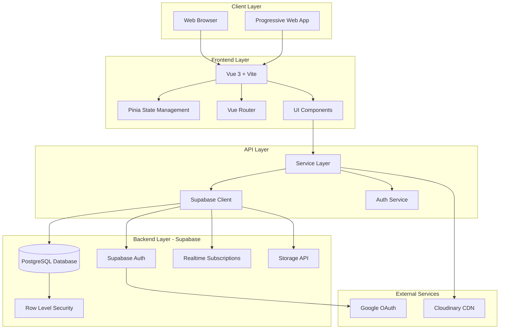

**Key Characteristics:**
- **Architecture Pattern**: JAMstack (JavaScript, APIs, Markup)
- **Frontend**: Vue 3 SPA with Vite bundler
- **Backend**: Serverless (Supabase)
- **Database**: PostgreSQL with Row Level Security
- **Real-time**: WebSocket-based subscriptions
- **Storage**: Cloudinary CDN for images

---

## Component Diagram

### Frontend Component Architecture

```mermaid
graph TB
    subgraph "Application Layer"
        App[App.vue]
        Router[Router]
        MainLayout[MainLayout.vue]
    end
    
    subgraph "Page Components"
        Closet[Closet.vue]
        Catalog[Catalog.vue]
        Suggestions[OutfitSuggestions.vue]
        Feed[SocialFeed.vue]
        Notifications[Notifications.vue]
        Friends[Friends.vue]
        Settings[Settings.vue]
    end
    
    subgraph "Feature Components"
        ItemCard[ItemCard.vue]
        ItemDetail[ItemDetailModal.vue]
        OutfitCard[OutfitCard.vue]
        NotificationsList[NotificationsList.vue]
        FriendsList[FriendsList.vue]
    end
    
    subgraph "UI Components"
        Spinner[Spinner.vue]
        Skeleton[Skeleton.vue]
        ProgressBar[ProgressBar.vue]
        Modal[Modal.vue]
        Toast[Toast.vue]
    end
    
    subgraph "State Management (Pinia)"
        AuthStore[Auth Store]
        ClosetStore[Closet Store]
        CatalogStore[Catalog Store]
        SocialStore[Social Store]
        NotificationsStore[Notifications Store]
    end
    
    subgraph "Services Layer"
        AuthService[auth-service.js]
        ClosetService[closet-service.js]
        CatalogService[catalog-service.js]
        SocialService[social-service.js]
        NotificationsService[notifications-service.js]
        LikesService[likes-service.js]
        OutfitGenService[outfit-generation-service.js]
    end
    
    App --> Router
    Router --> MainLayout
    MainLayout --> Closet
    MainLayout --> Catalog
    MainLayout --> Suggestions
    MainLayout --> Feed
    MainLayout --> Notifications
    MainLayout --> Friends
    MainLayout --> Settings
    
    Closet --> ItemCard
    Closet --> ItemDetail
    Catalog --> ItemCard
    Suggestions --> OutfitCard
    Feed --> OutfitCard
    Notifications --> NotificationsList
    Friends --> FriendsList
    
    ItemCard --> Spinner
    ItemCard --> Modal
    OutfitCard --> Skeleton
    NotificationsList --> Spinner
    
    Closet --> ClosetStore
    Catalog --> CatalogStore
    Feed --> SocialStore
    Notifications --> NotificationsStore
    
    ClosetStore --> ClosetService
    CatalogStore --> CatalogService
    SocialStore --> SocialService
    NotificationsStore --> NotificationsService
    
    AuthService --> AuthStore
```

---

## Class Diagrams

### Services Class Diagram

```mermaid
classDiagram
    class BaseService {
        +supabase: SupabaseClient
        +handleError(error): void
        +getCurrentUser(): User
    }
    
    class ClosetService {
        +fetchItems(filters): Promise~Item[]~
        +addItem(itemData): Promise~Item~
        +updateItem(id, updates): Promise~Item~
        +deleteItem(id): Promise~void~
        +restoreItem(id): Promise~void~
        +getQuotaInfo(): Promise~QuotaInfo~
    }
    
    class CatalogService {
        +browse(options): Promise~CatalogItem[]~
        +search(query, filters): Promise~CatalogItem[]~
        +getItemById(id): Promise~CatalogItem~
        +addToCloset(catalogItemId): Promise~Item~
    }
    
    class SocialService {
        +getFeed(options): Promise~FeedResponse~
        +shareOutfit(outfitData): Promise~Outfit~
        +likeOutfit(outfitId): Promise~void~
        +unlikeOutfit(outfitId): Promise~void~
        +commentOnOutfit(outfitId, comment): Promise~Comment~
    }
    
    class NotificationsService {
        +getNotifications(options): Promise~Notification[]~
        +getUnreadCount(): Promise~number~
        +markAsRead(notificationId): Promise~void~
        +markAllAsRead(): Promise~void~
        +subscribeToNotifications(userId, callback): Subscription
    }
    
    class OutfitGenerationService {
        +generateOutfits(options): Promise~GeneratedOutfit[]~
        +groupItemsByCategory(items): CategoryGroups
        +scoreOutfit(outfit): number
        +filterByContext(outfits, context): Outfit[]
    }
    
    class FriendSuggestionsService {
        +createSuggestion(data): Promise~Suggestion~
        +getReceivedSuggestions(): Promise~Suggestion[]~
        +approveSuggestion(id): Promise~Outfit~
        +rejectSuggestion(id): Promise~void~
    }
    
    class LikesService {
        +likeClosetItem(itemId): Promise~void~
        +unlikeClosetItem(itemId): Promise~void~
        +hasUserLikedClosetItem(itemId): Promise~boolean~
        +getClosetItemLikers(itemId): Promise~User[]~
        +toggleClosetItemLike(itemId): Promise~void~
    }
    
    BaseService <|-- ClosetService
    BaseService <|-- CatalogService
    BaseService <|-- SocialService
    BaseService <|-- NotificationsService
    BaseService <|-- OutfitGenerationService
    BaseService <|-- FriendSuggestionsService
    BaseService <|-- LikesService
```

### Store Class Diagram

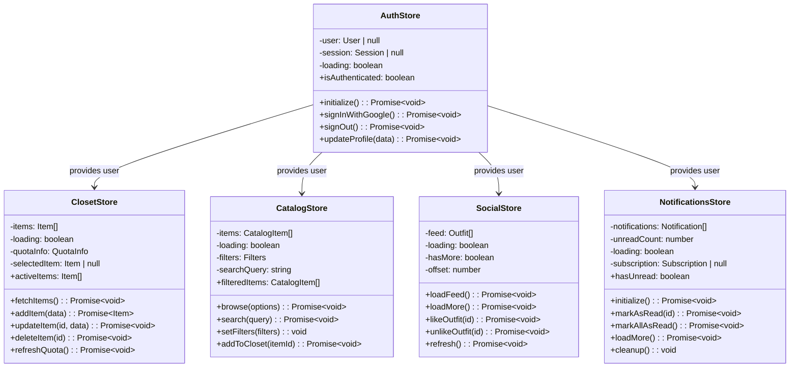

### Domain Models

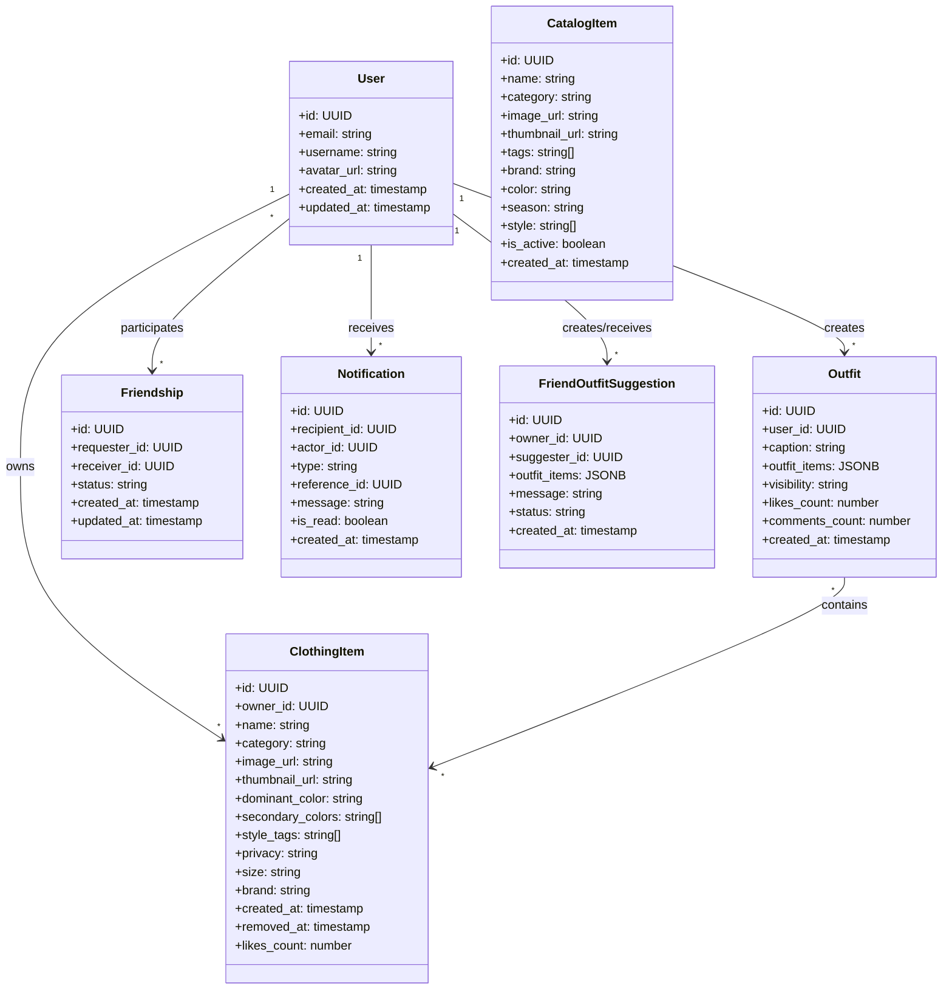

---

## Sequence Diagrams

### Authentication Sequence

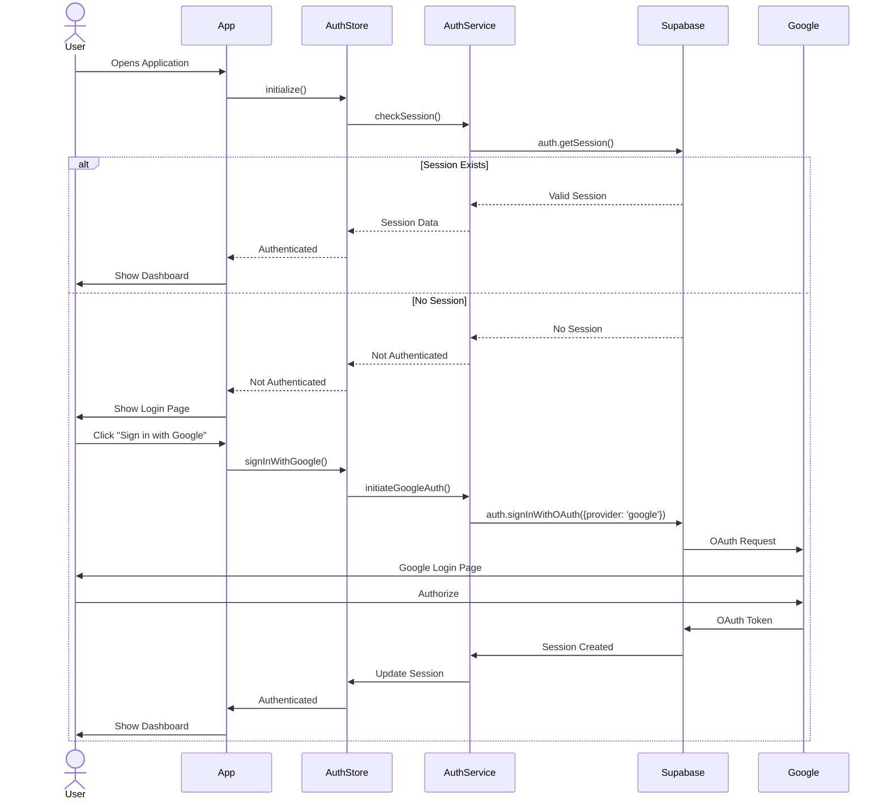

### Adding Item Sequence

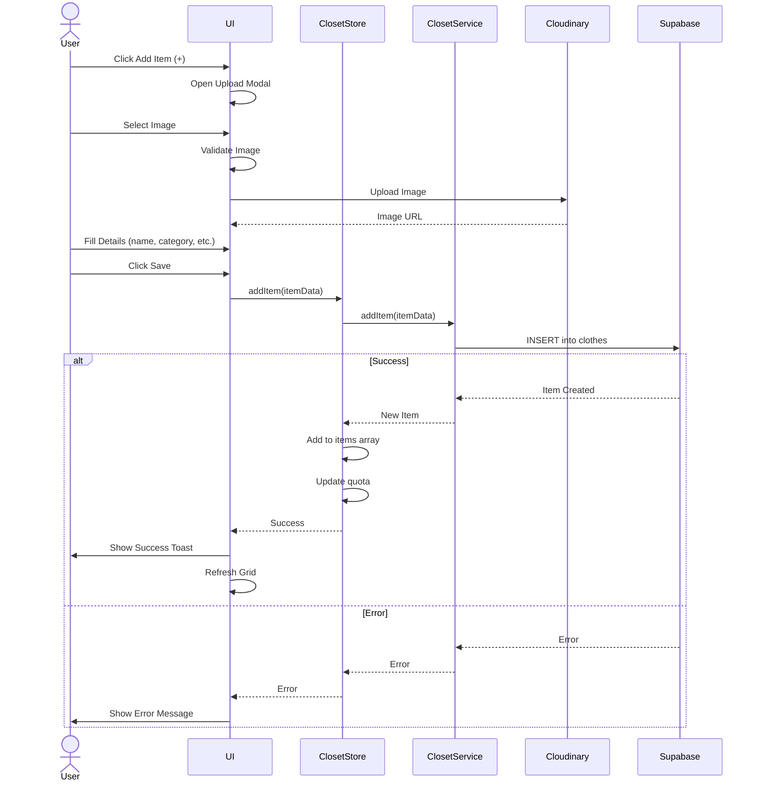

### Real-Time Notification Sequence

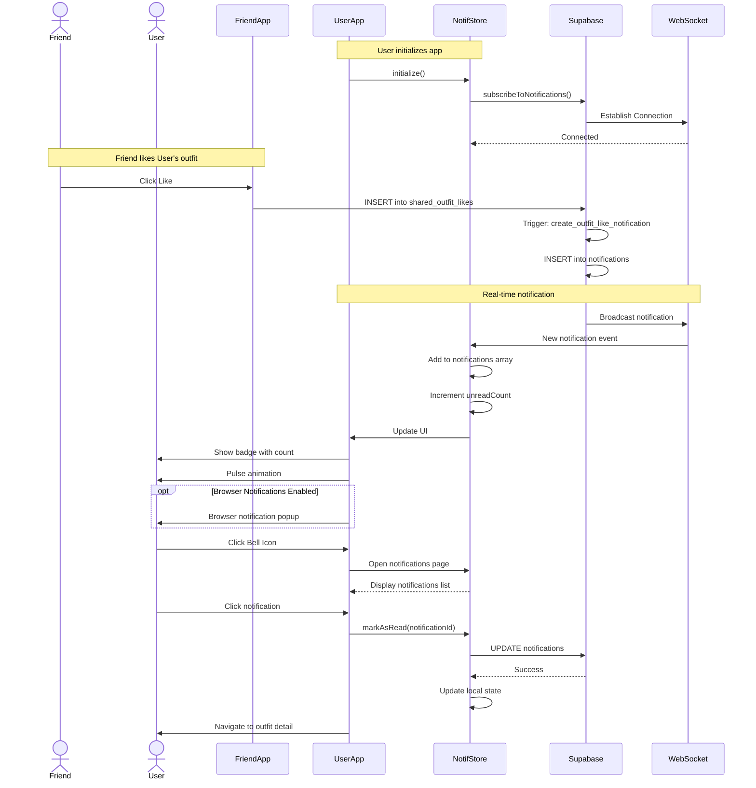

### Outfit Generation Sequence

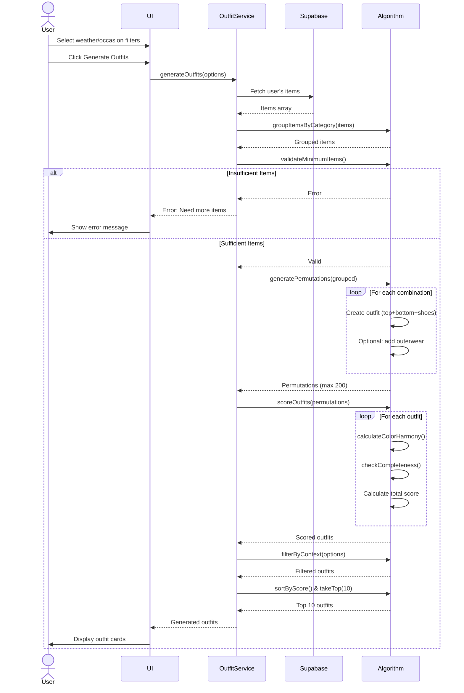

---

## State Diagrams

### Item Lifecycle State Machine

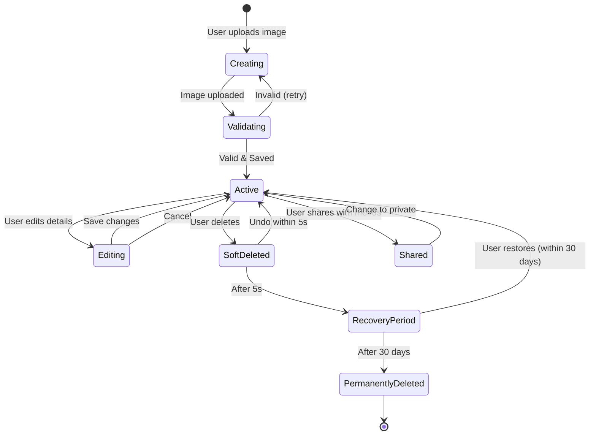

### Friendship State Machine

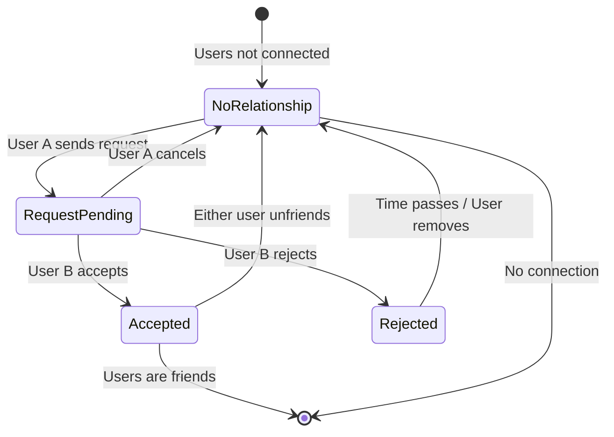

### Notification State Machine

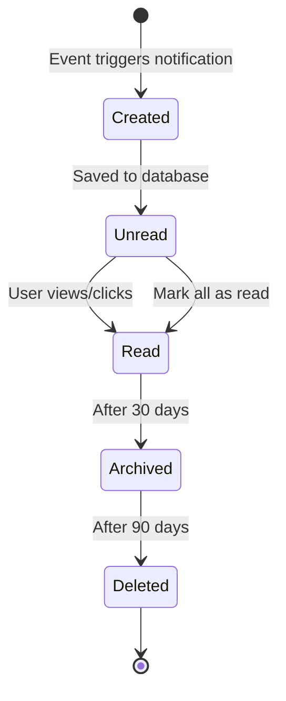

---

## Deployment Architecture

### Production Deployment Diagram

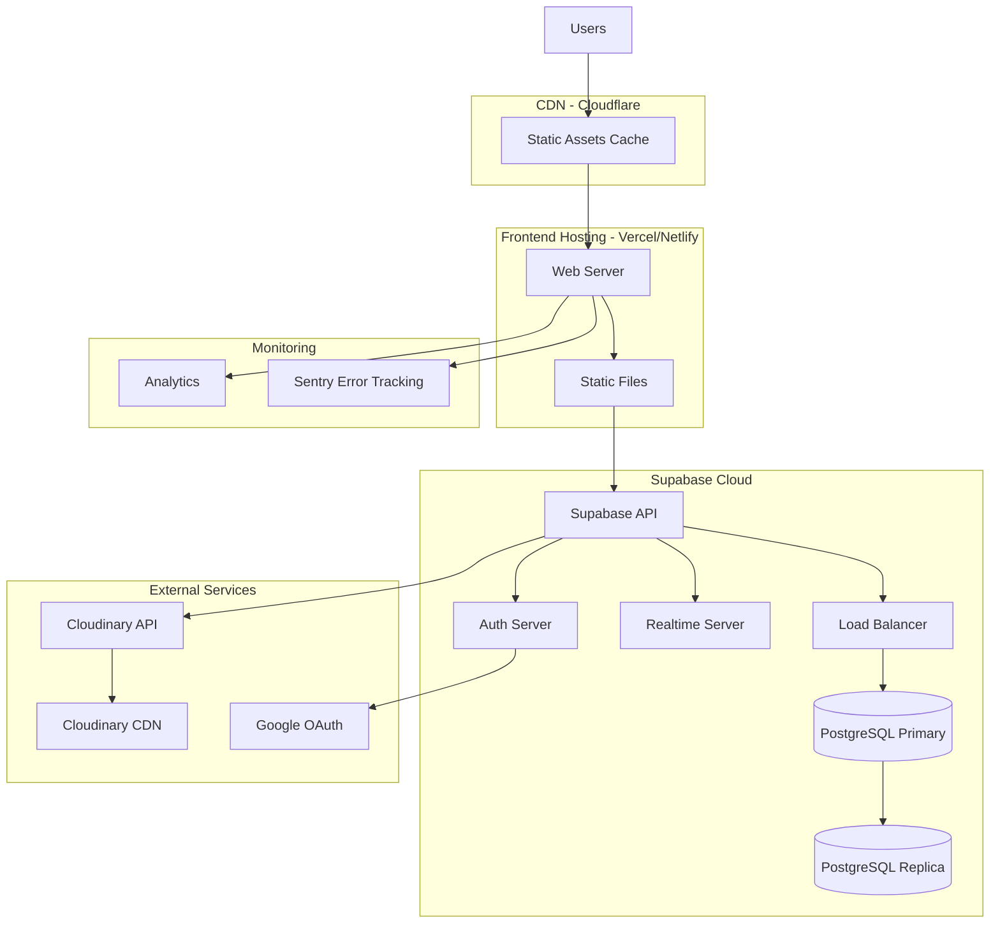

### Infrastructure Components

**Frontend:**
- **Hosting**: Vercel or Netlify
- **CDN**: Cloudflare
- **Build**: Vite production build
- **Deployment**: Git-based (auto-deploy on push)

**Backend (Supabase):**
- **Database**: PostgreSQL 15+ with read replicas
- **API**: Auto-generated REST & GraphQL APIs
- **Real-time**: WebSocket server for subscriptions
- **Auth**: Supabase Auth with Google OAuth
- **Storage**: Supabase Storage (optional, using Cloudinary instead)

**External Services:**
- **Cloudinary**: Image hosting and transformation
- **Google OAuth**: Authentication provider
- **Sentry**: Error tracking and monitoring
- **Analytics**: User behavior tracking

---

## Technology Stack

### Frontend Technologies
```
Vue 3.4+                    # Progressive framework
Vite 5+                     # Build tool
Pinia 2+                    # State management
Vue Router 4+               # Client-side routing
TailwindCSS 3+              # Utility-first CSS
Headless UI                 # Accessible components
date-fns                    # Date utilities
```

### Backend Technologies
```
Supabase                    # Backend-as-a-Service
PostgreSQL 15+              # Relational database
PostgREST                   # Automatic REST API
Realtime                    # WebSocket server
pgvector (optional)         # Vector similarity search
```

### Development Tools
```
ESLint                      # Linting
Prettier                    # Code formatting
Vitest                      # Unit testing
Playwright                  # E2E testing
Husky                       # Git hooks
```

---

## Design Patterns

### Service Layer Pattern
All API calls go through dedicated service modules:
```
Component → Store → Service → Supabase
```

### Repository Pattern
Services act as repositories for data access:
```js
// Abstract data access
class ClosetRepository {
  async findAll() { /* ... */ }
  async findById(id) { /* ... */ }
  async create(data) { /* ... */ }
  async update(id, data) { /* ... */ }
  async delete(id) { /* ... */ }
}
```

### Observer Pattern (Real-time)
WebSocket subscriptions for real-time updates:
```js
// Subscribe to changes
const subscription = supabase
  .channel('notifications')
  .on('postgres_changes', { event: 'INSERT' }, (payload) => {
    // Handle new notification
  })
  .subscribe()
```

### Factory Pattern (Outfit Generation)
Generate outfits using factory methods:
```js
class OutfitFactory {
  static create(items, options) {
    const outfit = new Outfit()
    outfit.addItems(items)
    outfit.setContext(options)
    return outfit
  }
}
```

---

## Security Architecture

### Row Level Security (RLS)
```sql
-- Users can only see their own items
CREATE POLICY "Users own items"
ON clothes FOR ALL
USING (owner_id = auth.uid());

-- Users can see friends' shared items
CREATE POLICY "Users see friends items"
ON clothes FOR SELECT
USING (
  privacy = 'friends'
  AND owner_id IN (SELECT friend_id FROM friends WHERE user_id = auth.uid())
);
```

### Authentication Flow
```
User → Google OAuth → Supabase Auth → JWT Token → API Requests
```

### API Security
- JWT tokens for authentication
- RLS policies for authorization
- HTTPS only
- CORS configuration
- Rate limiting (Supabase built-in)

---

## Performance Optimization

### Frontend
- **Code Splitting**: Lazy load routes
- **Image Optimization**: Cloudinary transformations
- **Caching**: Service worker cache
- **Virtual Scrolling**: Large lists
- **Debouncing**: Search inputs

### Backend
- **Indexing**: Strategic database indexes
- **Connection Pooling**: Supabase Pooler
- **Query Optimization**: Efficient SQL queries
- **CDN**: Static asset caching
- **Read Replicas**: Scale read operations

---

## Related Documentation
- [User Flows](./USER_FLOWS.md) - User journey diagrams
- [Database Guide](../DATABASE_GUIDE.md) - Complete database setup, schema, and ER diagrams
- [API Reference](./API_REFERENCE.md) - API documentation
- [Deployment](./DEPLOYMENT.md) - Deployment guide

---

## Status: COMPLETE ✅
Complete system architecture documented with UML diagrams!
