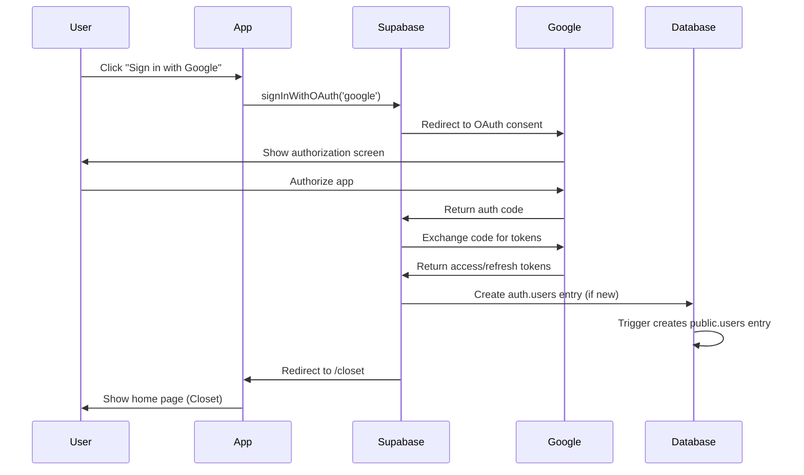

# 🔐 Authentication Guide

## Overview
StyleSnap uses **Google OAuth 2.0 exclusively** for authentication via Supabase Auth. No email/password, magic links, or other authentication methods are supported.

---

## Features
- Google OAuth 2.0 (SSO) only
- Automatic user profile creation
- Secure session management (IndexedDB with localStorage fallback)
- Auto-refresh tokens
- Row Level Security (RLS) integration
- Soft delete support

---

## Authentication Flow

### Sign In / Sign Up Process

Both `/login` and `/register` pages use the same Google OAuth flow:



### Key Points
1. **Single OAuth method**: Both login and registration use `signInWithGoogle()`
2. **Auto-registration**: New users are automatically registered on first sign-in
3. **Profile creation**: Database trigger creates `public.users` entry linked to `auth.users`
4. **Post-auth redirect**: Users always land on `/closet` after authentication

---

## Database Schema

### Users Table

```sql
CREATE TABLE users (
    id UUID PRIMARY KEY DEFAULT gen_random_uuid(),
    email VARCHAR(255) UNIQUE NOT NULL,
    username VARCHAR(255) NOT NULL,        -- Auto-generated from email
    name VARCHAR(255),                     -- Full name from Google
    avatar_url TEXT,                       -- Google photo or default avatar
    google_id VARCHAR(255) UNIQUE,         -- Google OAuth provider ID
    removed_at TIMESTAMP WITH TIME ZONE,   -- Soft delete timestamp
    created_at TIMESTAMP WITH TIME ZONE DEFAULT NOW(),
    updated_at TIMESTAMP WITH TIME ZONE DEFAULT NOW()
);
```

### Field Details

| Field | Type | Description | Mutable |
|-------|------|-------------|---------|
| `id` | UUID | Matches `auth.users.id` for RLS | No |
| `email` | VARCHAR(255) | Google account email | No |
| `username` | VARCHAR(255) | Auto-generated from email (part before @) | No |
| `name` | VARCHAR(255) | Full name from Google OAuth | No |
| `avatar_url` | TEXT | Default avatar path or Google photo URL | Yes |
| `google_id` | VARCHAR(255) | Google OAuth provider ID | No |
| `removed_at` | TIMESTAMP | NULL = active, timestamp = soft deleted | System |

### Avatar System

**Default Avatars**: 6 pre-loaded options in `/public/avatars/`
- `default-1.png` through `default-6.png`

**Avatar Sources**:
1. Google profile photo (default on sign-up)
2. User-selected default avatar
3. Future: Custom uploaded avatars via Cloudinary

---

## Session Management

### Token Storage
- **Primary**: IndexedDB (secure, persistent)
- **Fallback**: localStorage
- **Managed by**: Supabase client automatically

### Token Lifecycle

| Token Type | Duration | Purpose | Auto-Refresh |
|------------|----------|---------|--------------|
| Access Token | 1 hour | API authentication | Yes |
| Refresh Token | 30 days | Obtain new access tokens | No |

### Auto-Refresh Behavior
```javascript
// Supabase client handles this automatically
// Refresh occurs ~5 minutes before expiry
// App doesn't need to manage refresh logic
```

---

## API Service

### File: `src/services/auth-service.js`

#### Functions

##### `signInWithGoogle()`
Initiates Google OAuth flow for both login and registration.

```javascript
import { signInWithGoogle } from '@/services/auth-service'

// In Login.vue or Register.vue
async function handleGoogleSignIn() {
  try {
    await signInWithGoogle()
    // User redirected to /closet automatically
  } catch (error) {
    console.error('Sign in failed:', error)
  }
}
```

**Options**:
```javascript
signInWithOAuth({
  provider: 'google',
  options: {
    redirectTo: `${window.location.origin}/closet`
  }
})
```

---

##### `signOut()`
Signs out current user and clears session.

```javascript
import { signOut } from '@/services/auth-service'

async function handleSignOut() {
  try {
    await signOut()
    // Redirect to /login in your component
    router.push('/login')
  } catch (error) {
    console.error('Sign out failed:', error)
  }
}
```

---

##### `getCurrentUser()`
Gets currently authenticated user from session.

```javascript
import { getCurrentUser } from '@/services/auth-service'

const user = await getCurrentUser()
// Returns: { id, email, user_metadata: { name, avatar_url, ... }, ... }
// Returns: null if not authenticated
```

**Response Structure**:
```json
{
  "id": "uuid",
  "email": "user@example.com",
  "user_metadata": {
    "full_name": "John Doe",
    "avatar_url": "https://lh3.googleusercontent.com/...",
    "email_verified": true,
    "provider_id": "google-oauth-id"
  },
  "created_at": "2025-01-01T00:00:00Z"
}
```

---

##### `getSession()`
Gets current Supabase session with tokens.

```javascript
import { getSession } from '@/services/auth-service'

const session = await getSession()
// Returns: { access_token, refresh_token, user, expires_at, ... }
```

---

##### `refreshSession()`
Manually refresh session tokens (rarely needed - auto-refreshes).

```javascript
import { refreshSession } from '@/services/auth-service'

const session = await refreshSession()
```

---

##### `onAuthStateChange(callback)`
Subscribe to authentication state changes.

```javascript
import { onAuthStateChange } from '@/services/auth-service'

const subscription = onAuthStateChange((event, session) => {
  console.log('Auth event:', event) // 'SIGNED_IN', 'SIGNED_OUT', 'TOKEN_REFRESHED'
  console.log('Session:', session)
})

// Cleanup on component unmount
subscription.unsubscribe()
```

**Events**:
- `SIGNED_IN` - User signed in
- `SIGNED_OUT` - User signed out
- `TOKEN_REFRESHED` - Access token refreshed
- `USER_UPDATED` - User metadata updated

---

## Row Level Security (RLS)

### How RLS Works with Auth

Supabase Auth provides `auth.uid()` function that returns the authenticated user's UUID.

**Example Policy**:
```sql
-- Users can only view their own closet items
CREATE POLICY "Users can view own clothes"
  ON clothes FOR SELECT
  USING (owner_id = auth.uid());

-- Users can insert their own items
CREATE POLICY "Users can insert own clothes"
  ON clothes FOR INSERT
  WITH CHECK (owner_id = auth.uid());
```

### Critical for Security
- **ALL tables** have RLS enabled
- **ALL operations** check `auth.uid()` in policies
- **No direct database access** without authentication
- See `sql/002_rls_policies.sql` for complete policies

---

## Environment Variables

### Required in `.env`

```bash
VITE_SUPABASE_URL=https://your-project.supabase.co
VITE_SUPABASE_ANON_KEY=your-anon-key
```

### Supabase Dashboard Setup

1. **Enable Google Provider**
   - Navigate to: Authentication > Providers
   - Enable "Google"
   - Add Client ID and Client Secret from Google Cloud Console

2. **Configure Google OAuth**
   - Google Cloud Console: https://console.cloud.google.com
   - Create OAuth 2.0 Client ID
   - Authorized redirect URI: `https://YOUR-PROJECT.supabase.co/auth/v1/callback`

3. **Site URL** (Supabase Dashboard)
   - Development: `http://localhost:5173`
   - Production: `https://yourdomain.com`

---

## Router Integration

### Protected Routes

```javascript
// src/router.js
import { getCurrentUser } from '@/services/auth-service'

router.beforeEach(async (to, from, next) => {
  const user = await getCurrentUser()
  
  // Redirect to login if not authenticated
  if (!user && to.path !== '/login') {
    next('/login')
  }
  // Redirect to closet if already authenticated
  else if (user && to.path === '/login') {
    next('/closet')
  }
  else {
    next()
  }
})
```

---

## User Profile Management

### Updating Profile

Users can update:
- Avatar (select default or use Google photo)
- Display preferences (via Settings page)

Users **cannot** update:
- Email (tied to Google account)
- Username (auto-generated, immutable)
- Name (from Google OAuth, immutable)

```javascript
// Example: Update avatar
import { supabase } from '@/services/auth-service'

async function updateAvatar(avatarUrl) {
  const { error } = await supabase
    .from('users')
    .update({ avatar_url: avatarUrl })
    .eq('id', user.id)
    
  if (error) throw error
}
```

---

## Soft Delete

### User Account Deletion

When users delete their account:
1. `removed_at` timestamp set to current time
2. User cannot sign in (blocked at app level)
3. Data retained for 30 days for recovery
4. After 30 days, cleanup script permanently deletes

```sql
-- Soft delete user
UPDATE users
SET removed_at = NOW()
WHERE id = auth.uid();

-- Restore user (within 30 days)
UPDATE users
SET removed_at = NULL
WHERE id = auth.uid();
```

---

## Error Handling

### Common Errors

| Error | Cause | Solution |
|-------|-------|----------|
| `Invalid login credentials` | User not found in Supabase | Check Google OAuth setup |
| `Missing Supabase credentials` | .env not configured | Add VITE_SUPABASE_URL and VITE_SUPABASE_ANON_KEY |
| `Redirect URI mismatch` | Google OAuth config | Update authorized redirect URI in Google Console |
| `Session expired` | Tokens expired | Call `refreshSession()` or re-authenticate |

### Error Handling Pattern

```javascript
try {
  await signInWithGoogle()
} catch (error) {
  if (error.message.includes('credentials')) {
    // Handle auth failure
  } else if (error.message.includes('network')) {
    // Handle network error
  } else {
    // Generic error
  }
}
```

---

## Security Best Practices

1. **Never expose service role key** - Only use anon key in frontend
2. **Always use RLS** - Never bypass with service role in production
3. **Validate on backend** - Don't trust client-side checks alone
4. **Use HTTPS** - Required for OAuth in production
5. **Rotate keys periodically** - Update anon key if compromised

---

## Testing Authentication

### Manual Testing Checklist

- [ ] Sign in with Google on `/login`
- [ ] Sign up (new user) with Google on `/register`
- [ ] Verify redirect to `/closet` after auth
- [ ] Verify user profile created in `public.users`
- [ ] Verify avatar from Google photo displayed
- [ ] Sign out and verify redirect to `/login`
- [ ] Verify session persists after page reload
- [ ] Verify protected routes require authentication
- [ ] Test token refresh after 1 hour

### Unit Tests

See `tests/unit/auth-service.test.js` for comprehensive test suite.

---

## Related Documentation

- **API Guide**: [API_GUIDE.md](../API_GUIDE.md#authentication--authorization) - Auth API endpoints
- **Database Setup**: [DATABASE_GUIDE.md](../DATABASE_GUIDE.md) - Schema and migrations
- **Security**: [requirements/security.md](../requirements/security.md) - Security requirements
- **Tasks**: [tasks/02-authentication-database.md](../tasks/02-authentication-database.md) - Auth implementation task

---

## Troubleshooting

### Issue: "Redirect URI mismatch"

**Cause**: Google OAuth redirect URI not configured correctly.

**Fix**:
1. Go to Google Cloud Console > APIs & Services > Credentials
2. Edit OAuth 2.0 Client ID
3. Add authorized redirect URI: `https://YOUR-PROJECT.supabase.co/auth/v1/callback`
4. Save changes

---

### Issue: Session not persisting

**Cause**: Browser blocking IndexedDB or localStorage.

**Fix**:
1. Check browser privacy settings
2. Allow third-party cookies for Supabase domain
3. Test in incognito mode to rule out extensions

---

### Issue: User profile not created

**Cause**: Database trigger not running.

**Fix**:
1. Check `sql/001_initial_schema.sql` trigger exists
2. Manually create entry if needed:
```sql
INSERT INTO users (id, email, username, name, avatar_url, google_id)
VALUES (
  auth.uid(),
  'user@example.com',
  'username',
  'Full Name',
  'https://avatar-url',
  'google-oauth-id'
);
```

---

## Status

✅ **Production Ready**

**Last Updated**: October 8, 2025
