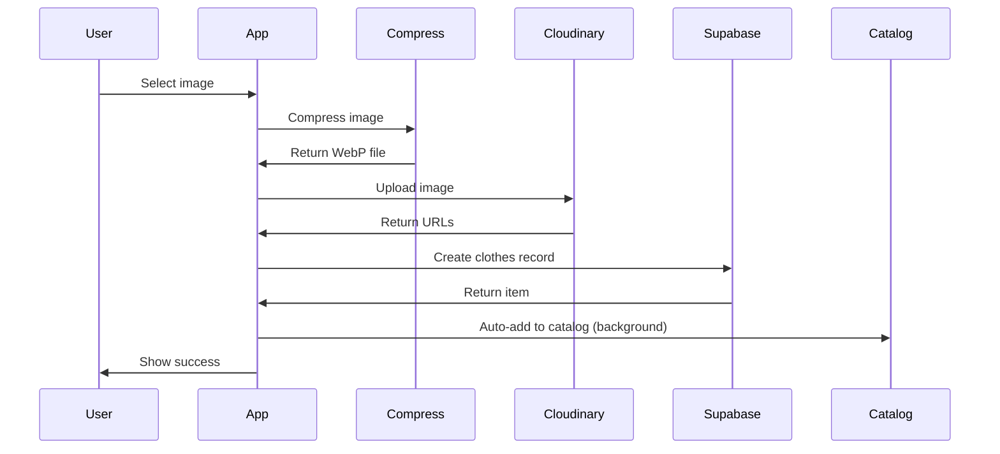
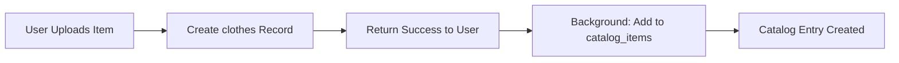

# 👔 Closet Management Guide

## Overview

The Closet feature is the core of StyleSnap - a digital wardrobe where users can upload, organize, and manage their clothing items. Each user can store up to 200 items total: 50 uploaded items + unlimited items added from the catalog.

---

## Features

- Upload clothing items with images
- 200-item total capacity (50 uploads + unlimited catalog)
- Automatic image optimization (WebP format)
- Soft delete with 30-day recovery period
- Favorite/unfavorite items
- Filter by category, type, favorites, color
- Search by name or brand
- Item statistics (days in closet, times worn, etc.)
- Privacy controls (private or friends-visible)
- Auto-contribute uploads to catalog (anonymous)

---

## Quota System

### Limits

| Type | Limit | Description |
|------|-------|-------------|
| **Uploaded Items** | 50 | Items uploaded by user via camera/file picker |
| **Catalog Items** | Unlimited | Items added from pre-populated catalog |
| **Total Items** | 200 | Combined uploads + catalog items |
| **Recovery Period** | 30 days | Soft-deleted items kept for recovery |

### Why Two Quotas?

1. **Upload Quota (50 items)**: Limits storage/bandwidth costs from user uploads
2. **Total Quota (200 items)**: Prevents database bloat and maintains performance
3. **Catalog (Unlimited)**: Encourages catalog use (shared images, no upload costs)

### Quota Enforcement

```javascript
// Check before upload
const uploadCount = await getUploadCount() // Items NOT from catalog
if (uploadCount >= 50) {
  throw new Error('Upload limit reached. Add from catalog instead!')
}

// Check before catalog add
const totalCount = await getItemCount() // All items
if (totalCount >= 200) {
  throw new Error('Closet is full (200 items max)')
}
```

---

## Database Schema

### Clothes Table

```sql
CREATE TABLE clothes (
  id UUID PRIMARY KEY DEFAULT gen_random_uuid(),
  owner_id UUID REFERENCES users(id) ON DELETE CASCADE,
  name VARCHAR(255) NOT NULL,
  category VARCHAR(50) CHECK (category IN ('top', 'bottom', 'outerwear', 'shoes', 'accessory', 'dress', 'bag')),
  clothing_type VARCHAR(50),                    -- Detailed type (t-shirt, jeans, etc.)
  image_url TEXT NOT NULL,                      -- Full-resolution image
  thumbnail_url TEXT,                           -- Optimized thumbnail
  style_tags TEXT[],                            -- Array of style keywords
  privacy VARCHAR(20) DEFAULT 'friends' CHECK (privacy IN ('private', 'friends')),
  size VARCHAR(20),
  brand VARCHAR(100),
  primary_color VARCHAR(50),                    -- Detected dominant color
  secondary_colors VARCHAR(50)[],               -- Additional colors
  is_favorite BOOLEAN DEFAULT false,            -- Favorited by user
  catalog_item_id UUID REFERENCES catalog_items(id),  -- Link to catalog (if from catalog)
  removed_at TIMESTAMP WITH TIME ZONE,          -- Soft delete timestamp
  created_at TIMESTAMP WITH TIME ZONE DEFAULT NOW(),
  updated_at TIMESTAMP WITH TIME ZONE DEFAULT NOW()
);
```

### Key Fields

| Field | Type | Description | Editable |
|-------|------|-------------|----------|
| `id` | UUID | Unique identifier | No |
| `owner_id` | UUID | User who owns item | No |
| `name` | VARCHAR(255) | Item name | Yes |
| `category` | VARCHAR(50) | General category | Yes |
| `clothing_type` | VARCHAR(50) | Specific type (20 options) | Yes |
| `image_url` | TEXT | Cloudinary full image URL | No* |
| `thumbnail_url` | TEXT | Cloudinary thumbnail URL | No* |
| `style_tags` | TEXT[] | Style keywords array | Yes |
| `privacy` | VARCHAR(20) | 'private' or 'friends' | Yes |
| `size` | VARCHAR(20) | Clothing size | Yes |
| `brand` | VARCHAR(100) | Brand name | Yes |
| `primary_color` | VARCHAR(50) | AI-detected main color | Yes |
| `secondary_colors` | VARCHAR(50)[] | Additional colors | Yes |
| `is_favorite` | BOOLEAN | Favorite status | Yes |
| `catalog_item_id` | UUID | Link to catalog source | No |
| `removed_at` | TIMESTAMP | NULL = active | System |

\* Image URLs cannot be changed (must delete and re-upload)

---

## Image Upload System

### Upload Flow



### Image Processing

**Client-Side Compression** (`utils/image-compression.js`):
1. Max dimensions: 1080x1080px
2. Format: WebP
3. Quality: 85%
4. Max file size: 800KB

**Cloudinary Transformations**:
```javascript
// Full image URL
https://res.cloudinary.com/{cloud}/image/upload/f_webp,q_auto:good/{public_id}.webp

// Thumbnail URL (400x400)
https://res.cloudinary.com/{cloud}/image/upload/f_webp,q_auto:good,w_400,h_400,c_fill/{public_id}.webp
```

### Upload Function

```javascript
import { uploadImage } from '@/services/clothes-service'

async function handleImageUpload(file) {
  try {
    const { url, thumbnail_url, public_id } = await uploadImage(file)
    
    // Use these URLs to create item
    return {
      image_url: url,
      thumbnail_url: thumbnail_url
    }
  } catch (error) {
    console.error('Upload failed:', error)
  }
}
```

---

## API Service

### File: `src/services/clothes-service.js`

#### Core Functions

##### `getItems(filters)`

Fetch user's closet items with optional filters.

```javascript
import { getItems } from '@/services/clothes-service'

const items = await getItems({
  category: 'top',          // Filter by category
  clothing_type: 't-shirt', // Filter by specific type
  is_favorite: true,        // Only favorites
  search: 'nike',           // Search name/brand
  sort: 'recent'            // Sort: 'recent', 'name', 'category'
})
```

**Response**:
```json
[
  {
    "id": "uuid",
    "owner_id": "uuid",
    "name": "Blue T-Shirt",
    "category": "top",
    "clothing_type": "t-shirt",
    "image_url": "https://...",
    "thumbnail_url": "https://...",
    "style_tags": ["casual", "summer"],
    "privacy": "friends",
    "size": "M",
    "brand": "Nike",
    "primary_color": "blue",
    "secondary_colors": ["white"],
    "is_favorite": false,
    "catalog_item_id": null,
    "removed_at": null,
    "created_at": "2025-01-01T00:00:00Z",
    "updated_at": "2025-01-01T00:00:00Z"
  }
]
```

---

##### `getItem(id)`

Get single item by ID.

```javascript
import { getItem } from '@/services/clothes-service'

const item = await getItem('item-uuid')
```

---

##### `createItem(itemData)`

Create new clothing item (requires uploaded image).

```javascript
import { createItem, uploadImage } from '@/services/clothes-service'

// 1. Upload image first
const { url, thumbnail_url } = await uploadImage(imageFile)

// 2. Create item
const newItem = await createItem({
  name: 'Blue Denim Jacket',
  category: 'outerwear',
  clothing_type: 'jacket',
  image_url: url,
  thumbnail_url: thumbnail_url,
  style_tags: ['casual', 'denim'],
  privacy: 'friends',
  size: 'L',
  brand: "Levi's",
  primary_color: 'blue',
  secondary_colors: ['white']
})
```

**Quota Check**: Throws error if upload quota (50) exceeded.

---

##### `updateItem(id, updates)`

Update existing item fields.

```javascript
import { updateItem } from '@/services/clothes-service'

const updated = await updateItem('item-uuid', {
  name: 'Updated Name',
  category: 'top',
  privacy: 'private',
  is_favorite: true
})
```

**Note**: Cannot update `image_url` or `thumbnail_url` (must delete and re-upload).

---

##### `deleteItem(id)`

Soft delete item (30-day recovery period).

```javascript
import { deleteItem } from '@/services/clothes-service'

await deleteItem('item-uuid')
// Item marked with removed_at timestamp
// Still in database for 30 days
// Cleanup script runs monthly to permanently delete old items
```

---

##### `toggleFavorite(id, isFavorite)`

Toggle favorite status.

```javascript
import { toggleFavorite } from '@/services/clothes-service'

// Add to favorites
await toggleFavorite('item-uuid', true)

// Remove from favorites
await toggleFavorite('item-uuid', false)
```

---

##### `getItemDetails(id)`

Get item with statistics.

```javascript
import { getItemDetails } from '@/services/clothes-service'

const details = await getItemDetails('item-uuid')
```

**Response**:
```json
{
  "id": "uuid",
  "name": "Blue T-Shirt",
  "category": "top",
  "...": "...",
  "statistics": {
    "days_in_closet": 45,
    "times_worn": 12,
    "last_worn": "2025-10-01",
    "in_outfits": 8,
    "times_shared": 3
  }
}
```

---

##### `getUserCategories()`

Get unique categories in user's closet.

```javascript
import { getUserCategories } from '@/services/clothes-service'

const categories = await getUserCategories()
// Returns: ['top', 'bottom', 'outerwear']
```

---

##### `getItemCount()`

Get total item count (for quota checking).

```javascript
import { getItemCount } from '@/services/clothes-service'

const count = await getItemCount()
console.log(`${count} / 200 items`)
```

---

## Categories & Types

### 7 Main Categories

| Category | Description | Examples |
|----------|-------------|----------|
| `top` | Upper body clothing | T-shirts, hoodies, blouses |
| `bottom` | Lower body clothing | Jeans, shorts, skirts |
| `outerwear` | Jackets & coats | Blazers, winter coats |
| `shoes` | Footwear | Sneakers, boots, heels |
| `accessory` | Accessories | Belts, hats, scarves |
| `dress` | One-piece outfits | Dresses, jumpsuits |
| `bag` | Bags & purses | Backpacks, handbags |

### 20 Detailed Clothing Types

See [CATEGORIES_GUIDE.md](./CATEGORIES_GUIDE.md) for complete list.

**Examples**:
- `top` → `t-shirt`, `hoodie`, `blouse`, `polo`, `longsleeve`
- `bottom` → `pants`, `shorts`, `skirt`
- `outerwear` → `blazer`, `outerwear`

---

## Privacy Settings

### Privacy Levels

| Level | Description | Visible To |
|-------|-------------|------------|
| `private` | Hidden from everyone | Owner only |
| `friends` | Visible to accepted friends | Owner + friends |

### Use Cases

**Private Items**:
- Underwear
- Items you're unsure about
- Items not ready for sharing

**Friends Items**:
- Regular wardrobe items
- Items you'd recommend
- Outfit components

### Privacy in Features

| Feature | Respects Privacy | Notes |
|---------|------------------|-------|
| Closet View | Yes | Private items show lock icon |
| Outfit Generation | Yes | Can include private items |
| Social Feed | Yes | Private items not shown in shared outfits |
| Friend Profile | Yes | Only friends-visible items shown |
| Catalog | N/A | Catalog has no privacy (anonymous) |

---

## Auto-Catalog Contribution

### How It Works

When a user uploads an item, it's **automatically added to the catalog** in the background:



### Key Points

1. **Silent operation**: No user prompt or confirmation
2. **Anonymous**: Catalog entry has `owner_id = NULL`
3. **Identical data**: Uses same image URLs, name, category
4. **No attribution**: Cannot trace catalog item back to user
5. **Privacy preserved**: Original closet item respects privacy settings

### Implementation

```javascript
// After successful item creation
async function createItem(itemData) {
  // 1. Create closet item
  const item = await supabase.from('clothes').insert(itemData).single()
  
  // 2. Auto-add to catalog (background, no await)
  addToCatalogInBackground(item)
  
  return item
}
```

---

## Soft Delete & Recovery

### Soft Delete Mechanism

Items are **not permanently deleted** immediately:

1. User clicks "Delete"
2. `removed_at` timestamp set to current time
3. Item hidden from UI queries (`WHERE removed_at IS NULL`)
4. Item still in database for 30 days
5. Cleanup script runs monthly to purge old deletions

### Recovery

**Manual SQL Recovery** (within 30 days):
```sql
UPDATE clothes
SET removed_at = NULL
WHERE id = 'item-uuid'
  AND removed_at > NOW() - INTERVAL '30 days';
```

### Permanent Deletion

**Cleanup Script**: `scripts/purge-old-items.js`
- Runs monthly via cron job
- Deletes items where `removed_at < NOW() - 30 days`
- Also deletes Cloudinary images via API

---

## Favorite System

### Purpose

Users can mark items as favorites for:
- Quick access to frequently worn items
- Building capsule wardrobes
- Highlighting key pieces

### UI Behavior

- **Heart icon** on item cards
- **Filled heart** = favorited
- **Empty heart** = not favorited
- Click toggles state
- Filter button shows only favorites

### Database

```sql
-- Toggle favorite
UPDATE clothes
SET is_favorite = NOT is_favorite
WHERE id = 'item-uuid';
```

---

## Filtering & Search

### Available Filters

```javascript
const filters = {
  category: 'top',            // 7 main categories
  clothing_type: 't-shirt',   // 20 detailed types
  is_favorite: true,          // Boolean
  primary_color: 'blue',      // Color filter
  search: 'nike',             // Text search (name, brand)
  sort: 'recent'              // Sort order
}
```

### Sort Options

| Option | Order | Description |
|--------|-------|-------------|
| `recent` | `created_at DESC` | Newest first (default) |
| `name` | `name ASC` | Alphabetical |
| `category` | `category ASC` | Grouped by category |

### Search Implementation

```sql
-- Search by name OR brand (case-insensitive)
WHERE name ILIKE '%query%' OR brand ILIKE '%query%'
```

---

## Statistics & Analytics

### Per-Item Statistics

Available via `getItemDetails(id)`:

| Metric | Description | Source Table |
|--------|-------------|--------------|
| `days_in_closet` | Days since creation | Calculated |
| `times_worn` | Worn count | `outfit_history` |
| `last_worn` | Last wear date | `outfit_history` |
| `in_outfits` | Generated outfit count | `outfit_generation_history` |
| `times_shared` | Shared to social feed | `shared_outfits` |

### Closet-Wide Analytics

See [ANALYTICS_GUIDE.md](./ANALYTICS_GUIDE.md) for:
- Category distribution
- Color analysis
- Wear frequency
- Cost per wear
- Seasonal trends

---

## UI Components

### File Structure

```
src/components/closet/
├── ClosetGrid.vue           # Main grid view
├── ItemCard.vue             # Individual item card
├── ItemDetail.vue           # Detail modal/page
├── ItemFilters.vue          # Filter sidebar
├── ItemUploadForm.vue       # Upload form
├── ItemEditForm.vue         # Edit form
├── FavoriteButton.vue       # Heart icon toggle
└── EmptyCloset.vue          # Empty state
```

### Key Components

#### ClosetGrid.vue

Main grid layout with masonry/grid system.

**Props**:
```javascript
{
  items: Array,           // Array of clothing items
  loading: Boolean,       // Loading state
  columns: Number         // Grid columns (1-4)
}
```

**Events**:
```javascript
@item-click="handleItemClick"
@favorite-toggle="handleFavoriteToggle"
@delete-item="handleDeleteItem"
```

---

#### ItemCard.vue

Individual item card with image, name, favorite button.

**Props**:
```javascript
{
  item: Object,           // Clothing item
  showStats: Boolean,     // Show statistics badge
  selectable: Boolean     // Checkbox for outfit builder
}
```

**Slots**:
```vue
<template #actions>
  <!-- Custom action buttons -->
</template>
```

---

#### ItemUploadForm.vue

Form for uploading new items.

**Features**:
- Image upload with preview
- Category/type selection
- Style tags input
- Privacy toggle
- Color detection integration
- Quota warning

---

## Related Features

### Outfit Generation

- Uses closet items to generate outfit combinations
- See [OUTFIT_GENERATION_GUIDE.md](./OUTFIT_GENERATION_GUIDE.md)

### Catalog Integration

- Users can add catalog items to closet
- See [CATALOG_GUIDE.md](./CATALOG_GUIDE.md)

### Color Detection

- Auto-detects colors on upload
- See [COLOR_DETECTION_GUIDE.md](./COLOR_DETECTION_GUIDE.md)

### Social Sharing

- Share closet items in outfits
- See [SOCIAL_GUIDE.md](./SOCIAL_GUIDE.md)

---

## Environment Variables

```bash
# Cloudinary (Image Upload)
VITE_CLOUDINARY_CLOUD_NAME=your-cloud-name
VITE_CLOUDINARY_UPLOAD_PRESET=your-preset

# Supabase (Database)
VITE_SUPABASE_URL=https://your-project.supabase.co
VITE_SUPABASE_ANON_KEY=your-anon-key
```

---

## Performance Considerations

### Lazy Loading

```javascript
// Load items in batches
const loadMore = async () => {
  const nextBatch = await getItems({
    offset: items.length,
    limit: 20
  })
  items.push(...nextBatch)
}
```

### Thumbnail Usage

Always use `thumbnail_url` for:
- Grid views
- Carousels
- Previews

Use `image_url` for:
- Detail views
- Full-screen modals
- Printing

### Caching

Supabase client caches queries automatically. Manually invalidate:

```javascript
// After creating/updating/deleting
await closetStore.refreshItems()
```

---

## Error Handling

### Common Errors

| Error | Cause | Solution |
|-------|-------|----------|
| `Upload limit reached` | 50 uploads exceeded | Suggest catalog |
| `Closet is full (200 items)` | Total quota exceeded | Delete items |
| `Image upload failed` | Cloudinary error | Check credentials |
| `Network error` | No internet | Show offline UI |
| `Permission denied` | RLS policy | Check auth |

### Error Handling Pattern

```javascript
try {
  await createItem(itemData)
} catch (error) {
  if (error.message.includes('limit')) {
    showQuotaWarning()
  } else if (error.message.includes('upload')) {
    showUploadError()
  } else {
    showGenericError(error.message)
  }
}
```

---

## Testing

### Unit Tests

See `tests/unit/clothes-service.test.js`:
- CRUD operations
- Quota enforcement
- Favorite toggle
- Soft delete

### Integration Tests

See `tests/integration/closet-flow.test.js`:
- Upload flow
- Filter/search
- Catalog integration
- Privacy checks

### E2E Tests

See `tests/e2e/closet.spec.js`:
- User uploads item
- User edits item
- User deletes item
- User favorites item
- User searches closet

---

## Related Documentation

- **API Guide**: [API_GUIDE.md](../API_GUIDE.md#clothes-management-api) - All API endpoints
- **Database**: [DATABASE_GUIDE.md](../DATABASE_GUIDE.md) - Schema details
- **Categories**: [CATEGORIES_GUIDE.md](./CATEGORIES_GUIDE.md) - Category system
- **Catalog**: [CATALOG_GUIDE.md](./CATALOG_GUIDE.md) - Catalog integration
- **Color Detection**: [COLOR_DETECTION_GUIDE.md](./COLOR_DETECTION_GUIDE.md) - AI color detection
- **Tasks**: [tasks/03-closet-crud-image-management.md](../tasks/03-closet-crud-image-management.md)

---

## Status

✅ **Production Ready**

**Last Updated**: October 8, 2025
