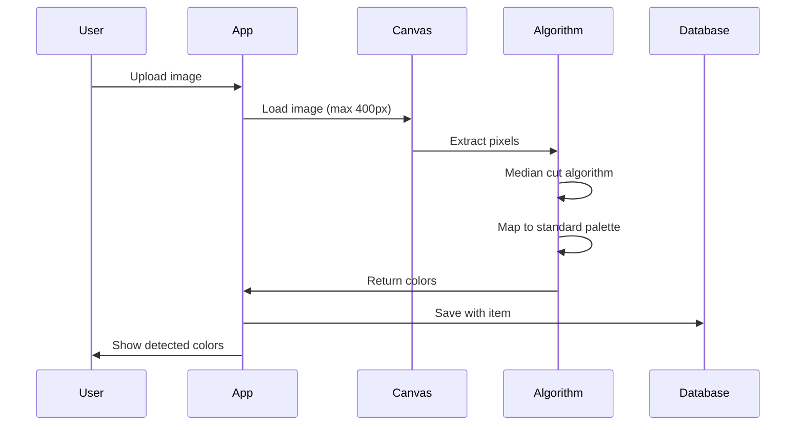

# 🎨 Color Detection Guide

## Overview

StyleSnap uses AI-powered color detection to automatically identify the dominant colors in clothing items. This enables color-based filtering, outfit harmony matching, and style recommendations.

---

## Features

- Automatic color detection on image upload
- 40+ standardized color palette
- Primary and secondary color identification
- Color harmony algorithms (complementary, analogous, triadic)
- Manual color override
- Color-based filtering and search
- Color distribution analytics
- Accessibility-friendly color names

---

## How It Works

### Detection Flow



### Algorithm Steps

1. **Image Loading**: Load image into HTML5 Canvas
2. **Resize**: Scale to max 400x400px for performance
3. **Pixel Sampling**: Sample every 10th pixel (quality=10)
4. **Color Extraction**: Median cut algorithm extracts dominant colors
5. **Palette Mapping**: Map RGB values to 40+ standard color names
6. **Ranking**: Rank by percentage coverage
7. **Primary Selection**: Most dominant color (excluding pure white/black)
8. **Secondary Selection**: Next 2-4 colors

---

## Color Palette

### 40+ Standard Colors

#### Neutrals (7 colors)
| Color | Hex | RGB | Use Case |
|-------|-----|-----|----------|
| black | #000000 | (0,0,0) | Formal, classic |
| white | #FFFFFF | (255,255,255) | Base, layering |
| gray | #808080 | (128,128,128) | Professional |
| beige | #F5F5DC | (245,245,220) | Neutral warm |
| brown | #8B4513 | (139,69,19) | Earth tones |
| charcoal | #36454F | (54,69,79) | Dark neutral |
| cream | #FFFDD0 | (255,253,208) | Soft neutral |

#### Primary Colors (3 colors)
| Color | Hex | RGB |
|-------|-----|-----|
| red | #FF0000 | (255,0,0) |
| blue | #0000FF | (0,0,255) |
| yellow | #FFFF00 | (255,255,0) |

#### Secondary Colors (4 colors)
| Color | Hex | RGB |
|-------|-----|-----|
| green | #00FF00 | (0,255,0) |
| orange | #FFA500 | (255,165,0) |
| purple | #800080 | (128,0,128) |
| pink | #FFC0CB | (255,192,203) |

#### Extended Colors (26+ colors)
- **Blues**: navy, teal, denim, sapphire, sky, turquoise, cyan
- **Reds**: maroon, burgundy, ruby, rose, wine, coral, salmon
- **Greens**: olive, emerald, forest, mint, lime
- **Yellows**: gold, amber, mustard, peach
- **Purples**: indigo, lavender, plum, magenta
- **Others**: silver, khaki, tan

---

## Database Schema

### Color Fields

```sql
ALTER TABLE clothes 
  ADD COLUMN primary_color VARCHAR(50),
  ADD COLUMN secondary_colors VARCHAR(50)[];

-- Constraint: Only valid color names
ALTER TABLE clothes 
  ADD CONSTRAINT check_primary_color 
  CHECK (primary_color IN ('black', 'white', 'gray', ...));

-- Indexes
CREATE INDEX idx_clothes_primary_color ON clothes(primary_color);
CREATE INDEX idx_clothes_secondary_colors ON clothes USING gin(secondary_colors);
CREATE INDEX idx_clothes_category_color ON clothes(category, primary_color);
```

---

## API & Utility

### File: `src/utils/color-detector.js`

#### Class: `ColorDetector`

##### `detectColors(imageFile, options)`

Detect colors from an image file.

```javascript
import colorDetector from '@/utils/color-detector'

const result = await colorDetector.detectColors(imageFile, {
  maxColors: 5,              // Max colors to detect (default: 5)
  quality: 10,               // Pixel sampling (1-10, default: 10)
  excludeWhiteBlack: true    // Exclude pure white/black (default: true)
})
```

**Response**:
```json
{
  "primary": "blue",
  "secondary": ["white", "navy"],
  "confidence": 0.85,
  "details": [
    {
      "name": "blue",
      "rgb": [0, 0, 255],
      "percentage": 45
    },
    {
      "name": "white",
      "rgb": [255, 255, 255],
      "percentage": 30
    },
    {
      "name": "navy",
      "rgb": [0, 0, 128],
      "percentage": 15
    }
  ]
}
```

**Confidence Score**:
- `0.9-1.0`: Very confident (single dominant color)
- `0.7-0.9`: Confident (2-3 clear colors)
- `0.5-0.7`: Moderate (multiple colors)
- `0.0-0.5`: Low (complex pattern/many colors)

---

##### `mapToStandardColor(rgb)`

Map RGB value to nearest standard color.

```javascript
const colorName = colorDetector.mapToStandardColor([0, 0, 255])
// Returns: 'blue'
```

**Algorithm**: Euclidean distance in RGB color space:
```javascript
distance = sqrt((r1-r2)² + (g1-g2)² + (b1-b2)²)
```

---

##### `getComplementaryColor(colorName)`

Get complementary color (opposite on color wheel).

```javascript
const complement = colorDetector.getComplementaryColor('blue')
// Returns: 'orange'
```

**Color Pairs**:
- red ↔ green
- blue ↔ orange
- yellow ↔ purple
- pink ↔ teal

---

##### `getAnalogousColors(colorName)`

Get analogous colors (adjacent on color wheel).

```javascript
const analogous = colorDetector.getAnalogousColors('blue')
// Returns: ['navy', 'teal']
```

---

##### `getTriadicColors(colorName)`

Get triadic colors (120° apart on color wheel).

```javascript
const triadic = colorDetector.getTriadicColors('red')
// Returns: ['blue', 'yellow']
```

---

## Database Functions

### File: `sql/006_color_detection.sql`

#### `find_items_by_color(user_id, color_name)`

Find items containing a specific color (primary or secondary).

```sql
SELECT * FROM find_items_by_color(auth.uid(), 'blue');
```

**Returns**: All items where `primary_color = 'blue'` OR `'blue' IN secondary_colors`

---

#### `get_color_stats(user_id)`

Get color distribution statistics for user's closet.

```sql
SELECT * FROM get_color_stats(auth.uid());
```

**Response**:
```json
[
  {
    "color": "blue",
    "count": 12,
    "percentage": 24.0,
    "categories": ["top", "bottom", "outerwear"]
  },
  {
    "color": "black",
    "count": 10,
    "percentage": 20.0,
    "categories": ["top", "bottom", "shoes"]
  }
]
```

---

#### `suggest_complementary_colors(user_id)`

Suggest complementary colors based on existing items.

```sql
SELECT * FROM suggest_complementary_colors(auth.uid());
```

**Response**:
```json
[
  {
    "base_color": "blue",
    "complement_color": "orange",
    "items_with_base": 12,
    "items_with_complement": 3
  }
]
```

**Use Case**: Show what colors to buy to complement existing wardrobe.

---

## Integration with Upload Flow

### ItemUploadForm.vue

```javascript
<template>
  <div>
    <!-- Image Upload -->
    <input type="file" @change="handleImageChange" />
    
    <!-- Color Detection (Auto) -->
    <div v-if="detectedColors">
      <p>Primary: {{ detectedColors.primary }}</p>
      <p>Secondary: {{ detectedColors.secondary.join(', ') }}</p>
      <p>Confidence: {{ (detectedColors.confidence * 100).toFixed(0) }}%</p>
    </div>
    
    <!-- Manual Override -->
    <ColorPicker 
      v-model:primary="formData.primary_color"
      v-model:secondary="formData.secondary_colors"
      :suggestions="detectedColors"
    />
  </div>
</template>

<script setup>
import { ref } from 'vue'
import colorDetector from '@/utils/color-detector'

const detectedColors = ref(null)
const formData = ref({
  primary_color: null,
  secondary_colors: []
})

async function handleImageChange(event) {
  const file = event.target.files[0]
  
  // Detect colors
  const colors = await colorDetector.detectColors(file)
  detectedColors.value = colors
  
  // Auto-fill form
  formData.value.primary_color = colors.primary
  formData.value.secondary_colors = colors.secondary
}
</script>
```

---

## UI Components

### ColorPicker.vue

**Props**:
```javascript
{
  primary: String,           // Selected primary color
  secondary: Array<String>,  // Selected secondary colors
  suggestions: Object        // Detected colors (optional)
}
```

**Events**:
```javascript
@update:primary="handlePrimaryChange"
@update:secondary="handleSecondaryChange"
```

**Features**:
- Grid of color swatches
- Visual selection (checkmarks)
- Auto-suggestions from detection
- Manual override
- Accessibility labels

---

### ColorFilter.vue

**Props**:
```javascript
{
  modelValue: String,        // Selected color filter
  availableColors: Array,    // Colors in user's closet
  showCounts: Boolean        // Show item counts
}
```

**Example**:
```vue
<ColorFilter
  v-model="selectedColor"
  :available-colors="['blue', 'red', 'black']"
  show-counts
/>
```

---

## Color Harmony Algorithms

### Complementary Colors

**Definition**: Colors opposite on the color wheel (high contrast).

**Use Case**: Create bold, eye-catching outfits.

**Example**:
```javascript
// Blue top + Orange accessories
const outfit = {
  top: { color: 'blue' },
  accessory: { color: 'orange' }  // Complement
}
```

**Database Function**:
```sql
CREATE FUNCTION get_complementary_color(color_name VARCHAR)
RETURNS VARCHAR AS $$
  SELECT CASE color_name
    WHEN 'red' THEN 'green'
    WHEN 'blue' THEN 'orange'
    WHEN 'yellow' THEN 'purple'
    -- ... more pairs
  END;
$$ LANGUAGE SQL;
```

---

### Analogous Colors

**Definition**: Colors adjacent on the color wheel (harmonious).

**Use Case**: Create cohesive, pleasing outfits.

**Example**:
```javascript
// Blue top + Navy bottom + Teal shoes
const outfit = {
  top: { color: 'blue' },
  bottom: { color: 'navy' },     // Analogous
  shoes: { color: 'teal' }       // Analogous
}
```

---

### Triadic Colors

**Definition**: Three colors evenly spaced (120°) on color wheel (balanced).

**Use Case**: Create vibrant, balanced outfits.

**Example**:
```javascript
// Red top + Blue bottom + Yellow accessory
const outfit = {
  top: { color: 'red' },
  bottom: { color: 'blue' },       // Triadic
  accessory: { color: 'yellow' }   // Triadic
}
```

---

### Monochromatic

**Definition**: Different shades of the same color.

**Use Case**: Create elegant, sophisticated outfits.

**Example**:
```javascript
// Navy top + Blue bottom + Sky accessory
const outfit = {
  top: { color: 'navy' },
  bottom: { color: 'blue' },       // Same family
  accessory: { color: 'sky' }      // Same family
}
```

---

## Outfit Generation Integration

### Color Harmony Scoring

In `src/services/outfit-generator-service.js`:

```javascript
function scoreColorHarmony(outfit) {
  const colors = outfit.items.map(item => item.primary_color)
  
  // Check harmony patterns
  if (isComplementary(colors)) {
    return 10  // High score for complementary
  } else if (isAnalogous(colors)) {
    return 9   // High score for analogous
  } else if (isTriadic(colors)) {
    return 8   // Good score for triadic
  } else if (isMonochromatic(colors)) {
    return 7   // Good score for monochromatic
  } else {
    return 5   // Neutral score
  }
}
```

See [OUTFIT_GENERATION_GUIDE.md](./OUTFIT_GENERATION_GUIDE.md) for details.

---

## Filtering & Search

### Filter by Color

```javascript
import { getItems } from '@/services/clothes-service'

// Get all blue items
const blueItems = await getItems({
  primary_color: 'blue'
})

// Get items with blue as primary OR secondary
const { data } = await supabase
  .from('clothes')
  .select('*')
  .or(`primary_color.eq.blue,secondary_colors.cs.{blue}`)
```

### Filter by Color Harmony

```javascript
// Get items that complement a blue top
const blueItem = { primary_color: 'blue' }
const complementColor = colorDetector.getComplementaryColor('blue')  // 'orange'

const matchingItems = await getItems({
  primary_color: complementColor
})
```

---

## Analytics & Insights

### Color Distribution

```javascript
import { supabase } from '@/services/auth-service'

const { data } = await supabase.rpc('get_color_stats', {
  user_id_param: user.id
})

// Visualize in pie chart or bar graph
```

### Color Recommendations

```javascript
// Find underrepresented colors
const stats = await supabase.rpc('get_color_stats', { user_id_param: user.id })
const leastUsed = stats.sort((a, b) => a.count - b.count)[0]

// Suggest: "Consider adding more ${leastUsed.color} items"
```

---

## Performance Optimization

### Client-Side Processing

- **Image Resize**: Max 400x400px (reduces processing time)
- **Pixel Sampling**: Sample every 10th pixel (quality=10)
- **Canvas API**: Hardware-accelerated rendering
- **Web Workers**: Move detection to background thread (future)

### Caching

```javascript
// Cache detected colors
const colorCache = new Map()

async function getCachedColors(imageUrl) {
  if (colorCache.has(imageUrl)) {
    return colorCache.get(imageUrl)
  }
  
  const colors = await colorDetector.detectColors(imageUrl)
  colorCache.set(imageUrl, colors)
  return colors
}
```

---

## Accessibility

### Color Names

Always show color **names**, not just swatches:
- ✅ "Blue" (accessible to color-blind users)
- ❌ Only showing a blue swatch

### ARIA Labels

```vue
<button
  :aria-label="`Select ${color} color`"
  :style="{ backgroundColor: color }"
>
  <span class="sr-only">{{ color }}</span>
</button>
```

---

## Testing

### Unit Tests

See `tests/unit/color-detector.test.js`:
- RGB to standard color mapping
- Complementary color calculation
- Analogous color calculation
- Triadic color calculation
- Color distance algorithm

### Integration Tests

See `tests/integration/color-detection.test.js`:
- Upload image → detect colors
- Save colors to database
- Filter by color
- Color statistics

### E2E Tests

See `tests/e2e/color-detection.spec.js`:
- User uploads item
- Colors auto-detected
- User overrides colors
- User filters by color
- User views color stats

---

## Manual Color Override

Users can always override detected colors:

```javascript
// In ItemEditForm.vue
<ColorPicker
  v-model:primary="item.primary_color"
  v-model:secondary="item.secondary_colors"
  :suggestions="originalDetection"
  show-reset
/>
```

**Reset Button**: Revert to originally detected colors.

---

## Troubleshooting

### Issue: Poor detection accuracy

**Causes**:
- Complex patterns (stripes, prints)
- Low image quality
- Poor lighting

**Solutions**:
- Use plain backgrounds when photographing
- Increase lighting
- Manual override

---

### Issue: Wrong primary color

**Cause**: Background color more dominant than clothing.

**Solution**: Crop image to focus on clothing item.

---

### Issue: Missing colors

**Cause**: Colors too similar (e.g., navy vs blue).

**Solution**: Increase `maxColors` parameter:
```javascript
detectColors(file, { maxColors: 10 })
```

---

## Related Documentation

- **API Guide**: [API_GUIDE.md](../API_GUIDE.md#color-detection) - Color API endpoints
- **Database**: [sql/006_color_detection.sql](../sql/006_color_detection.sql) - Schema
- **Closet**: [CLOSET_GUIDE.md](./CLOSET_GUIDE.md) - Integration with closet
- **Outfit Generation**: [OUTFIT_GENERATION_GUIDE.md](./OUTFIT_GENERATION_GUIDE.md) - Color harmony in outfits
- **Tasks**: [tasks/10-color-detection-ai.md](../tasks/10-color-detection-ai.md)

---

## Status

✅ **Production Ready**

**Last Updated**: October 8, 2025
