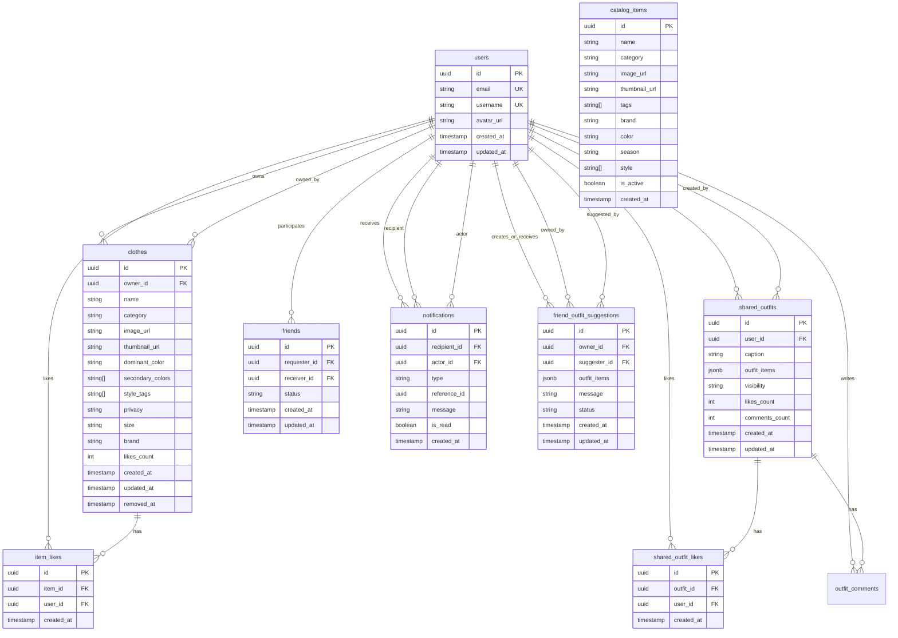

# 🗄️ Database Schema Documentation

## Overview
Complete database schema documentation for StyleSnap including Entity-Relationship diagrams, table structures, relationships, indexes, and constraints.

---

## Table of Contents
1. [Entity-Relationship Diagram](#entity-relationship-diagram)
2. [Core Tables](#core-tables)
3. [Social Tables](#social-tables)
4. [Catalog Tables](#catalog-tables)
5. [Notification Tables](#notification-tables)
6. [Indexes & Performance](#indexes--performance)
7. [Row Level Security](#row-level-security)
8. [Database Functions](#database-functions)

---

## Entity-Relationship Diagram

### Complete ER Diagram



---

## Core Tables

### users

**Purpose**: User accounts and profiles

**Schema:**
```sql
CREATE TABLE users (
  id UUID PRIMARY KEY REFERENCES auth.users(id) ON DELETE CASCADE,
  email TEXT UNIQUE NOT NULL,
  username TEXT UNIQUE NOT NULL,
  avatar_url TEXT,
  created_at TIMESTAMP WITH TIME ZONE DEFAULT now(),
  updated_at TIMESTAMP WITH TIME ZONE DEFAULT now()
);
```

**Indexes:**
```sql
CREATE UNIQUE INDEX idx_users_email ON users(email);
CREATE UNIQUE INDEX idx_users_username ON users(username);
CREATE INDEX idx_users_created ON users(created_at DESC);
```

**Constraints:**
- `id` references `auth.users(id)` (Supabase Auth)
- Email must be unique and not null
- Username must be unique and not null

**RLS Policies:**
```sql
-- Users can read all user profiles
CREATE POLICY "Public profiles"
ON users FOR SELECT
USING (true);

-- Users can update own profile
CREATE POLICY "Users update own profile"
ON users FOR UPDATE
USING (id = auth.uid());
```

---

### clothes

**Purpose**: Virtual closet items owned by users

**Schema:**
```sql
CREATE TABLE clothes (
  id UUID PRIMARY KEY DEFAULT gen_random_uuid(),
  owner_id UUID NOT NULL REFERENCES users(id) ON DELETE CASCADE,
  name TEXT NOT NULL CHECK (length(name) > 0 AND length(name) <= 255),
  category TEXT NOT NULL CHECK (category IN (
    'blouse', 'body', 'hoodie', 'longsleeve', 'polo', 
    'shirt', 't-shirt', 'top', 'undershirt',
    'pants', 'shorts', 'skirt',
    'blazer', 'outerwear',
    'shoes', 'hat', 'dress',
    'not-sure', 'other', 'skip'
  )),
  image_url TEXT NOT NULL,
  thumbnail_url TEXT,
  dominant_color TEXT,
  secondary_colors TEXT[],
  style_tags TEXT[],
  privacy TEXT NOT NULL CHECK (privacy IN ('private', 'friends')) DEFAULT 'private',
  size TEXT,
  brand TEXT,
  likes_count INT DEFAULT 0,
  created_at TIMESTAMP WITH TIME ZONE DEFAULT now(),
  updated_at TIMESTAMP WITH TIME ZONE DEFAULT now(),
  removed_at TIMESTAMP WITH TIME ZONE
);
```

**Indexes:**
```sql
CREATE INDEX idx_clothes_owner ON clothes(owner_id);
CREATE INDEX idx_clothes_category ON clothes(category);
CREATE INDEX idx_clothes_created ON clothes(created_at DESC);
CREATE INDEX idx_clothes_removed ON clothes(removed_at);
CREATE INDEX idx_clothes_privacy ON clothes(privacy);
CREATE INDEX idx_clothes_active ON clothes(owner_id, removed_at) 
  WHERE removed_at IS NULL;
```

**Functional Index:**
```sql
CREATE INDEX idx_clothes_category_group 
ON clothes(get_category_group(category));
```

**Constraints:**
- Owner must be a valid user
- Name length: 1-255 characters
- Category must be from predefined list
- Privacy: 'private' or 'friends'
- Soft delete: `removed_at` timestamp

**RLS Policies:**
```sql
-- Users can read own items
CREATE POLICY "Users read own items"
ON clothes FOR SELECT
USING (owner_id = auth.uid());

-- Users can read friends' shared items
CREATE POLICY "Users read friends items"
ON clothes FOR SELECT
USING (
  privacy = 'friends'
  AND owner_id IN (
    SELECT CASE 
      WHEN requester_id = auth.uid() THEN receiver_id
      WHEN receiver_id = auth.uid() THEN requester_id
    END
    FROM friends
    WHERE status = 'accepted'
    AND (requester_id = auth.uid() OR receiver_id = auth.uid())
  )
);

-- Users can insert own items
CREATE POLICY "Users insert own items"
ON clothes FOR INSERT
WITH CHECK (owner_id = auth.uid());

-- Users can update own items
CREATE POLICY "Users update own items"
ON clothes FOR UPDATE
USING (owner_id = auth.uid());

-- Users can delete own items
CREATE POLICY "Users delete own items"
ON clothes FOR DELETE
USING (owner_id = auth.uid());
```

---

### shared_outfits

**Purpose**: Outfits shared to social feed

**Schema:**
```sql
CREATE TABLE shared_outfits (
  id UUID PRIMARY KEY DEFAULT gen_random_uuid(),
  user_id UUID NOT NULL REFERENCES users(id) ON DELETE CASCADE,
  caption TEXT,
  outfit_items JSONB NOT NULL,
  visibility TEXT NOT NULL CHECK (visibility IN ('public', 'friends', 'private')) DEFAULT 'friends',
  likes_count INT DEFAULT 0,
  comments_count INT DEFAULT 0,
  created_at TIMESTAMP WITH TIME ZONE DEFAULT now(),
  updated_at TIMESTAMP WITH TIME ZONE DEFAULT now()
);
```

**outfit_items JSONB Structure:**
```json
[
  {
    "id": "uuid",
    "name": "Blue Hoodie",
    "category": "hoodie",
    "image_url": "https://...",
    "thumbnail_url": "https://..."
  }
]
```

**Indexes:**
```sql
CREATE INDEX idx_shared_outfits_user ON shared_outfits(user_id);
CREATE INDEX idx_shared_outfits_created ON shared_outfits(created_at DESC);
CREATE INDEX idx_shared_outfits_visibility ON shared_outfits(visibility);
CREATE INDEX idx_shared_outfits_user_created ON shared_outfits(user_id, created_at DESC);
```

**RLS Policies:**
```sql
-- Users can read friends' outfits
CREATE POLICY "Users read friends outfits"
ON shared_outfits FOR SELECT
USING (
  visibility = 'friends'
  AND (
    user_id = auth.uid()
    OR user_id IN (
      SELECT CASE 
        WHEN requester_id = auth.uid() THEN receiver_id
        WHEN receiver_id = auth.uid() THEN requester_id
      END
      FROM friends
      WHERE status = 'accepted'
      AND (requester_id = auth.uid() OR receiver_id = auth.uid())
    )
  )
);

-- Users can manage own outfits
CREATE POLICY "Users manage own outfits"
ON shared_outfits FOR ALL
USING (user_id = auth.uid());
```

---

## Social Tables

### friends

**Purpose**: Friend relationships between users

**Schema:**
```sql
CREATE TABLE friends (
  id UUID PRIMARY KEY DEFAULT gen_random_uuid(),
  requester_id UUID NOT NULL REFERENCES users(id) ON DELETE CASCADE,
  receiver_id UUID NOT NULL REFERENCES users(id) ON DELETE CASCADE,
  status TEXT NOT NULL CHECK (status IN ('pending', 'accepted', 'rejected')) DEFAULT 'pending',
  created_at TIMESTAMP WITH TIME ZONE DEFAULT now(),
  updated_at TIMESTAMP WITH TIME ZONE DEFAULT now(),
  UNIQUE(requester_id, receiver_id),
  CHECK (requester_id < receiver_id)
);
```

**Canonical Ordering:**
The `CHECK (requester_id < receiver_id)` constraint ensures:
- Only one friendship record per user pair
- Prevents duplicate relationships
- Simplifies queries (but requires bidirectional logic)

**Indexes:**
```sql
CREATE INDEX idx_friends_requester ON friends(requester_id);
CREATE INDEX idx_friends_receiver ON friends(receiver_id);
CREATE INDEX idx_friends_status ON friends(status);
CREATE INDEX idx_friends_accepted ON friends(requester_id, receiver_id) 
  WHERE status = 'accepted';
```

**RLS Policies:**
```sql
-- Users can read their friendships
CREATE POLICY "Users read own friendships"
ON friends FOR SELECT
USING (requester_id = auth.uid() OR receiver_id = auth.uid());

-- Users can create friendships
CREATE POLICY "Users create friendships"
ON friends FOR INSERT
WITH CHECK (requester_id = auth.uid() OR receiver_id = auth.uid());

-- Users can update friendships
CREATE POLICY "Users update friendships"
ON friends FOR UPDATE
USING (requester_id = auth.uid() OR receiver_id = auth.uid());

-- Users can delete friendships
CREATE POLICY "Users delete friendships"
ON friends FOR DELETE
USING (requester_id = auth.uid() OR receiver_id = auth.uid());
```

---

### shared_outfit_likes

**Purpose**: Likes on shared outfits

**Schema:**
```sql
CREATE TABLE shared_outfit_likes (
  id UUID PRIMARY KEY DEFAULT gen_random_uuid(),
  outfit_id UUID NOT NULL REFERENCES shared_outfits(id) ON DELETE CASCADE,
  user_id UUID NOT NULL REFERENCES users(id) ON DELETE CASCADE,
  created_at TIMESTAMP WITH TIME ZONE DEFAULT now(),
  UNIQUE(outfit_id, user_id)
);
```

**Indexes:**
```sql
CREATE INDEX idx_outfit_likes_outfit ON shared_outfit_likes(outfit_id);
CREATE INDEX idx_outfit_likes_user ON shared_outfit_likes(user_id);
CREATE UNIQUE INDEX idx_outfit_likes_unique ON shared_outfit_likes(outfit_id, user_id);
```

**Triggers:**
```sql
-- Increment likes_count on insert
CREATE TRIGGER increment_outfit_likes
AFTER INSERT ON shared_outfit_likes
FOR EACH ROW
EXECUTE FUNCTION increment_outfit_likes_count();

-- Decrement likes_count on delete
CREATE TRIGGER decrement_outfit_likes
AFTER DELETE ON shared_outfit_likes
FOR EACH ROW
EXECUTE FUNCTION decrement_outfit_likes_count();

-- Create notification on like
CREATE TRIGGER create_outfit_like_notification
AFTER INSERT ON shared_outfit_likes
FOR EACH ROW
EXECUTE FUNCTION create_outfit_like_notification();
```

---

### item_likes

**Purpose**: Likes on individual closet items

**Schema:**
```sql
CREATE TABLE item_likes (
  id UUID PRIMARY KEY DEFAULT gen_random_uuid(),
  item_id UUID NOT NULL REFERENCES clothes(id) ON DELETE CASCADE,
  user_id UUID NOT NULL REFERENCES users(id) ON DELETE CASCADE,
  created_at TIMESTAMP WITH TIME ZONE DEFAULT now(),
  UNIQUE(item_id, user_id)
);
```

**Indexes:**
```sql
CREATE INDEX idx_item_likes_item ON item_likes(item_id);
CREATE INDEX idx_item_likes_user ON item_likes(user_id);
CREATE UNIQUE INDEX idx_item_likes_unique ON item_likes(item_id, user_id);
```

**Triggers:**
```sql
-- Similar to outfit likes
CREATE TRIGGER increment_item_likes
AFTER INSERT ON item_likes
FOR EACH ROW
EXECUTE FUNCTION increment_item_likes_count();

CREATE TRIGGER create_item_like_notification
AFTER INSERT ON item_likes
FOR EACH ROW
EXECUTE FUNCTION create_item_like_notification();
```

---

## Catalog Tables

### catalog_items

**Purpose**: Pre-populated clothing catalog (no owner attribution)

**Schema:**
```sql
CREATE TABLE catalog_items (
  id UUID PRIMARY KEY DEFAULT gen_random_uuid(),
  name TEXT NOT NULL CHECK (length(name) > 0 AND length(name) <= 255),
  category TEXT NOT NULL,
  image_url TEXT NOT NULL,
  thumbnail_url TEXT NOT NULL,
  tags TEXT[],
  brand TEXT,
  color TEXT,
  season TEXT CHECK (season IN ('spring', 'summer', 'fall', 'winter', 'all-season')),
  style TEXT[],
  is_active BOOLEAN DEFAULT true,
  created_at TIMESTAMP WITH TIME ZONE DEFAULT now()
);
```

**Key Characteristics:**
- **NO `owner_id` column** - Anonymous by design
- Users cannot see who added items
- Admin and user-contributed items appear identical

**Indexes:**
```sql
CREATE INDEX idx_catalog_category ON catalog_items(category);
CREATE INDEX idx_catalog_active ON catalog_items(is_active) WHERE is_active = true;
CREATE INDEX idx_catalog_created ON catalog_items(created_at DESC);
CREATE INDEX idx_catalog_tags ON catalog_items USING gin(tags);
```

**RLS Policies:**
```sql
-- Anyone can read active catalog items
CREATE POLICY "Public catalog read"
ON catalog_items FOR SELECT
USING (is_active = true);

-- Only admins can modify (service role)
-- No policy needed - handled at application level
```

---

## Notification Tables

### notifications

**Purpose**: User notifications for all events

**Schema:**
```sql
CREATE TABLE notifications (
  id UUID PRIMARY KEY DEFAULT gen_random_uuid(),
  recipient_id UUID NOT NULL REFERENCES users(id) ON DELETE CASCADE,
  actor_id UUID NOT NULL REFERENCES users(id) ON DELETE CASCADE,
  type TEXT NOT NULL CHECK (type IN (
    'friend_outfit_suggestion',
    'outfit_like',
    'item_like',
    'friend_request',
    'comment'
  )),
  reference_id UUID NOT NULL,
  message TEXT,
  is_read BOOLEAN DEFAULT false,
  created_at TIMESTAMP WITH TIME ZONE DEFAULT now()
);
```

**Indexes:**
```sql
CREATE INDEX idx_notifications_recipient ON notifications(recipient_id);
CREATE INDEX idx_notifications_actor ON notifications(actor_id);
CREATE INDEX idx_notifications_type ON notifications(type);
CREATE INDEX idx_notifications_read ON notifications(is_read);
CREATE INDEX idx_notifications_created ON notifications(created_at DESC);
CREATE INDEX idx_notifications_unread ON notifications(recipient_id, is_read) 
  WHERE is_read = false;
```

**RLS Policies:**
```sql
-- Users can read own notifications
CREATE POLICY "Users read own notifications"
ON notifications FOR SELECT
USING (recipient_id = auth.uid());

-- Users can update own notifications (mark as read)
CREATE POLICY "Users update own notifications"
ON notifications FOR UPDATE
USING (recipient_id = auth.uid());
```

---

### friend_outfit_suggestions

**Purpose**: Outfit suggestions from friends

**Schema:**
```sql
CREATE TABLE friend_outfit_suggestions (
  id UUID PRIMARY KEY DEFAULT gen_random_uuid(),
  owner_id UUID NOT NULL REFERENCES users(id) ON DELETE CASCADE,
  suggester_id UUID NOT NULL REFERENCES users(id) ON DELETE CASCADE,
  outfit_items JSONB NOT NULL,
  message TEXT,
  status TEXT NOT NULL CHECK (status IN ('pending', 'approved', 'rejected')) DEFAULT 'pending',
  created_at TIMESTAMP WITH TIME ZONE DEFAULT now(),
  updated_at TIMESTAMP WITH TIME ZONE DEFAULT now()
);
```

**outfit_items JSONB Structure:**
```json
[
  {
    "id": "item-uuid",
    "name": "Blue Jeans",
    "category": "pants",
    "image_url": "https://...",
    "thumbnail_url": "https://..."
  }
]
```

**Indexes:**
```sql
CREATE INDEX idx_suggestions_owner ON friend_outfit_suggestions(owner_id);
CREATE INDEX idx_suggestions_suggester ON friend_outfit_suggestions(suggester_id);
CREATE INDEX idx_suggestions_status ON friend_outfit_suggestions(status);
CREATE INDEX idx_suggestions_pending ON friend_outfit_suggestions(owner_id, status) 
  WHERE status = 'pending';
```

**Triggers:**
```sql
-- Create notification when suggestion is created
CREATE TRIGGER create_suggestion_notification
AFTER INSERT ON friend_outfit_suggestions
FOR EACH ROW
EXECUTE FUNCTION create_suggestion_notification();
```

---

## Indexes & Performance

### Index Strategy

**Primary Indexes:**
- All primary keys automatically indexed
- Foreign keys should be indexed
- Frequently queried columns

**Composite Indexes:**
```sql
-- Clothes: owner + active items
CREATE INDEX idx_clothes_owner_active 
ON clothes(owner_id, removed_at) WHERE removed_at IS NULL;

-- Outfits: user + chronological
CREATE INDEX idx_outfits_user_created 
ON shared_outfits(user_id, created_at DESC);

-- Friends: accepted only
CREATE INDEX idx_friends_accepted 
ON friends(requester_id, receiver_id) WHERE status = 'accepted';

-- Notifications: unread only
CREATE INDEX idx_notifications_unread 
ON notifications(recipient_id, is_read) WHERE is_read = false;
```

**Functional Indexes:**
```sql
-- Category grouping
CREATE INDEX idx_clothes_category_group 
ON clothes(get_category_group(category));

-- Text search
CREATE INDEX idx_clothes_name_search 
ON clothes USING gin(to_tsvector('english', name));

-- Array search
CREATE INDEX idx_catalog_tags_gin 
ON catalog_items USING gin(tags);
```

### Query Optimization Tips

**Use EXPLAIN ANALYZE:**
```sql
EXPLAIN ANALYZE
SELECT * FROM clothes 
WHERE owner_id = '...' 
AND removed_at IS NULL 
ORDER BY created_at DESC;
```

**Avoid N+1 Queries:**
```sql
-- Bad: Multiple queries
SELECT * FROM clothes WHERE owner_id = '...';
-- Then for each item: SELECT count(*) FROM item_likes WHERE item_id = '...';

-- Good: Single query with join
SELECT c.*, COUNT(il.id) as likes_count
FROM clothes c
LEFT JOIN item_likes il ON il.item_id = c.id
WHERE c.owner_id = '...'
GROUP BY c.id;
```

---

## Row Level Security

### RLS Best Practices

**Always Enable RLS:**
```sql
ALTER TABLE clothes ENABLE ROW LEVEL SECURITY;
ALTER TABLE shared_outfits ENABLE ROW LEVEL SECURITY;
ALTER TABLE friends ENABLE ROW LEVEL SECURITY;
ALTER TABLE notifications ENABLE ROW LEVEL SECURITY;
```

**Policy Naming Convention:**
```sql
-- Format: "{who} {action} {what}"
CREATE POLICY "Users read own items" ON clothes FOR SELECT ...
CREATE POLICY "Users insert own items" ON clothes FOR INSERT ...
CREATE POLICY "Friends read shared items" ON clothes FOR SELECT ...
```

**Testing RLS:**
```sql
-- Test as specific user
SET LOCAL role TO authenticated;
SET LOCAL request.jwt.claim.sub TO 'user-uuid';

-- Run query
SELECT * FROM clothes;

-- Reset
RESET role;
```

---

## Database Functions

### Utility Functions

**Get Category Group:**
```sql
CREATE OR REPLACE FUNCTION get_category_group(category TEXT)
RETURNS TEXT AS $$
BEGIN
  CASE category
    WHEN 'blouse', 'body', 'hoodie', 'longsleeve', 'polo', 
         'shirt', 't-shirt', 'top', 'undershirt' 
      THEN RETURN 'top';
    WHEN 'pants', 'shorts', 'skirt' 
      THEN RETURN 'bottom';
    WHEN 'blazer', 'outerwear' 
      THEN RETURN 'outerwear';
    WHEN 'shoes' 
      THEN RETURN 'shoes';
    WHEN 'hat' 
      THEN RETURN 'accessory';
    WHEN 'dress' 
      THEN RETURN 'dress';
    ELSE RETURN 'other';
  END CASE;
END;
$$ LANGUAGE plpgsql IMMUTABLE;
```

**Get Friends Feed:**
```sql
CREATE OR REPLACE FUNCTION get_friends_outfit_feed(
  p_user_id UUID,
  p_limit INT DEFAULT 20,
  p_offset INT DEFAULT 0
)
RETURNS TABLE (
  outfit_id UUID,
  user_id UUID,
  username TEXT,
  user_avatar TEXT,
  caption TEXT,
  outfit_items JSONB,
  visibility TEXT,
  likes_count INT,
  comments_count INT,
  created_at TIMESTAMPTZ,
  is_liked_by_me BOOLEAN
) AS $$
BEGIN
  RETURN QUERY
  SELECT 
    so.id,
    so.user_id,
    u.username,
    u.avatar_url,
    so.caption,
    so.outfit_items,
    so.visibility,
    so.likes_count,
    so.comments_count,
    so.created_at,
    EXISTS(
      SELECT 1 FROM shared_outfit_likes 
      WHERE outfit_id = so.id AND user_id = p_user_id
    )
  FROM shared_outfits so
  JOIN users u ON u.id = so.user_id
  WHERE so.visibility = 'friends'
  AND so.user_id IN (
    SELECT CASE 
      WHEN requester_id = p_user_id THEN receiver_id
      WHEN receiver_id = p_user_id THEN requester_id
    END
    FROM friends
    WHERE status = 'accepted'
    AND (requester_id = p_user_id OR receiver_id = p_user_id)
  )
  ORDER BY so.created_at DESC
  LIMIT p_limit
  OFFSET p_offset;
END;
$$ LANGUAGE plpgsql STABLE;
```

**Approve Friend Suggestion:**
```sql
CREATE OR REPLACE FUNCTION approve_friend_outfit_suggestion(p_suggestion_id UUID)
RETURNS UUID AS $$
DECLARE
  v_owner_id UUID;
  v_outfit_items JSONB;
  v_new_outfit_id UUID;
BEGIN
  -- Get suggestion details
  SELECT owner_id, outfit_items 
  INTO v_owner_id, v_outfit_items
  FROM friend_outfit_suggestions
  WHERE id = p_suggestion_id AND status = 'pending';
  
  IF NOT FOUND THEN
    RAISE EXCEPTION 'Suggestion not found or already processed';
  END IF;
  
  -- Verify caller is owner
  IF v_owner_id != auth.uid() THEN
    RAISE EXCEPTION 'Not authorized';
  END IF;
  
  -- Create outfit
  INSERT INTO shared_outfits (user_id, outfit_items, visibility)
  VALUES (v_owner_id, v_outfit_items, 'friends')
  RETURNING id INTO v_new_outfit_id;
  
  -- Update suggestion status
  UPDATE friend_outfit_suggestions
  SET status = 'approved', updated_at = now()
  WHERE id = p_suggestion_id;
  
  RETURN v_new_outfit_id;
END;
$$ LANGUAGE plpgsql SECURITY DEFINER;
```

---

## Migration Scripts

### Running Migrations

**Order of Execution:**
```bash
# 1. Core schema
psql -f sql/001_initial_schema.sql

# 2. RLS policies
psql -f sql/002_rls_policies.sql

# 3. Indexes and functions
psql -f sql/003_indexes_functions.sql

# 4. Advanced features
psql -f sql/004_advanced_features.sql

# 5. Catalog system
psql -f sql/005_catalog_system.sql

# 6. Color detection
psql -f sql/006_color_detection.sql

# 7. Outfit generation
psql -f sql/007_outfit_generation.sql

# 8. Likes feature
psql -f sql/008_likes_feature.sql

# 9. Notifications system
psql -f sql/009_notifications_system.sql
```

### Verification Queries

**Check Table Existence:**
```sql
SELECT table_name 
FROM information_schema.tables 
WHERE table_schema = 'public' 
ORDER BY table_name;
```

**Check RLS Status:**
```sql
SELECT tablename, rowsecurity 
FROM pg_tables 
WHERE schemaname = 'public';
```

**Check Indexes:**
```sql
SELECT tablename, indexname, indexdef
FROM pg_indexes
WHERE schemaname = 'public'
ORDER BY tablename, indexname;
```

**Check Functions:**
```sql
SELECT routine_name, routine_type
FROM information_schema.routines
WHERE routine_schema = 'public'
ORDER BY routine_name;
```

---

## Database Maintenance

### Regular Tasks

**Vacuum & Analyze:**
```sql
-- Full vacuum (requires lock)
VACUUM FULL ANALYZE;

-- Regular vacuum (recommended)
VACUUM ANALYZE;

-- Specific table
VACUUM ANALYZE clothes;
```

**Reindex:**
```sql
-- Reindex all
REINDEX DATABASE stylesnap;

-- Specific table
REINDEX TABLE clothes;
```

**Update Statistics:**
```sql
ANALYZE;
```

### Monitoring Queries

**Table Sizes:**
```sql
SELECT 
  schemaname,
  tablename,
  pg_size_pretty(pg_total_relation_size(schemaname||'.'||tablename)) AS size
FROM pg_tables
WHERE schemaname = 'public'
ORDER BY pg_total_relation_size(schemaname||'.'||tablename) DESC;
```

**Index Usage:**
```sql
SELECT 
  schemaname,
  tablename,
  indexname,
  idx_scan,
  idx_tup_read,
  idx_tup_fetch
FROM pg_stat_user_indexes
ORDER BY idx_scan DESC;
```

**Slow Queries:**
```sql
SELECT 
  query,
  calls,
  total_time,
  mean_time,
  max_time
FROM pg_stat_statements
ORDER BY mean_time DESC
LIMIT 10;
```

---

## Related Documentation
- [SQL Migration Guide](./SQL_MIGRATION_GUIDE.md) - Migration procedures
- [Architecture](./ARCHITECTURE.md) - System architecture
- [API Reference](./API_REFERENCE.md) - API documentation
- [User Flows](./USER_FLOWS.md) - User journeys

---

## Status: COMPLETE ✅
Complete database schema documented with ER diagrams!
