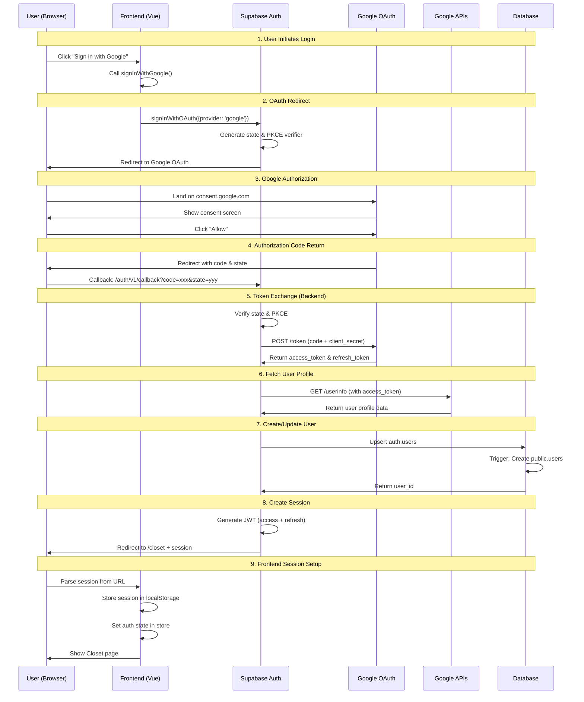

# 🔐 Complete Google OAuth Guide - StyleSnap

**Last Updated:** October 9, 2025  
**Comprehensive guide to understanding, implementing, and testing Google OAuth authentication**

---

## 📋 Table of Contents

1. [OAuth 2.0 Fundamentals](#oauth-20-fundamentals)
2. [StyleSnap OAuth Architecture](#stylesnap-oauth-architecture)
3. [Complete Setup Guide](#complete-setup-guide)
4. [How OAuth Works (Step-by-Step)](#how-oauth-works-step-by-step)
5. [Security Model](#security-model)
6. [Testing OAuth](#testing-oauth)
7. [Troubleshooting](#troubleshooting)
8. [Best Practices](#best-practices)

---

## 🎓 OAuth 2.0 Fundamentals

### What is OAuth 2.0?

OAuth 2.0 is an **authorization framework** that enables applications to obtain limited access to user accounts on an HTTP service (like Google) without exposing user passwords.

### Key Concepts

```
┌─────────────────────────────────────────────────────────────┐
│ OAuth 2.0 Actors                                            │
├─────────────────────────────────────────────────────────────┤
│                                                             │
│ 1. RESOURCE OWNER (User)                                    │
│    └─ The person who owns the Google account               │
│                                                             │
│ 2. CLIENT (StyleSnap Frontend)                              │
│    └─ Your application requesting access                   │
│                                                             │
│ 3. AUTHORIZATION SERVER (Google OAuth)                      │
│    └─ Google's server that authenticates users             │
│                                                             │
│ 4. RESOURCE SERVER (Google APIs)                            │
│    └─ Google's servers that host user data                 │
│                                                             │
│ 5. BACKEND (Supabase)                                       │
│    └─ Handles OAuth flow and token exchange                │
└─────────────────────────────────────────────────────────────┘
```

### OAuth Flow Types

StyleSnap uses **Authorization Code Flow with PKCE** (Proof Key for Code Exchange):

```
Authorization Code Flow = Most Secure
├─ Step 1: User clicks "Sign in with Google"
├─ Step 2: Redirect to Google for authorization
├─ Step 3: User grants permissions
├─ Step 4: Google returns authorization code
├─ Step 5: Backend exchanges code for access token
└─ Step 6: User authenticated with session
```

**Why this flow?**
- ✅ Most secure for web applications
- ✅ Tokens never exposed to browser
- ✅ Works with public clients (SPAs)
- ✅ PKCE prevents authorization code interception

---

## 🏗️ StyleSnap OAuth Architecture

### High-Level Architecture

```
┌──────────────────────────────────────────────────────────────┐
│                                                              │
│  ┌─────────────┐         ┌──────────────┐                  │
│  │   Browser   │────────▶│  StyleSnap   │                  │
│  │   (User)    │         │  (Frontend)  │                  │
│  └─────────────┘         └──────────────┘                  │
│        │                        │                            │
│        │ 1. Click Login         │ 2. Start OAuth            │
│        │                        │                            │
│        ▼                        ▼                            │
│  ┌─────────────┐         ┌──────────────┐                  │
│  │   Google    │◀────────│   Supabase   │                  │
│  │   OAuth     │         │   Auth       │                  │
│  └─────────────┘         └──────────────┘                  │
│        │                        │                            │
│        │ 3. Consent             │ 5. Token Exchange          │
│        │                        │                            │
│        ▼                        ▼                            │
│  ┌─────────────┐         ┌──────────────┐                  │
│  │  Authorize  │────────▶│  Create/Get  │                  │
│  │  & Return   │         │  User Session│                  │
│  └─────────────┘         └──────────────┘                  │
│                                 │                            │
│                                 │ 6. Session Token           │
│                                 ▼                            │
│                          ┌──────────────┐                  │
│                          │  Redirect to │                  │
│                          │    /closet   │                  │
│                          └──────────────┘                  │
│                                                              │
└──────────────────────────────────────────────────────────────┘
```

### OAuth Components in StyleSnap

```
StyleSnap OAuth Stack:
├─ Frontend (Vue.js)
│  ├─ Login.vue - Login UI with Google button
│  ├─ auth-service.js - OAuth initiation
│  └─ auth-store.js - Session state management
│
├─ Backend (Supabase)
│  ├─ Supabase Auth - OAuth orchestration
│  ├─ Database Triggers - Auto user creation
│  └─ RLS Policies - Row-level security
│
└─ External Services
   ├─ Google OAuth 2.0 - Authentication provider
   └─ Google Cloud Console - OAuth configuration
```

---

## 🔧 Complete Setup Guide

### Step 1: Google Cloud Console Configuration

#### 1.1 Create Project

```bash
# Open Google Cloud Console
$BROWSER https://console.cloud.google.com/
```

**Actions:**
1. Click "Select a project" dropdown (top bar)
2. Click "New Project"
3. Project name: `StyleSnap` (or your app name)
4. Organization: Your account
5. Click "Create"
6. Wait for project creation (~30 seconds)
7. Select your new project from the dropdown

#### 1.2 Enable Required APIs

```bash
# Navigate to APIs & Services
$BROWSER https://console.cloud.google.com/apis/library
```

**Enable these APIs:**
1. Search for "Google+ API"
   - Click "Google+ API"
   - Click "Enable"
2. Search for "People API"
   - Click "People API"
   - Click "Enable"

**Why these APIs?**
- **Google+ API**: Access to basic profile info (deprecated but still used for OAuth)
- **People API**: Modern API for user profile data

#### 1.3 Configure OAuth Consent Screen

```bash
# Navigate to OAuth consent screen
$BROWSER https://console.cloud.google.com/apis/credentials/consent
```

**Configuration:**

```yaml
# User Type
User Type: External  # For public apps
Status: Testing       # Start in testing mode

# OAuth consent screen
App name: StyleSnap
User support email: your-email@example.com
App logo: [Optional - 120x120 PNG]
Application home page: https://stylesnap.vercel.app
Application privacy policy link: https://stylesnap.vercel.app/privacy
Application terms of service link: https://stylesnap.vercel.app/terms

# App domain
Authorized domains:
  - vercel.app
  - supabase.co

# Developer contact information
Email addresses: your-email@example.com
```

**Click "Save and Continue"**

#### 1.4 Add OAuth Scopes

**On the Scopes page:**

```yaml
Required Scopes:
  ✅ openid
     - Authenticate using OpenID Connect
     - Essential for OAuth 2.0
     
  ✅ .../auth/userinfo.email
     - See your email address
     - Used for: User identification, notifications
     
  ✅ .../auth/userinfo.profile
     - See your personal info
     - Used for: Display name, profile picture
```

**Why these scopes?**
- `openid`: Core OpenID Connect scope for authentication
- `email`: Get user's verified email address
- `profile`: Get user's name and profile picture

**What data you get:**
```json
{
  "sub": "1234567890",           // Unique Google ID
  "email": "user@gmail.com",     // Email address
  "email_verified": true,         // Email verification status
  "name": "John Doe",             // Full name
  "given_name": "John",           // First name
  "family_name": "Doe",           // Last name
  "picture": "https://...",       // Profile picture URL
  "locale": "en"                  // User locale
}
```

**Click "Save and Continue"**

#### 1.5 Add Test Users (Development Phase)

**While app is in Testing mode:**

```yaml
Test users:
  - your-email@gmail.com
  - developer@gmail.com
  - tester@gmail.com
```

**Why?** Only these users can sign in while your app is in "Testing" status.

**Publishing to Production:**
1. Click "Publish App" when ready
2. Google reviews your app (2-4 weeks)
3. Once approved, anyone can sign in

**Click "Save and Continue"**

#### 1.6 Create OAuth 2.0 Client ID

```bash
# Navigate to Credentials
$BROWSER https://console.cloud.google.com/apis/credentials
```

**Actions:**
1. Click "Create Credentials" → "OAuth 2.0 Client ID"

**Configuration:**

```yaml
Application type: Web application
Name: StyleSnap Web Client

# Authorized JavaScript origins (where OAuth flow starts)
Authorized JavaScript origins:
  - http://localhost:5173                    # Vite dev server
  - http://localhost:3000                    # Alternative dev port
  - https://YOUR-PROJECT.supabase.co         # Supabase project
  - https://YOUR-APP.vercel.app              # Production URL

# Authorized redirect URIs (where Google sends users back)
Authorized redirect URIs:
  - http://localhost:5173/auth/callback      # Dev callback
  - https://YOUR-PROJECT.supabase.co/auth/v1/callback  # Supabase callback ⚠️ CRITICAL
  - https://YOUR-APP.vercel.app/auth/callback          # Production callback
```

**⚠️ CRITICAL:** The Supabase callback URL is the most important:
```
https://YOUR-PROJECT-REF.supabase.co/auth/v1/callback
```

**Click "Create"**

#### 1.7 Copy Credentials

**You'll see a popup with:**

```
Your Client ID:
123456789-abcdefghijklmnopqrstuvwxyz.apps.googleusercontent.com

Your Client Secret:
GOCSPX-xxxxxxxxxxxxxxxxxxxxxxxx
```

**🔐 IMPORTANT:**
- **Client ID** → Public, goes in frontend `.env.local`
- **Client Secret** → Private, goes in Supabase Dashboard ONLY

**Save both in a password manager!**

---

### Step 2: Supabase Configuration

#### 2.1 Configure Google Provider

```bash
# Open Supabase Dashboard
$BROWSER https://supabase.com/dashboard/project/YOUR_PROJECT_REF/auth/providers
```

**Actions:**
1. Find "Google" in the providers list
2. Toggle "Enable Sign in with Google" to **ON**
3. Fill in credentials:

```yaml
Client ID (for OAuth):
  123456789-abcdefghijklmnopqrstuvwxyz.apps.googleusercontent.com

Client Secret (for OAuth):
  GOCSPX-xxxxxxxxxxxxxxxxxxxxxxxx

Authorized Client IDs: [Leave empty unless using Google One Tap]

Skip nonce check: [Leave unchecked]
```

4. Click "Save"

**Note the Callback URL shown:**
```
Callback URL (for Google):
https://YOUR-PROJECT.supabase.co/auth/v1/callback
```

**This MUST match the redirect URI in Google Console!**

#### 2.2 Configure Site URL and Redirect URLs

```bash
# Navigate to URL Configuration
$BROWSER https://supabase.com/dashboard/project/YOUR_PROJECT_REF/auth/url-configuration
```

**Site URL:**
```
Production: https://YOUR-APP.vercel.app
Development: http://localhost:5173
```

**Redirect URLs (one per line):**
```
http://localhost:5173/**
https://YOUR-APP.vercel.app/**
```

**Wildcard explanation:** `**` allows any path after domain for OAuth callbacks.

---

### Step 3: Frontend Configuration

#### 3.1 Create `.env.local`

```bash
cd /workspaces/sgStyleSnap2025
touch .env.local
```

**Add credentials:**

```bash
# ==================================================
# SUPABASE (Required)
# ==================================================
VITE_SUPABASE_URL=https://YOUR-PROJECT.supabase.co
VITE_SUPABASE_ANON_KEY=eyJhbGciOiJIUzI1NiIsInR5cCI6IkpXVCJ9.xxxxx

# ==================================================
# GOOGLE OAUTH (Required - Public Client ID Only)
# ==================================================
# ✅ Client ID is PUBLIC and safe to expose in frontend
VITE_GOOGLE_CLIENT_ID=123456789-abcdefghijklmnopqrstuvwxyz.apps.googleusercontent.com

# ❌ DO NOT ADD CLIENT SECRET HERE!
# Client Secret stays in Supabase Dashboard only

# ==================================================
# CLOUDINARY (Required)
# ==================================================
VITE_CLOUDINARY_CLOUD_NAME=your-cloud-name
VITE_CLOUDINARY_UPLOAD_PRESET=your-preset

# ==================================================
# PUSH NOTIFICATIONS (Optional)
# ==================================================
VITE_VAPID_PUBLIC_KEY=BKxxxxxxxxxxxxxxxxxxx
```

#### 3.2 Verify Supabase Configuration

Check [`src/config/supabase.js`](src/config/supabase.js ):

```javascript
import { createClient } from '@supabase/supabase-js'

const supabaseUrl = import.meta.env.VITE_SUPABASE_URL
const supabaseAnonKey = import.meta.env.VITE_SUPABASE_ANON_KEY

if (!supabaseUrl || !supabaseAnonKey) {
  throw new Error('Missing Supabase environment variables')
}

export const supabase = createClient(supabaseUrl, supabaseAnonKey, {
  auth: {
    autoRefreshToken: true,
    persistSession: true,
    detectSessionInUrl: true,
    storage: window.localStorage  // or sessionStorage
  }
})
```

**Key settings:**
- `autoRefreshToken: true` - Automatically refresh expired tokens
- `persistSession: true` - Save session across page reloads
- `detectSessionInUrl: true` - Parse OAuth callback parameters

#### 3.3 Verify Auth Service

Check [`src/services/auth-service.js`](src/services/auth-service.js ):

```javascript
import { supabase } from '@/config/supabase'

/**
 * Sign in with Google OAuth
 * @returns {Promise<{data, error}>}
 */
export async function signInWithGoogle() {
  const result = await supabase.auth.signInWithOAuth({
    provider: 'google',
    options: {
      redirectTo: `${window.location.origin}/closet`,
      queryParams: {
        access_type: 'offline',  // Get refresh token
        prompt: 'consent'         // Always show consent screen
      }
    }
  })
  
  if (result.error) throw result.error
  return result.data
}

/**
 * Get current session
 * @returns {Promise<Session|null>}
 */
export async function getSession() {
  const result = await supabase.auth.getSession()
  if (result.error) throw result.error
  return result.data?.session
}

/**
 * Sign out current user
 * @returns {Promise<void>}
 */
export async function signOut() {
  const result = await supabase.auth.signOut()
  if (result.error) throw result.error
}
```

---

## 🔄 How OAuth Works (Step-by-Step)

### Complete OAuth Flow Sequence



### Detailed Step Breakdown

#### Step 1: User Clicks "Sign in with Google"

**Location:** [`src/pages/Login.vue`](src/pages/Login.vue )

```vue
<template>
  <div class="login-page">
    <h1>Welcome to StyleSnap</h1>
    <button @click="handleGoogleLogin" class="google-button">
      <GoogleIcon />
      Sign in with Google
    </button>
  </div>
</template>

<script setup>
import { signInWithGoogle } from '@/services/auth-service'
import { useRouter } from 'vue-router'

const router = useRouter()

async function handleGoogleLogin() {
  try {
    // This will redirect to Google
    await signInWithGoogle()
    // Code below won't execute - user is redirected
  } catch (error) {
    console.error('Login failed:', error)
  }
}
</script>
```

**What happens:**
1. User clicks button
2. `signInWithGoogle()` is called
3. Supabase initiates OAuth flow
4. User is **redirected** to Google (page navigation)

#### Step 2: OAuth Redirect to Google

**Backend:** Supabase Auth

```javascript
// Supabase generates:
const state = generateRandomString()          // CSRF protection
const codeVerifier = generateRandomString()   // PKCE verifier
const codeChallenge = sha256(codeVerifier)    // PKCE challenge

// Redirect URL constructed:
const googleAuthUrl = `https://accounts.google.com/o/oauth2/v2/auth?` +
  `client_id=${GOOGLE_CLIENT_ID}` +
  `&redirect_uri=${SUPABASE_CALLBACK_URL}` +
  `&response_type=code` +
  `&scope=openid%20email%20profile` +
  `&state=${state}` +
  `&code_challenge=${codeChallenge}` +
  `&code_challenge_method=S256` +
  `&access_type=offline` +
  `&prompt=consent`

// User browser navigates to this URL
window.location.href = googleAuthUrl
```

**URL Parameters Explained:**

| Parameter | Value | Purpose |
|-----------|-------|---------|
| `client_id` | Your Google Client ID | Identifies your app |
| `redirect_uri` | Supabase callback URL | Where to send user back |
| `response_type` | `code` | Request authorization code |
| `scope` | `openid email profile` | Requested permissions |
| `state` | Random string | CSRF protection |
| `code_challenge` | SHA256 hash | PKCE security |
| `code_challenge_method` | `S256` | Hash algorithm |
| `access_type` | `offline` | Request refresh token |
| `prompt` | `consent` | Always show consent screen |

#### Step 3: User Authorizes on Google

**User sees Google consent screen:**

```
┌───────────────────────────────────────────────┐
│  [Google Logo]                                │
│                                               │
│  Sign in with Google                          │
│                                               │
│  john.doe@gmail.com                           │
│                                               │
│  ┌──────────────────────────────────────┐    │
│  │  StyleSnap wants to:                 │    │
│  │                                       │    │
│  │  ✓ See your email address           │    │
│  │  ✓ See your personal info           │    │
│  │                                       │    │
│  │  StyleSnap will use this to:         │    │
│  │  • Create your account               │    │
│  │  • Personalize your experience       │    │
│  └──────────────────────────────────────┘    │
│                                               │
│  By clicking Allow, you allow this app to    │
│  use your information in accordance with      │
│  their privacy policy and terms of service.  │
│                                               │
│  [Cancel]              [Allow]                │
└───────────────────────────────────────────────┘
```

**User clicks "Allow"** → Google redirects back

#### Step 4: Authorization Code Return

**Google redirects to:**

```
https://YOUR-PROJECT.supabase.co/auth/v1/callback?
  code=4/0AbcDefGhiJkl...                    # Authorization code
  &state=xyz123...                            # State (CSRF check)
  &scope=email+profile+openid                 # Granted scopes
```

**Supabase receives this request and:**
1. Verifies `state` matches (CSRF protection)
2. Extracts `code`
3. Proceeds to token exchange

#### Step 5: Token Exchange (Backend - Hidden from Browser)

**Supabase makes server-to-server request:**

```http
POST https://oauth2.googleapis.com/token
Content-Type: application/x-www-form-urlencoded

code=4/0AbcDefGhiJkl...
client_id=123456789-abc.apps.googleusercontent.com
client_secret=GOCSPX-xxxxxxxxxxxxxxxx
redirect_uri=https://YOUR-PROJECT.supabase.co/auth/v1/callback
grant_type=authorization_code
code_verifier=abc123...  # PKCE verifier
```

**Google responds with:**

```json
{
  "access_token": "ya29.a0AfH6SMBx...",
  "expires_in": 3599,
  "refresh_token": "1//0gZxYz...",
  "scope": "openid email profile",
  "token_type": "Bearer",
  "id_token": "eyJhbGciOiJSUzI1NiIs..."
}
```

**Token Types:**
- **access_token**: Short-lived (1 hour) - Used to access Google APIs
- **refresh_token**: Long-lived - Used to get new access tokens
- **id_token**: JWT with user info - Verified by Supabase

#### Step 6: Fetch User Profile

**Supabase decodes `id_token` (JWT):**

```json
{
  "iss": "https://accounts.google.com",
  "azp": "123456789-abc.apps.googleusercontent.com",
  "aud": "123456789-abc.apps.googleusercontent.com",
  "sub": "1234567890",                    // Google User ID
  "email": "john.doe@gmail.com",
  "email_verified": true,
  "name": "John Doe",
  "picture": "https://lh3.googleusercontent.com/...",
  "given_name": "John",
  "family_name": "Doe",
  "locale": "en",
  "iat": 1234567890,
  "exp": 1234571490
}
```

**Supabase may also call Google's UserInfo API:**

```http
GET https://www.googleapis.com/oauth2/v3/userinfo
Authorization: Bearer ya29.a0AfH6SMBx...
```

#### Step 7: Create/Update User in Database

**Supabase creates/updates `auth.users` table:**

```sql
-- Supabase internal auth.users table
INSERT INTO auth.users (
  id,                -- Generated UUID
  email,             -- john.doe@gmail.com
  raw_app_meta_data, -- {provider: 'google', ...}
  raw_user_meta_data, -- {name, picture, email_verified}
  created_at,
  updated_at
) VALUES (...)
ON CONFLICT (email) DO UPDATE SET ...
```

**Database trigger creates `public.users` entry:**

```sql
-- Your custom trigger (from 001_initial_schema.sql)
CREATE TRIGGER on_auth_user_created
  AFTER INSERT ON auth.users
  FOR EACH ROW
  EXECUTE FUNCTION handle_new_user();

-- Trigger function
CREATE OR REPLACE FUNCTION handle_new_user()
RETURNS TRIGGER AS $$
BEGIN
  INSERT INTO public.users (
    id,                               -- Matches auth.users.id
    email,                            -- From auth.users
    username,                         -- Generated from email
    name,                             -- From Google profile
    avatar_url,                       -- From Google picture
    google_id                         -- From OAuth provider
  ) VALUES (
    NEW.id,
    NEW.email,
    split_part(NEW.email, '@', 1),   -- Username = email prefix
    NEW.raw_user_meta_data->>'name',
    NEW.raw_user_meta_data->>'avatar_url',
    NEW.raw_app_meta_data->>'provider_id'
  );
  RETURN NEW;
END;
$$ LANGUAGE plpgsql SECURITY DEFINER;
```

**Result:** Two linked records:
- `auth.users` → Supabase's internal auth table
- `public.users` → Your application's user profile

#### Step 8: Create Session (JWT)

**Supabase generates JWT access token:**

```json
{
  "header": {
    "alg": "HS256",
    "typ": "JWT"
  },
  "payload": {
    "aud": "authenticated",
    "exp": 1234571490,
    "sub": "uuid-1234-5678-90ab-cdef",  // User ID
    "email": "john.doe@gmail.com",
    "phone": "",
    "app_metadata": {
      "provider": "google",
      "providers": ["google"]
    },
    "user_metadata": {
      "name": "John Doe",
      "avatar_url": "https://lh3.googleusercontent.com/...",
      "email_verified": true
    },
    "role": "authenticated",
    "aal": "aal1",
    "session_id": "session-uuid"
  },
  "signature": "..."
}
```

**Supabase redirects user back:**

```
https://YOUR-APP.vercel.app/closet#
  access_token=eyJhbGciOiJIUzI1NiIs...
  &expires_in=3600
  &refresh_token=abc123...
  &token_type=bearer
```

**URL Hash Parameters:**
- Tokens are in hash (`#`) not query (`?`)
- Not sent to server (browser-only)
- Parsed by JavaScript

#### Step 9: Frontend Session Setup

**Supabase JS client automatically:**

```javascript
// When page loads with OAuth hash parameters
supabase.auth.onAuthStateChange((event, session) => {
  if (event === 'SIGNED_IN') {
    // session.access_token available
    // session.refresh_token stored
    // session.user populated
    
    // Store in localStorage
    localStorage.setItem('supabase.auth.token', JSON.stringify(session))
    
    // Update app state
    authStore.setSession(session)
    authStore.setUser(session.user)
  }
})
```

**Auth store updates:**

```javascript
// src/stores/auth-store.js
const authStore = defineStore('auth', {
  state: () => ({
    user: null,
    session: null,
    loading: false
  }),
  
  actions: {
    async initializeAuth() {
      const session = await getSession()
      if (session) {
        this.session = session
        this.user = session.user
        
        // Fetch full profile from public.users
        await this.fetchUserProfile()
      }
    },
    
    async fetchUserProfile() {
      const { data } = await supabase
        .from('users')
        .select('*')
        .eq('id', this.user.id)
        .single()
        
      this.user = { ...this.user, ...data }
    }
  }
})
```

**User sees the Closet page!** 🎉

---

## 🔒 Security Model

### OAuth Security Features

#### 1. State Parameter (CSRF Protection)

**What:** Random string generated before redirect

**Purpose:** Prevent Cross-Site Request Forgery attacks

**How it works:**
```javascript
// Before redirect
const state = crypto.randomUUID()
sessionStorage.setItem('oauth_state', state)
redirectToGoogle({ state })

// After callback
const returnedState = urlParams.get('state')
const savedState = sessionStorage.getItem('oauth_state')
if (returnedState !== savedState) {
  throw new Error('CSRF attack detected!')
}
```

**Attack prevented:**
```
Attacker's site → Initiates OAuth → Google → Your site
❌ State mismatch = Request rejected
```

#### 2. PKCE (Proof Key for Code Exchange)

**What:** Additional security layer for public clients (SPAs)

**Purpose:** Prevent authorization code interception

**How it works:**
```javascript
// 1. Generate random verifier
const codeVerifier = base64url(crypto.randomBytes(32))

// 2. Create challenge (SHA256 hash)
const codeChallenge = base64url(sha256(codeVerifier))

// 3. Send challenge in authorization request
redirectToGoogle({
  code_challenge: codeChallenge,
  code_challenge_method: 'S256'
})

// 4. Later, send verifier in token exchange
exchangeCodeForToken({
  code: authorizationCode,
  code_verifier: codeVerifier  // Must match challenge
})
```

**Attack prevented:**
```
Attacker intercepts authorization code
Attacker tries to exchange code for tokens
❌ No verifier = Exchange fails
```

#### 3. Client Secret Protection

**Never exposed to browser:**
```
❌ Frontend (.env.local):
   GOOGLE_CLIENT_SECRET=xxx  # NEVER DO THIS!

✅ Backend (Supabase):
   Client Secret stored securely
   Only used in server-to-server communication
```

**Why this matters:**
- Client Secret in frontend = Anyone can impersonate your app
- Secret in backend = Only your server can get tokens

#### 4. Scope Limitation

**Principle of least privilege:**

```javascript
// ❌ BAD: Request more than needed
scope: 'openid email profile gmail.readonly calendar drive'

// ✅ GOOD: Only what you need
scope: 'openid email profile'
```

**Why:**
- Reduces security risk
- Increases user trust
- Easier to pass Google review

#### 5. Token Expiration

**Access tokens expire after 1 hour:**

```javascript
// Token payload
{
  "exp": 1234571490,  // Expiry timestamp
  "iat": 1234567890   // Issued at timestamp
}

// Automatic refresh
supabase.auth.onAuthStateChange((event, session) => {
  if (event === 'TOKEN_REFRESHED') {
    // New token automatically stored
  }
})
```

#### 6. Secure Token Storage

**Best practices:**

```javascript
// ✅ GOOD: IndexedDB (encrypted by browser)
storage: window.indexedDB

// ✅ OK: localStorage (less secure but convenient)
storage: window.localStorage

// ❌ BAD: Cookies without HttpOnly flag
document.cookie = 'session=' + token  // Vulnerable to XSS

// ❌ WORSE: URL parameters
window.location = '/closet?token=' + token  // Visible in logs!
```

#### 7. HTTPS Enforcement

**Production requirements:**

```yaml
Development:
  ✅ http://localhost:5173

Production:
  ✅ https://stylesnap.vercel.app
  ❌ http://stylesnap.vercel.app  # Google will reject!
```

**Why HTTPS:**
- Prevents man-in-the-middle attacks
- Protects tokens in transit
- Required by Google for production

---

## 🧪 Testing OAuth

### Manual Testing Checklist

#### Test 1: Fresh User Sign-Up Flow

**Steps:**
1. Open incognito browser window
2. Navigate to `http://localhost:5173/login`
3. Click "Sign in with Google"
4. Select Google account (not previously used)
5. Review consent screen
6. Click "Allow"
7. Verify redirect to `/closet`
8. Check user appears in Supabase Dashboard → Authentication → Users
9. Check user profile in Database → Table Editor → `public.users`

**Expected results:**
- ✅ Smooth redirect to Google
- ✅ Consent screen shows correct scopes
- ✅ Return to app after authorization
- ✅ User lands on `/closet`
- ✅ User record created in `auth.users`
- ✅ Profile created in `public.users`
- ✅ Session persists after page reload

#### Test 2: Existing User Sign-In

**Steps:**
1. Sign out if logged in
2. Navigate to login page
3. Click "Sign in with Google"
4. Select same Google account as Test 1
5. Verify quick redirect (no consent screen)
6. Check returned to `/closet`

**Expected results:**
- ✅ No consent screen (already authorized)
- ✅ Fast redirect back
- ✅ User logged in successfully
- ✅ Existing user data loaded

#### Test 3: Session Persistence

**Steps:**
1. Log in via Google OAuth
2. Navigate to `/closet`
3. Refresh page (F5 or Ctrl+R)
4. Close browser tab
5. Reopen app in new tab

**Expected results:**
- ✅ User remains logged in after refresh
- ✅ User remains logged in after closing tab
- ✅ Session restored from localStorage

#### Test 4: Sign Out

**Steps:**
1. Log in via Google
2. Navigate to profile or settings
3. Click "Sign Out"
4. Verify redirect to landing/login page
5. Try accessing `/closet` directly

**Expected results:**
- ✅ User logged out
- ✅ Session cleared from storage
- ✅ Redirect to login page
- ✅ Cannot access protected routes

#### Test 5: Multiple Accounts

**Steps:**
1. Log in with Account A
2. Sign out
3. Log in with Account B
4. Verify Account B data shown
5. Sign out
6. Log in with Account A again

**Expected results:**
- ✅ Each account has separate data
- ✅ No data leakage between accounts
- ✅ Correct user shown in UI

#### Test 6: OAuth Error Handling

**Test 6a: User Denies Consent**

**Steps:**
1. Start OAuth flow
2. On Google consent screen, click "Cancel"

**Expected result:**
- ✅ Redirect back to login page
- ✅ Error message shown (optional)
- ✅ No session created

**Test 6b: Invalid Redirect URI**

**Steps:**
1. Temporarily change redirect URI in Google Console
2. Try to log in

**Expected result:**
- ✅ Google shows "redirect_uri_mismatch" error
- ✅ User cannot proceed

**Test 6c: Expired/Invalid Credentials**

**Steps:**
1. Use incorrect Client ID in `.env.local`
2. Try to log in

**Expected result:**
- ✅ Error during OAuth initiation
- ✅ User not redirected

---

### Automated Testing

#### Unit Tests for Auth Service

**File:** `tests/unit/auth-service.test.js`

```javascript
import { describe, it, expect, vi, beforeEach } from 'vitest'
import { signInWithGoogle, getSession, signOut } from '@/services/auth-service'

// Mock Supabase client
vi.mock('@/config/supabase', () => ({
  supabase: {
    auth: {
      signInWithOAuth: vi.fn(),
      getSession: vi.fn(),
      signOut: vi.fn()
    }
  }
}))

import { supabase } from '@/config/supabase'

describe('Auth Service', () => {
  beforeEach(() => {
    vi.clearAllMocks()
  })

  describe('signInWithGoogle', () => {
    it('should initiate Google OAuth flow', async () => {
      supabase.auth.signInWithOAuth.mockResolvedValue({
        data: { url: 'https://accounts.google.com/...' },
        error: null
      })

      const result = await signInWithGoogle()

      expect(supabase.auth.signInWithOAuth).toHaveBeenCalledWith({
        provider: 'google',
        options: expect.objectContaining({
          redirectTo: expect.stringContaining('/closet')
        })
      })
      expect(result.url).toBeDefined()
    })

    it('should include redirect URL', async () => {
      supabase.auth.signInWithOAuth.mockResolvedValue({
        data: { url: 'https://accounts.google.com/...' },
        error: null
      })

      await signInWithGoogle()

      const call = supabase.auth.signInWithOAuth.mock.calls[0][0]
      expect(call.options.redirectTo).toMatch(/\/closet$/)
    })

    it('should throw error on failure', async () => {
      supabase.auth.signInWithOAuth.mockResolvedValue({
        data: null,
        error: new Error('OAuth failed')
      })

      await expect(signInWithGoogle()).rejects.toThrow('OAuth failed')
    })
  })

  describe('getSession', () => {
    it('should return current session', async () => {
      const mockSession = {
        access_token: 'token123',
        user: { id: 'user123', email: 'test@example.com' }
      }

      supabase.auth.getSession.mockResolvedValue({
        data: { session: mockSession },
        error: null
      })

      const session = await getSession()

      expect(session).toEqual(mockSession)
    })

    it('should return null when no session', async () => {
      supabase.auth.getSession.mockResolvedValue({
        data: { session: null },
        error: null
      })

      const session = await getSession()

      expect(session).toBeNull()
    })
  })

  describe('signOut', () => {
    it('should sign out user', async () => {
      supabase.auth.signOut.mockResolvedValue({
        error: null
      })

      await signOut()

      expect(supabase.auth.signOut).toHaveBeenCalled()
    })

    it('should throw error on failure', async () => {
      supabase.auth.signOut.mockResolvedValue({
        error: new Error('Sign out failed')
      })

      await expect(signOut()).rejects.toThrow('Sign out failed')
    })
  })
})
```

#### Integration Tests for OAuth Flow

**File:** `tests/integration/oauth-flow.test.js`

```javascript
import { describe, it, expect, beforeEach, afterEach } from 'vitest'
import { TestTransaction } from '../helpers/db-transactions.js'

let transaction
let supabase

describe('OAuth Flow Integration', () => {
  beforeEach(async () => {
    transaction = new TestTransaction()
    supabase = await transaction.begin()
  })

  afterEach(async () => {
    await transaction.rollback()
  })

  it('should create user on first OAuth sign-in', async () => {
    // Simulate new user from OAuth
    const googleUser = {
      email: `test_${transaction.testId}@example.com`,
      name: 'Test User',
      avatar_url: 'https://lh3.googleusercontent.com/test',
      google_id: `google_${transaction.testId}`
    }

    // Create user as OAuth would
    const { data: user, error } = await supabase
      .from('users')
      .insert({
        email: googleUser.email,
        username: googleUser.email.split('@')[0],
        name: googleUser.name,
        avatar_url: googleUser.avatar_url,
        google_id: googleUser.google_id
      })
      .select()
      .single()

    expect(error).toBeNull()
    expect(user.email).toBe(googleUser.email)
    expect(user.name).toBe(googleUser.name)
    expect(user.google_id).toBe(googleUser.google_id)
  })

  it('should not create duplicate users', async () => {
    const email = `test_${transaction.testId}@example.com`

    // First OAuth sign-in
    await supabase
      .from('users')
      .insert({
        email,
        username: email.split('@')[0],
        name: 'Test User',
        google_id: `google_${transaction.testId}`
      })

    // Second OAuth sign-in (same email)
    const { error } = await supabase
      .from('users')
      .insert({
        email,
        username: email.split('@')[0],
        name: 'Test User',
        google_id: `google_${transaction.testId}`
      })

    // Should fail with unique constraint violation
    expect(error).not.toBeNull()
    expect(error.code).toBe('23505') // Unique violation
  })

  it('should link OAuth provider to user', async () => {
    const user = await transaction.createTestUser({
      email: `test_${transaction.testId}@example.com`,
      google_id: `google_${transaction.testId}`
    })

    // Verify Google ID is stored
    const { data } = await supabase
      .from('users')
      .select('google_id')
      .eq('id', user.id)
      .single()

    expect(data.google_id).toBe(user.google_id)
  })
})
```

#### E2E Tests for OAuth

**File:** `tests/e2e/oauth.test.js`

```javascript
import { test, expect } from '@playwright/test'

test.describe('Google OAuth Flow', () => {
  test.beforeEach(async ({ page }) => {
    await page.goto('http://localhost:5173/login')
  })

  test('should show Google sign-in button', async ({ page }) => {
    const googleButton = page.locator('button:has-text("Sign in with Google")')
    await expect(googleButton).toBeVisible()
  })

  test('should redirect to Google on click', async ({ page, context }) => {
    // Click Google sign-in
    const googleButton = page.locator('button:has-text("Sign in with Google")')
    
    // Wait for navigation to Google
    const [popup] = await Promise.all([
      context.waitForEvent('page'),
      googleButton.click()
    ])

    // Verify redirect to Google OAuth
    await popup.waitForLoadState()
    const url = popup.url()
    expect(url).toContain('accounts.google.com')
    expect(url).toContain('oauth2')
  })

  test('should include correct OAuth parameters', async ({ page, context }) => {
    const googleButton = page.locator('button:has-text("Sign in with Google")')
    
    const [popup] = await Promise.all([
      context.waitForEvent('page'),
      googleButton.click()
    ])

    await popup.waitForLoadState()
    const url = new URL(popup.url())

    // Check required OAuth parameters
    expect(url.searchParams.get('client_id')).toBeTruthy()
    expect(url.searchParams.get('redirect_uri')).toContain('supabase.co')
    expect(url.searchParams.get('response_type')).toBe('code')
    expect(url.searchParams.get('scope')).toContain('openid')
    expect(url.searchParams.get('scope')).toContain('email')
    expect(url.searchParams.get('scope')).toContain('profile')
    expect(url.searchParams.get('state')).toBeTruthy()
  })

  // Note: Can't automate actual Google login due to reCAPTCHA
  // Use test users in Google Console for manual testing
})
```

---

## 🐛 Troubleshooting

### Common OAuth Errors

#### Error: "redirect_uri_mismatch"

**Symptom:**
```
Error 400: redirect_uri_mismatch
The redirect URI in the request, https://xxx.supabase.co/auth/v1/callback,
does not match the ones authorized for the OAuth client.
```

**Cause:** Redirect URI mismatch between Google Console and Supabase

**Solution:**
1. Get exact callback URL from Supabase:
   ```
   Dashboard → Authentication → Providers → Google
   Look for: "Callback URL (for Google)"
   ```

2. Add to Google Console:
   ```bash
   $BROWSER https://console.cloud.google.com/apis/credentials
   ```
   - Click your OAuth 2.0 Client ID
   - Add to "Authorized redirect URIs":
     ```
     https://YOUR-PROJECT.supabase.co/auth/v1/callback
     ```
   - Save and wait 5 minutes for propagation

#### Error: "Access blocked: Authorization Error"

**Symptom:**
```
Access blocked: This app's request is invalid
```

**Cause:** App not verified or test user not added

**Solution:**

**For Development:**
1. Go to Google Console OAuth consent screen
2. Add test users:
   ```
   OAuth consent screen → Test users → Add users
   Email: your-test-email@gmail.com
   ```

**For Production:**
1. Complete OAuth consent screen info
2. Submit for verification:
   ```
   OAuth consent screen → Publish app → Submit for verification
   ```
3. Wait 2-4 weeks for Google review

#### Error: "invalid_client"

**Symptom:**
```
Error 401: invalid_client
The OAuth client was not found.
```

**Cause:** Incorrect Client ID or Client Secret

**Solution:**
1. Verify credentials in Supabase Dashboard:
   ```
   Authentication → Providers → Google
   ```

2. Re-copy from Google Console:
   ```bash
   $BROWSER https://console.cloud.google.com/apis/credentials
   ```
   - Click your OAuth 2.0 Client ID
   - Copy Client ID and Client Secret
   - Update in Supabase

3. Check `.env.local` has correct Client ID:
   ```bash
   cat .env.local | grep VITE_GOOGLE_CLIENT_ID
   ```

#### Error: "Token expired or revoked"

**Symptom:** User logged out unexpectedly or "Session expired" error

**Cause:** Refresh token expired or revoked

**Solution:**
1. Check token refresh is enabled:
   ```javascript
   // src/config/supabase.js
   export const supabase = createClient(url, key, {
     auth: {
       autoRefreshToken: true  // ✅ Must be true
     }
   })
   ```

2. Check session persists:
   ```javascript
   auth: {
     persistSession: true  // ✅ Must be true
   }
   ```

3. If issue persists, user must re-authenticate

#### Error: "Cookies required"

**Symptom:**
```
Cookies are required to use this feature.
Please enable cookies in your browser.
```

**Cause:** Third-party cookies blocked or browser in incognito mode

**Solution:**
1. Enable third-party cookies for development
2. For production, consider:
   - Custom domain (avoids third-party context)
   - Session storage fallback
   ```javascript
   auth: {
     storage: window.sessionStorage  // Alternative to localStorage
   }
   ```

#### Error: "CORS policy error"

**Symptom:**
```
Access to XMLHttpRequest blocked by CORS policy
```

**Cause:** Missing JavaScript origin in Google Console

**Solution:**
1. Add origins to Google Console:
   ```bash
   $BROWSER https://console.cloud.google.com/apis/credentials
   ```
2. Add to "Authorized JavaScript origins":
   ```
   http://localhost:5173
   https://YOUR-APP.vercel.app
   ```

---

## ✅ Best Practices

### Security Best Practices

1. **Never commit Client Secret**
   ```bash
   # .gitignore
   .env.local
   .env
   .env*.local
   ```

2. **Use HTTPS in production**
   ```yaml
   ✅ https://stylesnap.vercel.app
   ❌ http://stylesnap.vercel.app
   ```

3. **Rotate secrets regularly**
   - Regenerate Client Secret every 6-12 months
   - Update in Supabase Dashboard after rotation

4. **Limit OAuth scopes**
   ```javascript
   // ✅ GOOD
   scope: 'openid email profile'
   
   // ❌ BAD
   scope: 'openid email profile drive calendar gmail'
   ```

5. **Validate sessions on server**
   ```sql
   -- RLS policy checks JWT token
   CREATE POLICY "Users can only access own data"
   ON users FOR SELECT
   USING (auth.uid() = id);
   ```

### Development Best Practices

1. **Use test users in development**
   ```
   Google Console → OAuth consent screen → Test users
   Add: dev@example.com, test@example.com
   ```

2. **Separate dev and prod OAuth clients**
   ```
   Dev Client: stylesnap-dev
   Prod Client: stylesnap-prod
   ```

3. **Monitor OAuth failures**
   ```javascript
   supabase.auth.onAuthStateChange((event, session) => {
     if (event === 'SIGNED_OUT' || event === 'TOKEN_REFRESHED_FAILED') {
       // Log to analytics
       console.error('Auth event:', event)
     }
   })
   ```

4. **Handle edge cases**
   ```javascript
   try {
     await signInWithGoogle()
   } catch (error) {
     if (error.message.includes('popup_closed_by_user')) {
       // User closed popup - don't show error
     } else {
       // Real error - show message
       showError('Sign in failed')
     }
   }
   ```

### User Experience Best Practices

1. **Clear sign-in button**
   ```vue
   <button class="google-oauth-button">
     <GoogleIcon />
     <span>Sign in with Google</span>
   </button>
   ```

2. **Loading states**
   ```vue
   <button @click="login" :disabled="loading">
     <Spinner v-if="loading" />
     <span v-else>Sign in with Google</span>
   </button>
   ```

3. **Error messages**
   ```javascript
   if (error.message === 'user_cancelled') {
     // Don't show error - user chose to cancel
   } else {
     toast.error('Failed to sign in. Please try again.')
   }
   ```

4. **Privacy information**
   ```vue
   <div class="oauth-privacy">
     <p>
       By signing in, you agree to our
       <a href="/terms">Terms</a> and
       <a href="/privacy">Privacy Policy</a>
     </p>
   </div>
   ```

---

## 📚 Additional Resources

### Official Documentation

- **Google OAuth 2.0:** https://developers.google.com/identity/protocols/oauth2
- **Supabase Auth:** https://supabase.com/docs/guides/auth
- **Supabase Google Auth:** https://supabase.com/docs/guides/auth/social-login/auth-google
- **OAuth 2.0 RFC:** https://datatracker.ietf.org/doc/html/rfc6749

### Testing Tools

- **OAuth 2.0 Playground:** https://developers.google.com/oauthplayground
- **JWT Decoder:** https://jwt.io
- **Postman OAuth Collection:** https://www.postman.com/

### Security Resources

- **OAuth Security Best Practices:** https://datatracker.ietf.org/doc/html/rfc6819
- **PKCE Specification:** https://datatracker.ietf.org/doc/html/rfc7636
- **OWASP OAuth Security:** https://cheatsheetseries.owasp.org/cheatsheets/OAuth2_Cheat_Sheet.html

---

## 📝 Quick Reference

### Environment Variables

```bash
# Frontend (.env.local)
VITE_SUPABASE_URL=https://YOUR-PROJECT.supabase.co
VITE_SUPABASE_ANON_KEY=eyJhbGciOiJIUzI1NiIs...
VITE_GOOGLE_CLIENT_ID=123-abc.apps.googleusercontent.com

# Supabase Dashboard (Backend)
# Go to: Authentication → Providers → Google
Client ID: 123-abc.apps.googleusercontent.com
Client Secret: GOCSPX-xxxxxxxxxxxxxxxx
```

### Important URLs

```yaml
Google Console:
  - OAuth Credentials: https://console.cloud.google.com/apis/credentials
  - Consent Screen: https://console.cloud.google.com/apis/credentials/consent

Supabase Dashboard:
  - Auth Providers: /auth/providers
  - URL Configuration: /auth/url-configuration
  - Users: /auth/users

Callback URLs:
  - Supabase: https://YOUR-PROJECT.supabase.co/auth/v1/callback
  - Frontend: https://YOUR-APP.vercel.app/auth/callback
```

### Quick Troubleshooting

```bash
# Check environment variables
cat .env.local | grep GOOGLE

# Test OAuth flow
npm run dev
# Open: http://localhost:5173/login

# Check Supabase logs
# Dashboard → Logs → Auth Logs

# Verify user created
# Dashboard → Authentication → Users
```

---

**🎉 You now have a complete understanding of Google OAuth in StyleSnap!**

For more specific guides, see:
- [`docs/AUTHENTICATION_GUIDE.md`](AUTHENTICATION_GUIDE.md) - Authentication implementation
- [`docs/DEPLOYMENT_GUIDE.md`](DEPLOYMENT_GUIDE.md) - Production deployment
- [`docs/TESTS_GUIDE.md`](TESTS_GUIDE.md) - Testing strategies
