# 👤 User Flows Documentation

## Overview
This document contains detailed user flow diagrams for all major features in StyleSnap, showing step-by-step user journeys and decision points.

---

## Table of Contents
1. [Authentication Flow](#authentication-flow)
2. [Closet Management Flow](#closet-management-flow)
3. [Outfit Generation Flow](#outfit-generation-flow)
4. [Social Features Flow](#social-features-flow)
5. [Notification Flow](#notification-flow)
6. [Catalog Browsing Flow](#catalog-browsing-flow)
7. [Friend Management Flow](#friend-management-flow)

---

## Authentication Flow

### Google OAuth Login


**Key Decision Points:**
- Is user already authenticated?
- Does user profile exist in database?
- Did Google authentication succeed?

**Error Handling:**
- Failed auth: Show error, return to login
- Network error: Show retry option
- Invalid token: Clear session, force re-login

---

## Closet Management Flow

### Adding New Item


### Deleting Item (Soft Delete)
```mermaid
flowchart TD
    Start([User in Closet]) --> SelectItem[Click Item Card]
    SelectItem --> ItemDetail[Item Detail Modal]
    ItemDetail --> ClickDelete[Click Delete Button]
    
    ClickDelete --> ConfirmModal[Show Confirmation Modal]
    ConfirmModal --> Confirm{Confirm Delete?}
    
    Confirm -->|No| ItemDetail
    Confirm -->|Yes| SoftDelete[Set removed_at = now()]
    
    SoftDelete --> UpdateQuota[Decrement Quota Count]
    UpdateQuota --> RemoveFromGrid[Remove from Grid]
    RemoveFromGrid --> ShowUndo[Show Undo Toast]
    ShowUndo --> UndoTimer{User Clicks Undo?}
    
    UndoTimer -->|Yes, within 5s| RestoreItem[Set removed_at = NULL]
    RestoreItem -->|Success| ReAddToGrid[Re-add to Grid]
    ReAddToGrid --> End([Item Restored])
    
    UndoTimer -->|No, after 5s| ItemDeleted[Item Soft Deleted]
    ItemDeleted --> RecoveryPeriod[30-day Recovery Period]
    RecoveryPeriod --> End
```

---

## Outfit Generation Flow

### Auto-Generate Outfits


### Manual Outfit Creation


---

## Social Features Flow

### Viewing Friends Feed
```mermaid
flowchart TD
    Start([User Clicks Feed]) --> LoadFeed[Load Friends Feed]
    LoadFeed --> ShowLoading[Show Loading Skeleton]
    ShowLoading --> FetchFeed[Call get_friends_outfit_feed()]
    
    FetchFeed --> CheckFriends{Has Friends?}
    CheckFriends -->|No| ShowEmpty[Empty State: Find Friends]
    ShowEmpty --> GoToFriends[Link to Friends Page]
    GoToFriends --> End([In Friends Page])
    
    CheckFriends -->|Yes| CheckOutfits{Friends Have Outfits?}
    CheckOutfits -->|No| ShowEmptyFeed[Empty State: No Outfits Yet]
    ShowEmptyFeed --> End([Wait for Friends])
    
    CheckOutfits -->|Yes| DisplayFeed[Display Outfit Cards]
    DisplayFeed --> UserAction{User Action?}
    
    UserAction -->|Like| ToggleLike[Toggle Like]
    ToggleLike --> UpdateUI[Update Like Count]
    UpdateUI --> NotifyFriend[Create Notification]
    NotifyFriend --> DisplayFeed
    
    UserAction -->|Comment| OpenComments[Open Comments Modal]
    OpenComments --> WriteComment[Write Comment]
    WriteComment --> PostComment[Post Comment]
    PostComment --> UpdateComments[Update Comment Count]
    UpdateComments --> NotifyOwner[Notify Outfit Owner]
    NotifyOwner --> DisplayFeed
    
    UserAction -->|View Profile| GoToProfile[Go to Friend Profile]
    GoToProfile --> End
    
    UserAction -->|Load More| LoadMore[Load Next Page]
    LoadMore --> FetchMore[Fetch with Offset]
    FetchMore --> AppendFeed[Append to Feed]
    AppendFeed --> DisplayFeed
    
    UserAction -->|Refresh| LoadFeed
    UserAction -->|Exit| End
```

### Sending Friend Request


---

## Notification Flow

### Real-Time Notification System


---

## Catalog Browsing Flow

### Browse and Add from Catalog

```mermaid
flowchart TD
    Start([User in Catalog]) --> LoadCatalog[Load Catalog Items]
    LoadCatalog --> DisplayGrid[Display Item Grid]
    
    DisplayGrid --> UserAction{User Action?}
    
    UserAction -->|Filter Category| SelectCategory[Select Category Filter]
    SelectCategory --> ApplyFilter[Apply Filter]
    ApplyFilter --> RefreshGrid[Refresh Grid]
    RefreshGrid --> DisplayGrid
    
    UserAction -->|Search| EnterSearch[Enter Search Query]
    EnterSearch --> ClickSearch[Click Search]
    ClickSearch --> SearchDB[Search Database]
    SearchDB --> DisplayResults[Display Results]
    DisplayResults --> DisplayGrid
    
    UserAction -->|Click Item| ViewDetail[View Item Detail]
    ViewDetail --> ShowModal[Show Detail Modal]
    ShowModal --> CheckQuota{Under 50 items?}
    
    CheckQuota -->|No| ShowQuotaError[Show Quota Error]
    ShowQuotaError --> CloseModal[Close Modal]
    CloseModal --> DisplayGrid
    
    CheckQuota -->|Yes| ShowAddButton[Show 'Add to Closet']
    ShowAddButton --> ClickAdd[Click Add]
    ClickAdd --> CopyItem[Copy Item Data]
    CopyItem --> AssignOwner[Assign to User]
    AssignOwner --> InsertCloset[Insert into clothes table]
    
    InsertCloset --> InsertSuccess{Success?}
    InsertSuccess -->|No| ShowError[Show Error]
    ShowError --> ShowModal
    
    InsertSuccess -->|Yes| IncrementQuota[Increment Quota]
    IncrementQuota --> ShowSuccess[Show Success Toast]
    ShowSuccess --> UpdateButton[Update Button: Added ✓]
    UpdateButton --> CloseModal
    
    UserAction -->|Load More| LoadNextPage[Load Next Page]
    LoadNextPage --> AppendGrid[Append to Grid]
    AppendGrid --> DisplayGrid
    
    UserAction -->|Exit| End([Leave Catalog])
```


---

## Friend Management Flow

### Managing Friend Relationships


---

## Key Interactions Summary

### Cross-Feature Flows

**1. Notification → Action Flow**
```
Notification Received 
  → Click Bell Icon 
  → View Notification 
  → Click Notification Item 
  → Route to Feature (Outfit/Profile/Suggestion) 
  → Perform Action
```

**2. Social Share Flow**
```
Generate Outfit 
  → Save Outfit 
  → Click Share 
  → Select Visibility 
  → Add Caption 
  → Post to Feed 
  → Friends See in Feed
```

**3. Friend Suggestion Flow**
```
View Friend's Closet 
  → Select Items 
  → Create Suggestion 
  → Friend Gets Notification 
  → Friend Approves 
  → Outfit Added to Friend's Closet
```

---

## Error Handling Flows

### Network Error Recovery


---

## Related Documentation
- [API Reference](./API_REFERENCE.md) - API endpoints
- [Architecture](./ARCHITECTURE.md) - System architecture
- [Database Guide](../DATABASE_GUIDE.md) - Complete database structure and setup
- [Notifications](./NOTIFICATIONS.md) - Notification system

---

## Status: COMPLETE ✅
All major user flows documented with detailed diagrams!
