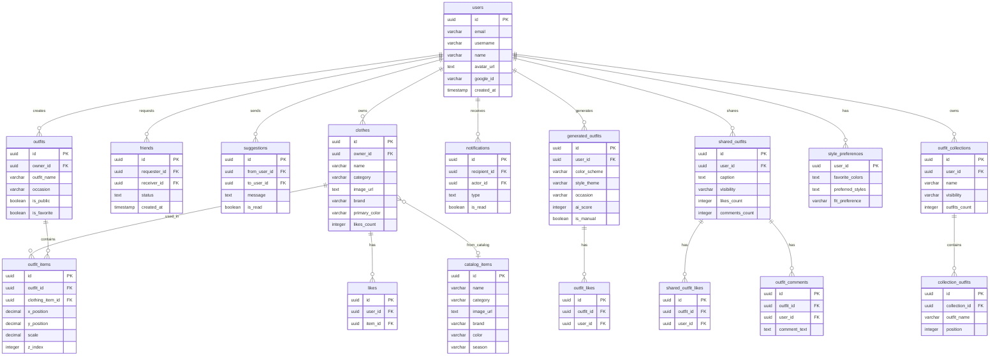

# StyleSnap Database Schema Diagram

## Entity Relationship Diagram



---

## Complete Table List

### Core Entities

| Table | Description | Key Columns |
|-------|-------------|-------------|
| `users` | User accounts via Google OAuth | id, email, username, name, avatar_url, google_id |
| `clothes` | Clothing items in user closets | id, owner_id, name, category, image_url, brand, primary_color, likes_count |
| `catalog_items` | Pre-seeded clothing catalog | id, name, category, image_url, brand, color, season, search_vector |
| `friends` | Friend connections between users | id, requester_id, receiver_id, status (pending/accepted/rejected) |

### Outfit System

| Table | Description | Key Columns |
|-------|-------------|-------------|
| `outfits` | User-created outfits | id, owner_id, outfit_name, occasion, is_public, is_favorite |
| `outfit_items` | Junction: outfit ↔ clothes | id, outfit_id, clothing_item_id, x_position, y_position, scale, z_index |
| `generated_outfits` | AI-generated outfits | id, user_id, item_ids[], ai_score, color_scheme, is_manual |
| `outfit_history` | Wear tracking | id, user_id, outfit_items (JSONB), worn_date, weather_temp, rating |

### Social Features

| Table | Description | Key Columns |
|-------|-------------|-------------|
| `shared_outfits` | Social feed posts | id, user_id, caption, visibility, likes_count, comments_count |
| `shared_outfit_likes` | Likes on shared posts | id, outfit_id, user_id |
| `outfit_comments` | Comments on shared posts | id, outfit_id, user_id, comment_text |
| `suggestions` | Friend outfit suggestions | id, from_user_id, to_user_id, suggested_item_ids[], message |
| `friend_outfit_suggestions` | Friend-created outfits | id, owner_id, suggester_id, outfit_items (JSONB), status |

### Likes System

| Table | Description | Key Columns |
|-------|-------------|-------------|
| `likes` | Likes on clothing items | id, user_id, item_id |
| `item_likes` | Alternate item likes table | id, item_id, user_id |
| `outfit_likes` | Likes on generated outfits | id, outfit_id, user_id |

### Preferences & Collections

| Table | Description | Key Columns |
|-------|-------------|-------------|
| `style_preferences` | User style preferences | user_id, favorite_colors[], preferred_styles[], fit_preference |
| `outfit_collections` | Lookbooks/collections | id, user_id, name, visibility, outfits_count |
| `collection_outfits` | Outfits in collections | id, collection_id, outfit_name, position |
| `suggestion_feedback` | Feedback on suggestions | id, user_id, suggestion_id, feedback_type |

### Notifications

| Table | Description | Key Columns |
|-------|-------------|-------------|
| `notifications` | All notification types | id, recipient_id, actor_id, type, reference_id, is_read |

---

## Relationship Cardinality

```
                              ┌─────────────┐
                              │   users     │
                              │  (Central)  │
                              └──────┬──────┘
           ┌──────────┬───────┬──────┼──────┬───────┬──────────┐
           │          │       │      │      │       │          │
           ▼          ▼       ▼      ▼      ▼       ▼          ▼
       ┌───────┐  ┌───────┐ ┌────┐ ┌────┐ ┌────┐ ┌────┐  ┌──────────┐
       │clothes│  │friends│ │out-│ │gen │ │shar│ │noti│  │preference│
       │ (1:N) │  │ (M:N) │ │fits│ │out │ │ed  │ │fic │  │  (1:1)   │
       └───┬───┘  └───────┘ │(1:N│ │fits│ │outs│ │atio│  └──────────┘
           │                └─┬──┘ │(1:N│ │(1:N│ │ns  │
           │                  │    └────┘ └────┘ └────┘
           │                  │
           ▼                  ▼
       ┌───────┐         ┌────────┐
       │ likes │         │outfit  │
       │ (M:N) │         │_items  │
       └───────┘         │ (M:N)  │
                         └────────┘
```

---

## Key Database Features

| Feature | Implementation |
|---------|----------------|
| **Row Level Security** | Enabled on all tables - users can only access their own data |
| **Soft Deletes** | `removed_at` column on clothes, outfits |
| **Auto Timestamps** | Triggers update `updated_at` on changes |
| **Likes Caching** | `likes_count` cached on clothes for performance |
| **Full-text Search** | `search_vector` tsvector on catalog_items |
| **JSONB Storage** | outfit_items stored as JSONB for flexible positioning |
| **Canonical Ordering** | Friends table enforces requester_id < receiver_id |

---

## Table Statistics

| Category | Count |
|----------|-------|
| Core tables | 4 |
| Outfit tables | 4 |
| Social tables | 5 |
| Likes tables | 3 |
| Preference tables | 4 |
| Notification tables | 1 |
| **Total** | **~20 tables** |

---

**Generated from:** 38 migration files  
**Database:** Supabase (PostgreSQL)  
**Last Updated:** January 2026
