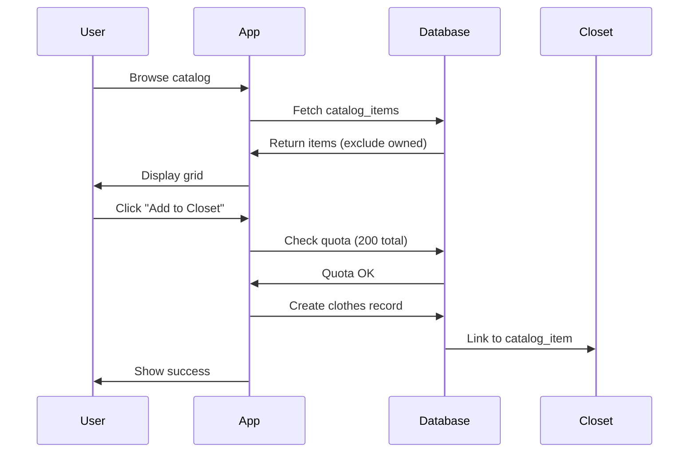

# 🛍️ Catalog System Guide

## Overview

The Catalog is a pre-populated collection of clothing items that users can browse and add to their closet **without counting toward their upload quota**. All catalog items are displayed anonymously with no owner attribution.

---

## Features

- Pre-populated clothing database (admin + auto-contributed)
- Unlimited adds to closet (doesn't count toward upload quota)
- Anonymous browsing (no owner information)
- Full-text search with filters
- Category, color, brand, season filtering
- Pagination (20 items per page, max 50)
- Automatic de-duplication (owned items excluded)
- Mobile-optimized grid layout

---

## How It Works

### Catalog Flow



### Key Concepts

1. **Anonymous by Design**: Catalog items have NO `owner_id` field
2. **Auto-Contribution**: User uploads automatically added to catalog (background)
3. **Quota-Free**: Adding from catalog doesn't count toward 50 upload limit
4. **Linked Items**: Closet items link back to catalog via `catalog_item_id`
5. **Smart Filtering**: Items user already owns are excluded from browse results

---

## Database Schema

### Catalog Items Table

```sql
CREATE TABLE catalog_items (
  id UUID PRIMARY KEY DEFAULT gen_random_uuid(),
  name VARCHAR(255) NOT NULL,
  category VARCHAR(50) NOT NULL,
  clothing_type VARCHAR(50),
  image_url TEXT NOT NULL,
  thumbnail_url TEXT,
  style TEXT[],                        -- Style tags array
  brand VARCHAR(100),
  color VARCHAR(50),                   -- Primary color
  season VARCHAR(20),                  -- spring, summer, fall, winter, all-season
  is_active BOOLEAN DEFAULT true,      -- Admin can deactivate
  search_vector TSVECTOR,              -- Full-text search index
  created_at TIMESTAMP WITH TIME ZONE DEFAULT NOW(),
  updated_at TIMESTAMP WITH TIME ZONE DEFAULT NOW()
);
```

**Note**: No `owner_id` field - all items are anonymous!

---

## Quota System

### Catalog vs Uploads

| Source | Upload Quota | Total Quota | Cost |
|--------|--------------|-------------|------|
| **User Upload** | Counts (50 max) | Counts (200 max) | Storage cost |
| **Catalog Add** | ❌ Doesn't count | ✅ Counts (200 max) | No cost |

### Example Scenario

```javascript
// User has:
// - 45 uploaded items
// - 100 catalog items
// Total: 145 items

uploadQuota: {
  used: 45,
  limit: 50,
  available: 5  // Can upload 5 more
}

totalQuota: {
  used: 145,
  limit: 200,
  available: 55  // Can add 55 more (upload or catalog)
}
```

---

## API Service

### File: `src/services/catalog-service.js`

#### Functions

##### `browse(options)`

Browse catalog with filters and pagination.

```javascript
import { catalogService } from '@/services/catalog-service'

const result = await catalogService.browse({
  category: 'top',              // Optional filter
  color: 'blue',                // Optional filter
  brand: 'Nike',                // Optional filter (partial match)
  season: 'summer',             // Optional filter
  style: 'casual',              // Optional filter (array contains)
  page: 1,                      // Page number (default: 1)
  limit: 20                     // Items per page (default: 20, max: 50)
})
```

**Response**:
```json
{
  "items": [
    {
      "id": "uuid",
      "name": "Blue Denim Jacket",
      "category": "outerwear",
      "clothing_type": "jacket",
      "image_url": "https://...",
      "thumbnail_url": "https://...",
      "style": ["casual", "denim"],
      "brand": "Levi's",
      "color": "blue",
      "season": "all-season",
      "is_active": true,
      "created_at": "2025-01-01T00:00:00Z"
    }
  ],
  "pagination": {
    "page": 1,
    "limit": 20,
    "total": 150,
    "totalPages": 8
  }
}
```

---

##### `search(options)`

Full-text search with filters.

```javascript
const result = await catalogService.search({
  q: 'blue jacket',             // Search query
  category: 'outerwear',        // Optional filter
  color: 'blue',                // Optional filter
  page: 1,                      // Page number
  limit: 20                     // Items per page
})
```

**Search Behavior**:
- Searches: `name`, `brand`, `style` tags
- Case-insensitive
- Partial matching
- Ranked by relevance

---

##### `getById(id)`

Get single catalog item by ID.

```javascript
const item = await catalogService.getById('catalog-item-uuid')
```

---

##### `addToCloset(catalogItemId, options)`

Add catalog item to user's closet.

```javascript
const newItem = await catalogService.addToCloset('catalog-item-uuid', {
  customName: 'My Blue Jacket',  // Optional: Override name
  privacy: 'friends'             // Optional: 'private' or 'friends' (default)
})
```

**Process**:
1. Fetch catalog item details
2. Check if user already has this item (`catalog_item_id` match)
3. Check total quota (200 items)
4. Create new `clothes` record with `catalog_item_id` link
5. Copy: name, category, image URLs, style, brand, color
6. Return new closet item

**Error Handling**:
```javascript
try {
  await catalogService.addToCloset(id)
} catch (error) {
  if (error.message.includes('already have')) {
    // User already owns this catalog item
  } else if (error.message.includes('full')) {
    // Total quota (200) exceeded
  } else if (error.message.includes('not found')) {
    // Catalog item doesn't exist
  }
}
```

---

##### `getCategories()`

Get available categories with item counts.

```javascript
const categories = await catalogService.getCategories()
// Returns: { top: 50, bottom: 30, outerwear: 20, shoes: 15, ... }
```

---

##### `getColors()`

Get available colors with item counts.

```javascript
const colors = await catalogService.getColors()
// Returns: { blue: 25, red: 15, black: 30, white: 20, ... }
```

---

## Auto-Contribution System

### How User Uploads Become Catalog Items

When a user uploads an item, it's **automatically added to the catalog** via a **database trigger** (no application code needed):

```sql
-- Database trigger in sql/005_catalog_system.sql
-- Runs AFTER INSERT on clothes table
CREATE TRIGGER auto_contribute_to_catalog_trigger
  AFTER INSERT ON clothes
  FOR EACH ROW
  EXECUTE FUNCTION auto_contribute_to_catalog();

-- Trigger function
CREATE FUNCTION auto_contribute_to_catalog() RETURNS TRIGGER AS $$
BEGIN
  -- Only auto-contribute if:
  -- 1. New item (INSERT operation)
  -- 2. Not already linked to catalog (catalog_item_id IS NULL)
  -- 3. Has valid image URLs
  IF (NEW.catalog_item_id IS NULL AND 
      NEW.image_url IS NOT NULL) THEN
    
    -- Insert into catalog (anonymous, no owner_id)
    INSERT INTO catalog_items (
      name, category, image_url, thumbnail_url,
      tags, brand, color, season, style, is_active
    ) VALUES (
      NEW.name, NEW.category, NEW.image_url, NEW.thumbnail_url,
      NEW.style_tags, NEW.brand, NEW.primary_color, 
      'all-season', NEW.style_tags, true
    )
    ON CONFLICT (image_url) DO NOTHING; -- Prevent duplicates
  END IF;
  
  RETURN NEW;
END;
$$ LANGUAGE plpgsql;
```

**Key Points:**
- ✅ **Fully automatic** - No application code required
- ✅ **Silent operation** - User never prompted or notified
- ✅ **Duplicate prevention** - `UNIQUE(image_url)` constraint
- ✅ **Anonymous** - No `owner_id` field in catalog_items
- ✅ **Non-blocking** - AFTER INSERT trigger doesn't delay response

### Privacy Preservation

| Data | User's Closet Item | Catalog Entry |
|------|-------------------|---------------|
| Owner | ✅ `owner_id = user.id` | ❌ No `owner_id` field |
| Privacy | ✅ `privacy = 'private'/'friends'` | ❌ Always public |
| Attribution | ✅ Linked to user | ❌ Anonymous |
| Traceability | ✅ Can see own items | ❌ Cannot trace back |

**Result**: User uploads are shared anonymously to benefit all users.

---

## Smart Filtering (Exclude Owned Items)

### Database Function: `get_catalog_excluding_owned()`

The catalog automatically **excludes items the user already owns** to prevent showing duplicates:

```sql
-- In sql/005_catalog_system.sql
CREATE FUNCTION get_catalog_excluding_owned(
  user_id_param UUID,
  category_filter VARCHAR(50),
  color_filter VARCHAR(50),
  brand_filter VARCHAR(50),
  season_filter VARCHAR(20),
  page_limit INTEGER,
  page_offset INTEGER
) RETURNS TABLE (...) AS $$
BEGIN
  RETURN QUERY
  SELECT ci.*
  FROM catalog_items ci
  WHERE ci.is_active = true
    -- Apply filters
    AND (category_filter IS NULL OR ci.category = category_filter)
    AND (color_filter IS NULL OR ci.color = color_filter)
    AND (brand_filter IS NULL OR ci.brand ILIKE '%' || brand_filter || '%')
    AND (season_filter IS NULL OR ci.season = season_filter)
    -- EXCLUDE OWNED ITEMS
    AND (
      user_id_param IS NULL
      OR NOT EXISTS (
        SELECT 1 FROM clothes c
        WHERE c.owner_id = user_id_param
          AND c.removed_at IS NULL
          AND (
            c.catalog_item_id = ci.id       -- Match by catalog link
            OR c.image_url = ci.image_url   -- Match by image URL
          )
      )
    )
  ORDER BY ci.created_at DESC
  LIMIT page_limit OFFSET page_offset;
END;
$$;
```

### How It Works

1. **Check Ownership**: For each catalog item, check if user owns it
2. **Two Match Methods**:
   - `catalog_item_id = ci.id` - Direct catalog link
   - `image_url = ci.image_url` - Image URL match (for old items)
3. **Exclude Matches**: If found in user's closet, don't show in catalog
4. **Result**: User only sees items they don't already own

### Example Scenario

```javascript
// User's closet:
// - Blue Denim Jacket (from catalog, catalog_item_id = 'abc-123')
// - White T-Shirt (uploaded, image_url matches catalog item)

// Catalog browse results:
catalogService.browse({ category: 'outerwear' })
// Returns: All outerwear EXCEPT Blue Denim Jacket
//         (already owned via catalog_item_id)

catalogService.browse({ category: 'top' })
// Returns: All tops EXCEPT White T-Shirt
//         (already owned via image_url match)
```

**Benefits:**
- ✅ No duplicate suggestions
- ✅ Cleaner catalog browsing experience
- ✅ Works for both catalog adds AND user uploads
- ✅ Automatic - no manual tracking needed

---

## Search Implementation

### Database Function

```sql
CREATE FUNCTION search_catalog(
  search_query TEXT,
  filter_category VARCHAR(50),
  filter_color VARCHAR(50),
  filter_brand VARCHAR(100),
  filter_season VARCHAR(20),
  page_limit INT,
  page_offset INT
) RETURNS SETOF catalog_items AS $$
  SELECT *
  FROM catalog_items
  WHERE
    is_active = true
    AND (
      search_query IS NULL
      OR search_vector @@ plainto_tsquery('english', search_query)
    )
    AND (filter_category IS NULL OR category = filter_category)
    AND (filter_color IS NULL OR color = filter_color)
    AND (filter_brand IS NULL OR brand ILIKE '%' || filter_brand || '%')
    AND (filter_season IS NULL OR season = filter_season)
  ORDER BY
    ts_rank(search_vector, plainto_tsquery('english', search_query)) DESC,
    created_at DESC
  LIMIT page_limit
  OFFSET page_offset;
$$ LANGUAGE SQL;
```

### Search Vector

Automatically updated on insert/update:

```sql
CREATE TRIGGER update_catalog_search_vector
BEFORE INSERT OR UPDATE ON catalog_items
FOR EACH ROW EXECUTE FUNCTION update_catalog_search_vector();

CREATE FUNCTION update_catalog_search_vector() RETURNS TRIGGER AS $$
BEGIN
  NEW.search_vector := to_tsvector('english',
    COALESCE(NEW.name, '') || ' ' ||
    COALESCE(NEW.brand, '') || ' ' ||
    ARRAY_TO_STRING(COALESCE(NEW.style, '{}'), ' ')
  );
  RETURN NEW;
END;
$$ LANGUAGE plpgsql;
```

---

## Filtering System

### Available Filters

| Filter | Type | Description | Example |
|--------|------|-------------|---------|
| `category` | VARCHAR(50) | Main category | 'top', 'bottom', 'outerwear' |
| `clothing_type` | VARCHAR(50) | Detailed type | 't-shirt', 'jeans', 'jacket' |
| `color` | VARCHAR(50) | Primary color | 'blue', 'red', 'black' |
| `brand` | VARCHAR(100) | Brand name (partial) | 'Nike', 'Adidas' |
| `season` | VARCHAR(20) | Season | 'spring', 'summer', 'fall', 'winter', 'all-season' |
| `style` | TEXT[] | Style tags | 'casual', 'formal', 'sporty' |

### Filter Combination

Filters are applied with **AND logic**:

```javascript
// Returns: Blue Nike T-shirts for summer
catalogService.browse({
  category: 'top',
  clothing_type: 't-shirt',
  color: 'blue',
  brand: 'Nike',
  season: 'summer'
})
```

---

## Smart De-Duplication

### Excluding Owned Items

By default, catalog browse **excludes items the user already owns**:

```javascript
// In catalog-service.js
async function browse(options) {
  const { data: { user } } = await supabase.auth.getUser()
  
  let query = supabase.from('catalog_items').select('*')
  
  if (user && options.excludeOwned !== false) {
    // Get user's catalog_item_ids
    const { data: ownedIds } = await supabase
      .from('clothes')
      .select('catalog_item_id')
      .eq('owner_id', user.id)
      .not('catalog_item_id', 'is', null)
    
    const ids = ownedIds.map(item => item.catalog_item_id)
    
    // Exclude owned items
    query = query.not('id', 'in', `(${ids.join(',')})`)
  }
  
  return query
}
```

**Override**:
```javascript
// Show all items (including owned)
catalogService.browse({ excludeOwned: false })
```

---

## UI Components

### File Structure

```
src/components/catalog/
├── CatalogGrid.vue          # Main grid view
├── CatalogSearch.vue        # Search bar
├── CatalogFilter.vue        # Filter sidebar
├── CatalogItemCard.vue      # Individual item card
├── CatalogItemModal.vue     # Detail modal (future)
└── EmptyCatalog.vue         # Empty state
```

### CatalogGrid.vue

**Props**:
```javascript
{
  items: Array,           // Catalog items
  loading: Boolean,       // Loading state
  hasMore: Boolean        // More pages available
}
```

**Events**:
```javascript
@add-to-closet="handleAdd"
@item-click="handleClick"
@load-more="loadMore"
```

---

### CatalogItemCard.vue

**Props**:
```javascript
{
  item: Object,           // Catalog item
  showAddButton: Boolean, // Show "Add to Closet" button
  isOwned: Boolean        // User already owns this item
}
```

**Slots**:
```vue
<template #badge>
  <!-- Custom badge (e.g., "NEW", "POPULAR") -->
</template>
```

---

## Pagination

### Infinite Scroll Pattern

```javascript
import { useCatalogStore } from '@/stores/catalog-store'

const catalogStore = useCatalogStore()

async function loadMore() {
  if (catalogStore.hasMore && !catalogStore.loading) {
    await catalogStore.loadNextPage()
  }
}

// In template
<div v-intersection-observer="loadMore">
  <!-- Trigger when scrolled into view -->
</div>
```

### Page-Based Pattern

```javascript
async function goToPage(page) {
  await catalogStore.fetchCatalog({ page })
}
```

---

## Performance Considerations

### Indexes

```sql
-- Category filter
CREATE INDEX idx_catalog_category ON catalog_items(category);

-- Color filter
CREATE INDEX idx_catalog_color ON catalog_items(color);

-- Brand search
CREATE INDEX idx_catalog_brand ON catalog_items USING gin(brand gin_trgm_ops);

-- Full-text search
CREATE INDEX idx_catalog_search_vector ON catalog_items USING gin(search_vector);

-- Active items
CREATE INDEX idx_catalog_active ON catalog_items(is_active) WHERE is_active = true;
```

### Caching Strategy

```javascript
// Store-level caching
const catalogStore = useCatalogStore()

// Cache for 5 minutes
if (catalogStore.lastFetch > Date.now() - 5 * 60 * 1000) {
  return catalogStore.cachedItems
}

// Fetch fresh data
await catalogStore.fetchCatalog()
```

---

## Admin Functions

### Add Catalog Items (Admin Only)

```javascript
// Admin script: scripts/populate-catalog.js
async function addCatalogItem(itemData) {
  const { error } = await supabase
    .from('catalog_items')
    .insert({
      name: itemData.name,
      category: itemData.category,
      clothing_type: itemData.clothing_type,
      image_url: itemData.image_url,
      thumbnail_url: itemData.thumbnail_url,
      style: itemData.style,
      brand: itemData.brand,
      color: itemData.color,
      season: itemData.season || 'all-season',
      is_active: true
    })
  
  if (error) throw error
}
```

### Deactivate Items

```sql
-- Mark item as inactive (hide from catalog)
UPDATE catalog_items
SET is_active = false
WHERE id = 'item-uuid';
```

---

## Testing

### Unit Tests

See `tests/unit/catalog-service.test.js`:
- Browse with filters
- Search functionality
- Add to closet
- Quota checks
- De-duplication

### Integration Tests

See `tests/integration/catalog-flow.test.js`:
- Browse catalog
- Search catalog
- Add to closet
- Check closet item link

### E2E Tests

See `tests/e2e/catalog.spec.js`:
- User browses catalog
- User searches catalog
- User adds item to closet
- User sees success message
- User's closet shows new item

---

## Related Documentation

- **API Guide**: [API_GUIDE.md](../API_GUIDE.md#catalog-api) - Catalog API endpoints
- **Database**: [DATABASE_GUIDE.md](../DATABASE_GUIDE.md) - Schema details
- **Closet**: [CLOSET_GUIDE.md](./CLOSET_GUIDE.md) - Closet integration
- **Categories**: [CATEGORIES_GUIDE.md](./CATEGORIES_GUIDE.md) - Category system
- **Tasks**: [tasks/09-item-catalog-system.md](../tasks/09-item-catalog-system.md)

---

## Status

✅ **Production Ready**

**Last Updated**: October 8, 2025
