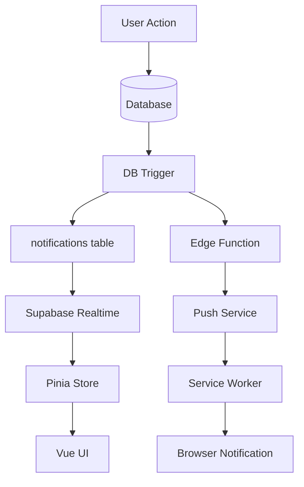
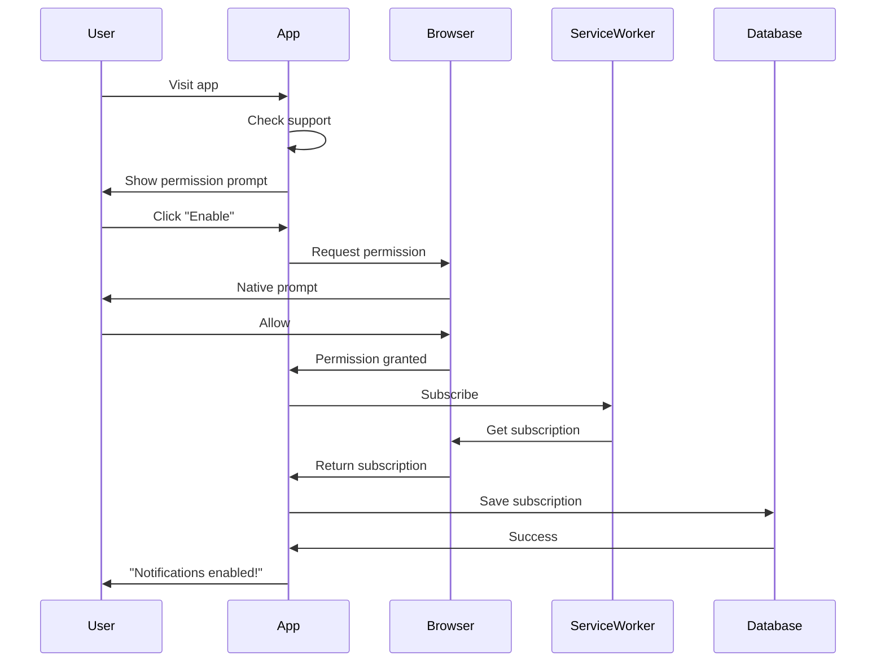

# 🔔 Notifications & Push Notifications Guide

## Overview

StyleSnap features a comprehensive notification system with both in-app notifications and browser push notifications. Users receive real-time updates for friend interactions, outfit suggestions, likes, and more.

**Status**: ✅ **FULLY IMPLEMENTED** (Task 14 Complete)

---

## Features

### In-App Notifications ✅ IMPLEMENTED
- ✅ Real-time notifications via Supabase Realtime subscriptions
- ✅ Friend outfit suggestions (with approval workflow)
- ✅ Item and outfit likes
- ✅ Notification badge with unread count
- ✅ Mark as read (single/all)
- ✅ Pagination (20 per page)
- ✅ Filtered views (All/Unread)

### Push Notifications ✅ IMPLEMENTED
- ✅ Browser push notifications (Web Push API)
- ✅ 9 notification types with custom configurations
- ✅ User preferences and quiet hours
- ✅ Multi-device support
- ✅ Delivery tracking and analytics
- ✅ Auto-retry on failures
- ✅ VAPID authentication

---

## System Architecture



---

## Database Schema

### notifications Table

```sql
CREATE TABLE notifications (
  id UUID PRIMARY KEY DEFAULT gen_random_uuid(),
  recipient_id UUID NOT NULL REFERENCES users(id),
  actor_id UUID REFERENCES users(id),
  type VARCHAR(50) NOT NULL,
  reference_id UUID,
  message TEXT,
  is_read BOOLEAN DEFAULT false,
  created_at TIMESTAMP WITH TIME ZONE DEFAULT NOW()
);

CREATE INDEX idx_notifications_recipient ON notifications(recipient_id, created_at DESC);
CREATE INDEX idx_notifications_unread ON notifications(recipient_id) WHERE is_read = false;
```

---

### friend_outfit_suggestions Table

```sql
CREATE TABLE friend_outfit_suggestions (
  id UUID PRIMARY KEY DEFAULT gen_random_uuid(),
  owner_id UUID NOT NULL REFERENCES users(id),
  suggester_id UUID NOT NULL REFERENCES users(id),
  outfit_items JSONB NOT NULL,
  message TEXT,
  status VARCHAR(20) DEFAULT 'pending' CHECK (status IN ('pending', 'approved', 'rejected')),
  created_at TIMESTAMP WITH TIME ZONE DEFAULT NOW(),
  updated_at TIMESTAMP WITH TIME ZONE DEFAULT NOW()
);
```

**outfit_items JSONB structure**:
```json
[
  {
    "id": "item-uuid",
    "name": "Blue T-Shirt",
    "image_url": "https://...",
    "thumbnail_url": "https://...",
    "category": "top"
  },
  {
    "id": "item-uuid",
    "name": "Black Jeans",
    "image_url": "https://...",
    "thumbnail_url": "https://...",
    "category": "bottom"
  }
]
```

---

### push_subscriptions Table

```sql
CREATE TABLE push_subscriptions (
  id UUID PRIMARY KEY DEFAULT gen_random_uuid(),
  user_id UUID NOT NULL REFERENCES users(id),
  endpoint TEXT UNIQUE NOT NULL,
  p256dh TEXT NOT NULL,
  auth TEXT NOT NULL,
  device_type VARCHAR(20),
  browser VARCHAR(50),
  os VARCHAR(50),
  is_active BOOLEAN DEFAULT true,
  failed_count INTEGER DEFAULT 0,
  last_used_at TIMESTAMP DEFAULT NOW(),
  created_at TIMESTAMP DEFAULT NOW()
);
```

---

### notification_preferences Table

```sql
CREATE TABLE notification_preferences (
  user_id UUID PRIMARY KEY REFERENCES users(id),
  push_enabled BOOLEAN DEFAULT true,
  friend_requests BOOLEAN DEFAULT true,
  friend_accepted BOOLEAN DEFAULT true,
  outfit_likes BOOLEAN DEFAULT true,
  outfit_comments BOOLEAN DEFAULT true,
  item_likes BOOLEAN DEFAULT true,
  friend_outfit_suggestions BOOLEAN DEFAULT true,
  daily_suggestions BOOLEAN DEFAULT false,
  daily_suggestion_time TIME DEFAULT '08:00:00',
  weather_alerts BOOLEAN DEFAULT false,
  quota_warnings BOOLEAN DEFAULT true,
  quiet_hours_enabled BOOLEAN DEFAULT false,
  quiet_hours_start TIME DEFAULT '22:00:00',
  quiet_hours_end TIME DEFAULT '08:00:00'
);
```

---

## Notification Types

| Type | Description | Reference | In-App | Push | Actions |
|------|-------------|-----------|--------|------|---------|
| `friend_request` | Friend request received | user_id | ✅ | ✅ | Accept/Reject |
| `friend_accepted` | Friend request accepted | user_id | ✅ | ✅ | View Profile |
| `outfit_like` | Outfit liked by friend | outfit_id | ✅ | ✅ | View Outfit |
| `outfit_comment` | Comment on outfit | outfit_id | ✅ | ✅ | View Comment |
| `item_like` | Closet item liked | item_id | ✅ | ✅ | View Item |
| `friend_outfit_suggestion` | Outfit suggested by friend | suggestion_id | ✅ | ✅ | Approve/Reject |
| `daily_suggestion` | Morning outfit suggestion | N/A | ❌ | ✅ | View Suggestions |
| `weather_alert` | Weather-based outfit alert | N/A | ❌ | ✅ | View Alert |
| `quota_warning` | Approaching upload limit | N/A | ✅ | ✅ | View Catalog |

---

## API Services

### File: `src/services/notifications-service.js`

#### Functions

##### `getNotifications(options)`

Fetch user's notifications with pagination.

```javascript
import { notificationsService } from '@/services/notifications-service'

const data = await notificationsService.getNotifications({
  limit: 20,
  offset: 0,
  unreadOnly: false
})
```

**Response**:
```json
{
  "notifications": [
    {
      "id": "uuid",
      "recipient_id": "uuid",
      "actor_id": "uuid",
      "actor_name": "John Doe",
      "actor_avatar": "https://...",
      "type": "item_like",
      "reference_id": "item-uuid",
      "message": "John Doe liked your Blue T-Shirt",
      "is_read": false,
      "created_at": "2025-10-08T12:00:00Z"
    }
  ],
  "total": 50,
  "unreadCount": 12
}
```

---

##### `getUnreadCount()`

Get count of unread notifications.

```javascript
const count = await notificationsService.getUnreadCount()
// Returns: 5
```

---

##### `markAsRead(notificationId)`

Mark single notification as read.

```javascript
await notificationsService.markAsRead('notification-uuid')
```

---

##### `markAllAsRead()`

Mark all notifications as read.

```javascript
await notificationsService.markAllAsRead()
```

---

##### `subscribeToNotifications(userId, callback)`

Subscribe to real-time notification updates.

```javascript
const subscription = notificationsService.subscribeToNotifications(
  user.id,
  (notification) => {
    console.log('New notification:', notification)
    // Update UI, show toast, etc.
  }
)

// Cleanup
subscription.unsubscribe()
```

---

### File: `src/services/friend-suggestions-service.js`

#### Functions

##### `createSuggestion(data)`

Create outfit suggestion for a friend.

```javascript
import { friendSuggestionsService } from '@/services/friend-suggestions-service'

await friendSuggestionsService.createSuggestion({
  friendId: 'friend-uuid',
  outfitItems: [
    {
      id: 'item1-uuid',
      name: 'Blue Shirt',
      image_url: 'https://...',
      thumbnail_url: 'https://...',
      category: 'top'
    },
    {
      id: 'item2-uuid',
      name: 'Black Jeans',
      image_url: 'https://...',
      thumbnail_url: 'https://...',
      category: 'bottom'
    }
  ],
  message: 'This would look great on you!'
})
```

---

##### `getReceivedSuggestions()`

Get outfit suggestions received from friends.

```javascript
const suggestions = await friendSuggestionsService.getReceivedSuggestions()
```

**Response**:
```json
[
  {
    "id": "uuid",
    "suggester_id": "uuid",
    "suggester_name": "John Doe",
    "suggester_avatar": "https://...",
    "outfit_items": [...],
    "message": "This would look great!",
    "status": "pending",
    "created_at": "2025-10-08T12:00:00Z"
  }
]
```

---

##### `approveSuggestion(suggestionId)`

Approve outfit suggestion and add items to closet.

```javascript
await friendSuggestionsService.approveSuggestion('suggestion-uuid')
// Creates notification for suggester
// Adds items to user's closet
```

---

##### `rejectSuggestion(suggestionId)`

Reject outfit suggestion.

```javascript
await friendSuggestionsService.rejectSuggestion('suggestion-uuid')
// Updates status to 'rejected'
// Does not create notification
```

---

### File: `src/services/push-notifications.js`

#### Functions

##### `isPushNotificationSupported()`

Check if browser supports push notifications.

```javascript
import { isPushNotificationSupported } from '@/services/push-notifications'

if (isPushNotificationSupported()) {
  // Show permission prompt
}
```

---

##### `requestNotificationPermission()`

Request browser notification permission.

```javascript
import { requestNotificationPermission } from '@/services/push-notifications'

const permission = await requestNotificationPermission()
// Returns: 'granted', 'denied', or 'default'
```

---

##### `subscribeToPushNotifications()`

Subscribe to push notifications and save subscription to database.

```javascript
import { subscribeToPushNotifications } from '@/services/push-notifications'

const subscription = await subscribeToPushNotifications()
// Subscription saved to push_subscriptions table
```

---

##### `unsubscribeFromPushNotifications()`

Unsubscribe from push notifications.

```javascript
import { unsubscribeFromPushNotifications } from '@/services/push-notifications'

await unsubscribeFromPushNotifications()
// Subscription removed from database
```

---

##### `getNotificationPreferences()`

Get user's notification preferences.

```javascript
import { getNotificationPreferences } from '@/services/push-notifications'

const prefs = await getNotificationPreferences()
```

**Response**:
```json
{
  "push_enabled": true,
  "friend_requests": true,
  "friend_accepted": true,
  "outfit_likes": true,
  "outfit_comments": true,
  "item_likes": true,
  "friend_outfit_suggestions": true,
  "daily_suggestions": false,
  "daily_suggestion_time": "08:00:00",
  "weather_alerts": false,
  "quota_warnings": true,
  "quiet_hours_enabled": false,
  "quiet_hours_start": "22:00:00",
  "quiet_hours_end": "08:00:00"
}
```

---

##### `updateNotificationPreferences(prefs)`

Update user's notification preferences.

```javascript
import { updateNotificationPreferences } from '@/services/push-notifications'

await updateNotificationPreferences({
  push_enabled: true,
  quiet_hours_enabled: true,
  quiet_hours_start: '22:00:00',
  quiet_hours_end: '08:00:00'
})
```

---

##### `sendTestNotification()`

Send test notification (for settings testing).

```javascript
import { sendTestNotification } from '@/services/push-notifications'

await sendTestNotification()
// Triggers a test notification
```

---

## Pinia Store

### File: `src/stores/notifications-store.js`

#### State

```javascript
{
  notifications: [],      // Array of notification objects
  unreadCount: 0,        // Number of unread notifications
  loading: false,        // Loading state
  hasMore: true,         // More pages available
  subscription: null     // Realtime subscription
}
```

#### Getters

```javascript
{
  hasUnread: (state) => state.unreadCount > 0,
  unreadNotifications: (state) => state.notifications.filter(n => !n.is_read)
}
```

#### Actions

```javascript
// Initialize store and start real-time updates
await store.initialize()

// Mark single notification as read
await store.markAsRead(notificationId)

// Mark all as read
await store.markAllAsRead()

// Refresh notifications
await store.refresh()

// Load more (pagination)
await store.loadMore()

// Cleanup (on component unmount)
store.cleanup()
```

---

## UI Components

### File Structure

```
src/components/notifications/
├── NotificationBadge.vue         # Unread count badge
├── NotificationItem.vue          # Single notification card
├── NotificationsList.vue         # List with pagination
├── EmptyNotifications.vue        # Empty state
├── SuggestionApprovalCard.vue    # Outfit suggestion modal
├── PushNotificationPrompt.vue    # Permission request prompt
├── NotificationSettings.vue      # Settings panel
└── NotificationToggle.vue        # Individual toggle
```

---

### NotificationBadge.vue

**Props**:
```javascript
{
  count: Number,          // Unread count
  pulse: Boolean          // Pulse animation
}
```

**Usage**:
```vue
<NotificationBadge :count="5" :pulse="true" />
```

---

### NotificationsList.vue

**Props**:
```javascript
{
  notifications: Array,    // Notifications array
  unreadCount: Number,     // Unread count
  loading: Boolean,        // Loading state
  hasMore: Boolean         // More pages available
}
```

**Events**:
```javascript
@notification-click="handleClick"
@load-more="loadMore"
@mark-all-read="markAllRead"
```

---

### SuggestionApprovalCard.vue

**Props**:
```javascript
{
  suggestion: Object,      // Suggestion object
  visible: Boolean         // Modal visibility
}
```

**Events**:
```javascript
@approve="handleApprove"
@reject="handleReject"
@close="closeModal"
```

---

### NotificationSettings.vue

**Features**:
- Master toggle for all notifications
- Individual toggles for each notification type
- Quiet hours configuration
- Daily suggestion time picker
- Test notification button

**Usage**:
```vue
<NotificationSettings v-model="preferences" />
```

---

## Push Notification Setup

### 1. Generate VAPID Keys

```bash
npm install -g web-push
web-push generate-vapid-keys
```

Output:
```
Public Key: BKx...
Private Key: 4T1...
```

---

### 2. Environment Variables

**Client (.env)**:
```env
VITE_VAPID_PUBLIC_KEY=BKx...
```

**Server (Supabase Secrets)**:
```bash
supabase secrets set VAPID_PUBLIC_KEY=BKx...
supabase secrets set VAPID_PRIVATE_KEY=4T1...
supabase secrets set VAPID_SUBJECT=mailto:support@yourapp.com
```

---

### 3. Service Worker

**File**: `public/service-worker.js`

Already configured with:
- Push event handler (9 notification types)
- Click event handler (smart routing)
- Notification action handlers
- Delivery confirmation

---

### 4. Edge Function

**File**: `supabase/functions/send-push-notification/index.ts`

Deploy:
```bash
supabase functions deploy send-push-notification
```

---

### 5. Database Migration

Run in Supabase SQL Editor:
```bash
# File: sql/010_push_notifications.sql
```

---

## User Permission Flow



---

## Quiet Hours

Users can configure quiet hours to prevent notifications during sleep:

```javascript
const prefs = {
  quiet_hours_enabled: true,
  quiet_hours_start: '22:00:00',  // 10 PM
  quiet_hours_end: '08:00:00'     // 8 AM
}

// Notifications will NOT be sent between 10 PM - 8 AM
```

**Server-side check**:
```sql
CREATE FUNCTION should_send_notification(
  user_id UUID,
  notification_type VARCHAR
) RETURNS BOOLEAN AS $$
  -- Check if user has push enabled
  -- Check if specific type is enabled
  -- Check quiet hours
  -- Return true/false
$$ LANGUAGE plpgsql;
```

---

## Delivery Tracking

### notification_delivery_log Table

```sql
CREATE TABLE notification_delivery_log (
  id UUID PRIMARY KEY DEFAULT gen_random_uuid(),
  user_id UUID NOT NULL,
  notification_type VARCHAR(50) NOT NULL,
  subscription_id UUID REFERENCES push_subscriptions(id),
  status VARCHAR(20) CHECK (status IN ('delivered', 'failed', 'filtered')),
  error_message TEXT,
  sent_at TIMESTAMP DEFAULT NOW()
);
```

### Analytics

```sql
-- Delivery rate (last 7 days)
SELECT 
  notification_type,
  COUNT(*) as total,
  COUNT(*) FILTER (WHERE status = 'delivered') as delivered,
  ROUND(
    COUNT(*) FILTER (WHERE status = 'delivered')::NUMERIC / 
    COUNT(*)::NUMERIC * 100, 2
  ) as delivery_rate_pct
FROM notification_delivery_log
WHERE sent_at > NOW() - INTERVAL '7 days'
GROUP BY notification_type;
```

---

## Error Handling

### Failed Subscriptions

If a subscription fails 5 times, it's automatically disabled:

```sql
CREATE FUNCTION mark_subscription_failed(subscription_id UUID)
RETURNS VOID AS $$
  UPDATE push_subscriptions
  SET 
    failed_count = failed_count + 1,
    is_active = CASE 
      WHEN failed_count + 1 >= 5 THEN false
      ELSE is_active
    END
  WHERE id = subscription_id;
$$ LANGUAGE SQL;
```

### Retry Logic

Edge function retries failed deliveries:
- Immediate retry on timeout
- Skip retry on 404/410 (expired subscription)
- Mark subscription as failed after 5 consecutive failures

---

## Testing

### Manual Testing

1. **In-App Notifications**:
   - Open 2 browser windows
   - Log in as 2 different users who are friends
   - Like an item in one window
   - See notification appear in other window (real-time)

2. **Push Notifications**:
   - Enable notifications in settings
   - Close the app tab
   - Like an item from another user
   - See browser notification appear

3. **Quiet Hours**:
   - Set quiet hours (e.g., current time +5 minutes to +10 minutes)
   - Trigger notification
   - Verify no push notification sent

### Unit Tests

See `tests/unit/notifications-service.test.js`:
- Fetch notifications
- Mark as read
- Unread count
- Subscription management

### Integration Tests

See `tests/integration/notification-flow.test.js`:
- Create notification trigger
- Receive real-time update
- Mark as read
- Push notification delivery

---

## Security

### Row Level Security (RLS)

```sql
-- Users can only see their own notifications
CREATE POLICY "Users can view own notifications"
  ON notifications FOR SELECT
  USING (recipient_id = auth.uid());

-- Users can only update their own notifications
CREATE POLICY "Users can update own notifications"
  ON notifications FOR UPDATE
  USING (recipient_id = auth.uid());

-- Only friends can create suggestions
CREATE POLICY "Only friends can suggest outfits"
  ON friend_outfit_suggestions FOR INSERT
  WITH CHECK (
    EXISTS (
      SELECT 1 FROM friends
      WHERE status = 'accepted'
      AND (
        (requester_id = auth.uid() AND receiver_id = owner_id)
        OR (receiver_id = auth.uid() AND requester_id = owner_id)
      )
    )
  );
```

---

## Performance

### Indexes

```sql
CREATE INDEX idx_notifications_recipient_created 
  ON notifications(recipient_id, created_at DESC);

CREATE INDEX idx_notifications_unread 
  ON notifications(recipient_id) WHERE is_read = false;

CREATE INDEX idx_push_subscriptions_user 
  ON push_subscriptions(user_id) WHERE is_active = true;
```

### Pagination

Default: 20 notifications per page

```javascript
// First page
const page1 = await getNotifications({ limit: 20, offset: 0 })

// Second page
const page2 = await getNotifications({ limit: 20, offset: 20 })
```

---

## Related Documentation

- **API Guide**: [API_GUIDE.md](../API_GUIDE.md#notifications-api) - Notifications API
- **Database**: [DATABASE_GUIDE.md](../DATABASE_GUIDE.md) - Schema details
- **Social**: [SOCIAL_GUIDE.md](./SOCIAL_GUIDE.md) - Friend interactions
- **Likes**: [LIKES_GUIDE.md](./LIKES_GUIDE.md) - Like system
- **Tasks**: [tasks/14-notification-system.md](../tasks/14-notification-system.md)

---

## Implementation Status

### ✅ Completed Features

#### Backend & Database
- ✅ `sql/009_notifications_system.sql` - Complete database schema
- ✅ `sql/010_push_notifications.sql` - Push notification tables
- ✅ RLS policies for all notification tables
- ✅ Database triggers for auto-notification creation
- ✅ RPC functions for approve/reject/mark-as-read

#### Services Layer
- ✅ `src/services/notifications-service.js` - Full notification operations
- ✅ `src/services/friend-suggestions-service.js` - Outfit suggestion management
- ✅ `src/services/likes-service.js` - Item/outfit likes with notifications

#### State Management
- ✅ `src/stores/notifications-store.js` - Pinia store with real-time subscriptions
- ✅ `src/stores/likes-store.js` - Likes state management

#### UI Components
- ✅ `src/components/notifications/NotificationsList.vue` - Main list view
- ✅ `src/components/notifications/NotificationItem.vue` - Individual notification
- ✅ `src/components/notifications/NotificationBadge.vue` - Unread badge
- ✅ `src/components/notifications/EmptyNotifications.vue` - Empty state
- ✅ `src/components/social/SuggestionApprovalCard.vue` - Approval interface
- ✅ `src/components/social/CreateSuggestionModal.vue` - Create suggestions
- ✅ `src/components/social/SuggestionPreview.vue` - Preview suggestions
- ✅ `src/components/closet/ItemLikeButton.vue` - Like button
- ✅ `src/components/closet/ItemLikersList.vue` - Show who liked

#### Pages & Navigation
- ✅ `src/pages/Notifications.vue` - Notifications page with tabs
- ✅ Navigation bar with notification icon and badge
- ✅ Route `/notifications` configured in router

#### Testing
- ✅ `tests/unit/notifications-service.test.js` - Service unit tests
- ✅ `tests/unit/friend-suggestions-service.test.js` - Suggestions tests
- ✅ `tests/unit/notifications-store.test.js` - Store tests
- ✅ `tests/integration/notifications-api.test.js` - Integration tests

### Key Features

1. **Real-time Updates**: Supabase Realtime subscriptions for instant notifications
2. **Friend Suggestions**: Friends can create and suggest outfits
3. **Approval Workflow**: Accept or decline outfit suggestions
4. **Like System**: Like items with automatic notifications
5. **Unread Tracking**: Badge shows unread count across the app
6. **Pagination**: Efficient loading with 20 notifications per page
7. **Filtering**: View all or unread-only notifications

---

## Status

✅ **Production Ready** - Task 14 Complete

**Last Updated**: October 8, 2025
